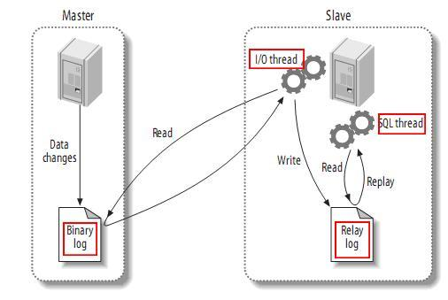
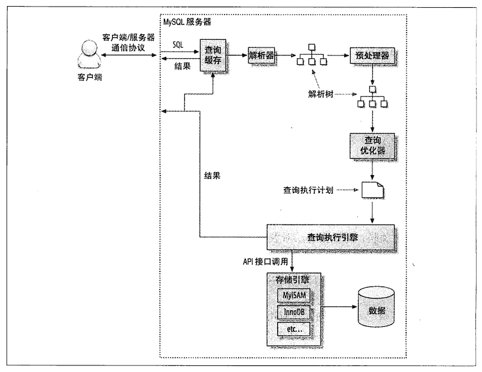

### 事务

- 两阶段锁

数据库遵循的是两段锁协议，将事务分成两个阶段，加锁阶段和解锁阶段（所以叫两段锁）。

1. 加锁阶段：在该阶段可以进行加锁操作。在对任何数据进行读操作之前要申请并获得 S 锁（共享锁，其它事务可以继续加共享锁，但不能加排它锁），在进行写操作之前要申请并获得 X 锁（排它锁，其它事务不能再获得任何锁）。加锁不成功，则事务进入等待状态，直到加锁成功才继续执行。
2. 解锁阶段：当事务释放了一个封锁以后，事务进入解锁阶段，在该阶段只能进行解锁操作不能再进行加锁操作。

> 在 InnoDB 事务中，行锁是在需要的时候才加上的，但并不是不需要了就立刻释放，而是*等到事务结束时才释放*。这个就是两阶段协议。因此，如果事务中需要锁多个行，要把最可能造成锁冲突、最可能影响性能的锁尽量往后放。

两阶段锁协议*使得事务具有较高的并发度*，因为解锁不必发生在事务结尾。它的不足是没有解决死锁的问题，因为它在加锁阶段没有顺序要求。如两个事务分别申请了 A, B 锁，接着又申请对方的锁，此时进入死锁状态。

- MySQL 事务有哪些隔离级别？（在 InnoDB 引擎下）

隔离级别 | 脏读（Dirty Read） | 不可重复读（NonRepeatable Read）| 幻读（Phantom Read）|
---|---|---|---|
读未提交（Read uncommitted） | 可能  | 可能  |  可能  |
读提交（Read committed）    | 不可能 | 可能  |  可能  |
可重复读（Repeatable read） | 不可能|不可能|不可能|
可串行化（Serializable ）   | 不可能 |不可能|不可能|

1. 读未提交（Read Uncommitted）：允许脏读，也就是可能读取到其他会话中未提交事务修改的数据；在 RC 级别中，数据的读取都是不加锁的，但是数据的写入、修改和删除是需要加锁的。

2. 读提交（Read Committed）：只能读取到已经提交的数据。Oracle 等多数数据库默认都是该级别 （不可重复读）；

3. 可重复读（Repeated Read）：可重复读。在同一个事务内的查询结果都是和事务开始时刻一致的，InnoDB 默认级别。通过 next-key lock（gap lock+行锁）来解决幻读的问题；

4. 串行读（Serializable）：完全串行化的读，每次读都需要获得表级共享锁，读写相互都会阻塞。一个事务结束后，下一个事务才能开始。

- InnoDB 的事务是如何实现的？

ACD 三个特性是通过 redo log 和 undo log 实现的。 而隔离性是通过锁 + MVCC 来实现的。

A 原子性：redo log 中记录了事务的提交或回滚信息，一个事务要么是提交了，要么就会被回滚（根据 undo log）；
D 持久性：修改记录到 redo log，即使断电重启了，也可以根据 redo log 恢复，实现持久化；

- [不同事务隔离级别分别会加哪些锁？](https://dev.mysql.com/doc/refman/5.6/en/innodb-transaction-isolation-levels.html)

|隔离级别 | Select | Update/Delete| Insert|
|---|---|---|---|
读未提交（Read uncommitted） | 不加锁  | 不加锁 |
读提交（Read committed）    | 不加锁| 加行锁 |
可重复读（Repeatable read） | 不加锁|加行锁|
可串行化（Serializable ）   | 加读锁|加写锁|

- 如何查看意向锁？

```sql
show engine innodb status;
```

- [分库分表如何选择分表键？](https://github.com/Meituan-Dianping/Zebra/wiki/%E5%A6%82%E4%BD%95%E9%80%89%E6%8B%A9%E5%90%88%E9%80%82%E7%9A%84%E5%88%86%E8%A1%A8%E9%94%AE%EF%BC%8C%E8%B7%AF%E7%94%B1%E8%A7%84%E5%88%99%E5%8F%8A%E5%88%86%E7%89%87%E6%95%B0)

数据表拆分的首要原则，就是要尽可能找到数据表中的数据在业务逻辑上的主体，并确定大部分（或核心的）数据库操作都是围绕这个主体的数据进行，然后可使用该主体对应的字段作为分表键，进行分库分表。

1. 从业务角度出发，选择业务逻辑上的主体对应的字段。例如：面向用户的互联网应用，都是围绕用户维度来做各种操作，那么业务逻辑主体就是用户，可使用用户对应的字段作为分表键；侧重于卖家的电商应用，都是围绕卖家维度来进行各种操作，那么业务逻辑主体就是卖家，可使用卖家对应的字段作为分表键；
2. 从数据分布角度出发，根据*数据分布和访问的均衡度*来考虑分表键，尽量将数据表中的数据相对均匀地分布在不同的物理分库/分表中，例如：主键，拿主键当分表键的好处是可以散列均衡，减少热点问题。

- [分片策略](https://www.cnblogs.com/butterfly100/p/9034281.html)

1. 根据数值范围（或时间范围），例如：按日期将不同月甚至是日的数据分散到不同的库中；将 userId 为 1-9999 的记录分到第一个库，10000-20000 的分到第二个库，以此类推。某种意义上，某些系统中使用的"冷热数据分离"，将一些使用较少的历史数据迁移到其他库中，业务功能上只提供热点数据的查询，也是类似的实践。

优点：
1. 单表大小可控；
2. 天然便于水平扩展，后期如果想对整个分片集群扩容时，只需要添加节点即可，无需对其他分片的数据进行迁移；
3. 使用分片字段进行范围查找时，连续分片可快速定位分片进行快速查询，有效避免跨分片查询的问题。

缺点：热点数据成为性能瓶颈。连续分片可能存在数据热点，例如按时间字段分片，有些分片存储最近时间段内的数据，可能会被频繁的读写，而有些分片存储的历史数据，则很少被查询。

2. hash 取模

优点：数据分片相对比较均匀，不容易出现热点和并发访问的瓶颈。

缺点：

1. 后期分片集群扩容时，需要迁移旧的数据（使用一致性哈希算法能较好的避免这个问题）；
2. 范围查询需要对所有分片发起查询。

- 分库分表的情况下，查询时一般是如何做排序的？

跨节点多库进行查询时，会出现 limit 分页、order by 排序等问题。分页需要按照指定字段进行排序，当排序字段就是分片字段时，通过分片规则就比较容易定位到指定的分片；当排序字段非分片字段时，就变得比较复杂了。需要先在不同的分片节点中将数据进行排序并返回，然后将不同分片返回的结果集进行汇总和再次排序，最终返回给用户。

如果取得页数很大，情况则变得复杂很多，因为各分片节点中的数据可能是随机的，为了排序的准确性，需要将所有节点的前N页数据都排序好做合并，最后再进行整体的排序，这样的操作时很耗费CPU和内存资源的，所以页数越大，系统的性能也会越差。

- 如何解决跨库 Join 的问题？

1. 通过数据冗余：A 库的表 t1 要与 B 库的表 t2 做 Join 操作，可以将 t1 的字段冗余到 t2 上；
2. 数据同步：将 t1 同步到 B 库上；
3. 在服务端手动 join；
4. 数据仓库：将 A 库和 B 库的数据都添加到数据仓库中，适合用于查询数据报表；
5. 通过中间件，例如：mycat；
6. 使用 MySQL 的 [federated](https://dev.mysql.com/doc/refman/5.6/en/federated-usagenotes.html) 引擎；
7. 业务上禁止跨库 Join。

### 索引

- 主键和聚集索引

1. 如果定义了主键，主键就是聚集索引；
2. 如果没有定义主键，**第一个非空（not null）且唯一（unique）列是聚集索引**；
3. 如果没有符合条件的列，会自动创建一个隐藏的 row-id 作为聚集索引。

- 有哪些不同数据结构的索引类型？

**索引（index）是在存储引擎（storage engine）层面实现的，而不是server层面。**

1. B 树索引

每一个树节点使用一个磁盘 page，这样每个节点只需要一次 I/O 就可以完全载入。

2. 哈希索引；

只支持精确查找，不支持范围查找，不支持排序。这意味着范围查找或 ORDER BY 都要依赖 server 层的额外工作。

3. 空间（Spatial/R-Tree）索引；
4. 全文（full-text）索引

主要用来查找文本中的关键字，而不是直接与索引中的值相比较。全文索引跟其它索引大不相同，它更像是一个搜索引擎，而不是简单的 WHERE 语句的参数匹配。你可以对某列分别进行全文索引和 B 树索引，两者互不冲突。全文索引配合 MATCH AGAINST 操作使用，而不是一般的 WHERE 语句加 LIKE。

- 为什么索引使用 B+ 树而不用 B 树或者红黑树？

    1.  B+ 跟 B 树不同 B+ 树的非叶子节点不保存数据，仅含有其子树根结点中最大（或最小）关键字，只进行数据索引，这样使得 B+ 树每个非叶子节点所能保存的关键字大大增加，从而加载一个磁盘页能够读取到更多索引数据；
    2.  B+ 树叶子节点保存了父节点的所有关键字记录的指针，所有数据地址必须要到叶子节点才能获取到，所以每次数据查询的次数都一样：稳定；B 树在内部节点出现的索引项不会再出现在叶子节点中；
    3.  B+ 树的层级更少，更加“矮胖”：相较于 B 树 B+ 每个非叶子节点存储的关键字数更多，树的层级更少所以查询数据更快；
    4. 所有叶子节点形成有序链表，便于范围查询。
    5. 红黑树是二叉树，每个节点最多只有两个子节点，会使得树更瘦高；

- （联合）索引的设计原则

1. 对经常在 WHERE、GROUP BY、ORDER BY、DISTINCT、UNION 等操作中使用到的列建立索引；
2. 尽量选择区分度高的列作为索引並按区分度大小对索引列进行排序：区分度的公式是 `count(distinct col)/count(col)`，表示字段不重复的比例，比例越大我们扫描的记录数越少，唯一键的区分度是 1。

3. 限制索引的数目

索引的数目不是越多越好。每个索引都需要占用磁盘空间，索引越多，需要的磁盘空间就越大。
修改表时，对索引的重构和更新很麻烦。越多的索引，会使更新表变得很浪费时间。

4. 尽量的扩展索引，不要新建索引。比如表中已经有 a 的索引，现在要加 (a,b) 的索引，那么只需要修改原来的索引即可；
5. 在 order by 或者 group by 子句中，如果想通过索引来进行排序，所建索引列的顺序必须与 order by 或者 group by 子句的顺序一致，并且所有列的排序方向（倒序或者正序）都一样；如果查询关联多张表，则只有 order by 子句引用的字段全部来自第一张表时，才能利用索引来排序；order by 或者 group by 语句与查询型语句的限制是一样的：需要满足索引的最左前缀原则；否则 MySQL 就要执行排序操作，无法利用索引来排序；（有一种情况 order by 或者 group by 子句可以不满足最左前缀原则，就是其前导为常量的时候，如果 where 或者 join 对这些列指定了常量，就可以弥补索引的不足）；
6. 删除不必要或过期的索引。

- 索引的优缺点

优点：

1. 索引可以减少服务器需要扫描的数据量，从而大大提高查询效率；
2. 唯一索引能保证表中数据的唯一性；
3. 利用索引对数据存储的特性，可以使查询语句避免排序和创建临时表；
4. 索引可以将随机I/O变为顺序I/O。（索引的有序性使得 `col=val` 这样的查询只需要顺序访问少数相邻的几个数据页）

缺点：

1. 索引的创建和维护会造成工作量的增加（插入和更新数据时需要更新对应的索引）；
2. 索引会造成数据量的增加，除了数据表中数据占数据空间之外，每一个索引还要占一定的物理空间；
3. 不恰当的使用索引会造成服务器重复扫描数据，造成查询浪费。

- SQL 查询条件使用了索引列，实际执行不使用预期索引的可能原因有哪些？

1. 使用索引成本比不适用索引高：例如查询返回结果集比较大的情况，在二级索引上的随机 I/O 成本可能高于全表扫描的顺序 I/O；
2. 查询优化器所依赖的统计信息不准确，可以通过运行 `Analyze table` 来校正统计信息；（直到 5.5 版本之前，InnoDB 也不在磁盘存储统计信息，而是通过随机的索引访问进行评估並将其存储在内存中）
3. 不正确地使用索引：例如在索引列上进行了函数运算或是不满足最左前缀规则等；
4. 小表；

- 索引失效的原因

1. 不满足最左前缀匹配；
2. 在索引列做运算、函数或是类型转换（例如：'123' 写成 123）；
3. 使用 <> 、not in 、not exist、!=；
4. B-tree 索引 is null 的条件不会使用索引。

- 唯一索引与 null

唯一索引允许多个 null 记录的存在，即 null 记录不受唯一索引的约束，因为 null 本身代表的是“未知”的数据状态，而不是一个具体的数值值，因此不能进行比较，即 `null != null`。

- 大表设计的注意点
- 大表删除一半数据的方案

1. 要避免长事务：批量删除；
2. 要避免过多加锁；
3. 用主键做为删除条件要比使用二级索引做为删除条件快（可以先根据二级索引找到符合条件的最大或最小主键，例如二级索引是创建时间）；
4. 删除 SQL 添加 limit 条件。

[官方的一个方案](https://dev.mysql.com/doc/refman/8.0/en/delete.html)
```sql
# 将要保留的数据插入另一张表中
INSERT INTO t_copy SELECT * FROM t WHERE ... ;
# 使用 rename 替换旧表
RENAME TABLE t TO t_old, t_copy TO t;
# 删除旧表
DROP TABLE t_old;
```

- SQL 优化的具体步骤

1. 结构优化
2. 查询优化

- MySQL 事务是如何实现的，提交回滚的细节

### 锁

- 表级锁和行锁的区别？

表锁虽然开销小，加锁快，但高并发下性能低。行锁虽然开销大，加锁慢，但高并发下相比之下性能更高。

表级锁包括表锁和 MDL(metadata lock) 锁（5.5 引进）。

对于 MyISAM 引擎：
1. 在执行查询语句（SELECT）前，会自动给涉及的所有表加表读锁，在执行更新操作（UPDATE、DELETE、INSERT等）前，会自动给涉及的表加表写锁；
2. DML（增删查改操作）语句自动加 MDL 的读锁，读锁之间不互斥；DDL 语句自动加 MDL 的写锁，写锁之间、写锁与读锁之间互斥。

对于 InnoDB 引擎：

1. InnoDB 行锁是通过给索引上的索引项加锁来实现的，这一点 MySQL 与 Oracle 不同，后者是通过在数据块中对相应数据行加锁来实现的。当 InnoDB 使用的索引是唯一索引时，这种行锁实现特点意味着：**只有通过索引条件检索数据，InnoDB 才使用行级锁，否则，InnoDB 将加表锁（待确认）**。
2. DML（增删查改操作）语句自动加 MDL 的读锁，读锁之间不互斥；DDL 语句自动加 MDL 的写锁，写锁之间、写锁与读锁之间互斥。

> Record locks always lock index records, even if a table is defined with no indexes. For such cases, InnoDB creates a hidden clustered index and uses this index for record locking.

- 表锁什么场景下优于行锁？

1. 大量更新数据的场景下，如果使用行锁的话需要对许多数据加锁，使用表锁性能更高；

- InnoDB 中的表锁类型

1. 表共享锁（S）
2. 表排他锁（X)
3. 意向共享锁（IS）
4. 意向排他锁（IX）
5. MDL（meta-data lock）
6. [AUTO_INC lock](http://mysql.taobao.org/monthly/2016/01/01/#LOCK_AUTO_INC)

> While initializing a previously specified AUTO_INCREMENT column on a table, InnoDB sets an exclusive lock on the end of the index associated with the AUTO_INCREMENT column. While accessing the auto-increment counter, InnoDB uses a specific AUTO-INC table lock mode where the lock lasts only to the end of the current SQL statement, not to the end of the entire transaction. Other clients cannot insert into the table while the AUTO-INC table lock is held.

- mysql 的行锁、表锁、间隙锁、意向锁分别是做什么的？

1. 行锁：用于锁定一行数据（读/写），锁粒度小，但加锁慢；
2. 表锁：用于锁定一个表（读/写），锁粒度大，加锁快；
3. 间隙锁（gap lock）：用于**锁定索引记录之间的间隙**，跟其之后的行锁形成 next-key lock，用于防止幻读，是一个**前开后闭区间**；
4. 意向锁（意向共享锁IS、意向排他锁IX）：InnoDB 实现的表级锁，用于实现行锁与表锁的共存。**在加行读锁之前，需要先加 IS 或者 IX 锁，在加行写锁之前，需要先加 IX 锁。** 

表共享锁（S）、表排他锁（X)、意向共享锁（IS）、意向排他锁（IX）的兼容关系：

| |X	|IX |S  |IS |
|---|---|---|---|---|	
X	|冲突|冲突|冲突|冲突|
IX	|冲突|兼容|冲突|兼容|
S	|冲突|冲突|兼容|兼容|
IS	|冲突|兼容|兼容|兼容|

**IS、IX 之间是兼容的，从而保证意向锁并不会影响到多个事务对不同数据行加排他锁时的并发性。**

- [意向表锁的作用](https://www.zhihu.com/question/51513268)

考虑这个例子：

事务A锁住了表中的一行，让这一行只能读，不能写。

之后，事务B申请整个表的写锁。如果事务B申请成功，那么理论上它就能修改表中的任意一行，这与A持有的行锁是冲突的。

数据库需要避免这种冲突，就是说要让B的申请被阻塞，直到A释放了行锁。数据库要怎么判断这个冲突呢？

1. 判断表是否已被其他事务用表锁锁表；
2. 判断表中的每一行是否已被行锁锁住。

注意step2，这样的判断方法效率实在不高，因为需要遍历整个表。于是就有了意向锁。


- InnoDB 什么时候加表锁？


1. DDL 操作；
2. 使用了 `lock tables` 语句显式加锁；
3. 

> LOCK TABLES sets table locks, but it is the higher MySQL layer above the InnoDB layer that sets these locks. InnoDB is aware of table locks if innodb_table_locks = 1 (the default) and autocommit = 0, and the MySQL layer above InnoDB knows about row-level locks.
> 
> Otherwise, InnoDB's automatic deadlock detection cannot detect deadlocks where such table locks are involved. Also, because in this case the higher MySQL layer does not know about row-level locks, it is possible to get a table lock on a table where another session currently has row-level locks. However, this does not endanger transaction integrity, as discussed in Section 15.7.5.2, “Deadlock Detection and Rollback”.
> 
> LOCK TABLES acquires two locks on each table if innodb_table_locks=1 (the default). In addition to a table lock on the MySQL layer, it also acquires an InnoDB table lock. Versions of MySQL before 4.1.2 did not acquire InnoDB table locks; the old behavior can be selected by setting innodb_table_locks=0. If no InnoDB table lock is acquired, LOCK TABLES completes even if some records of the tables are being locked by other transactions.
> 
> In MySQL 8.0, innodb_table_locks=0 has no effect for tables locked explicitly with LOCK TABLES ... WRITE. It does have an effect for tables locked for read or write by LOCK TABLES ... WRITE implicitly (for example, through triggers) or by LOCK TABLES ... READ.
> 
> All InnoDB locks held by a transaction are released when the transaction is committed or aborted. Thus, it does not make much sense to invoke LOCK TABLES on InnoDB tables in autocommit=1 mode because the acquired InnoDB table locks would be released immediately.
> 
> You cannot lock additional tables in the middle of a transaction because LOCK TABLES performs an implicit COMMIT and UNLOCK TABLES.

- `lock tables`

在InnoDB下 ，使用表锁要注意以下两点。

（１）使用LOCK TALBES虽然可以给InnoDB加表级锁，但必须说明的是，表锁不是由InnoDB存储引擎层管理的，而是由其上一层ＭySQL Server负责的，仅当autocommit=0、innodb_table_lock=1（默认设置）时，InnoDB层才能知道MySQL加的表锁，ＭySQL Server才能感知InnoDB加的行锁，这种情况下，InnoDB才能自动识别涉及表级锁的死锁；否则，InnoDB将无法自动检测并处理这种死锁。

（２）在用LOCAK TABLES对InnoDB锁时要注意，要将AUTOCOMMIT设为0，否则ＭySQL不会给表加锁；事务结束前，不要用UNLOCAK TABLES释放表锁，因为UNLOCK TABLES会隐含地提交事务；COMMIT或ROLLBACK产不能释放用LOCAK TABLES加的表级锁，必须用UNLOCK TABLES释放表锁，正确的方式见如下语句。

例如，如果需要写表t1并从表t读，可以按如下做：

```sql
SET AUTOCOMMIT=0;

LOCAK TABLES t1 WRITE, t2 READ, ...;

[do something with tables t1 and here];

COMMIT;

UNLOCK TABLES;
```
- MVCC 是怎么实现的？

### 日志
- binlog 是什么？
- redo log 是什么？
- 主从复制的原理

MySQL 主从复制的基础是主服务器对数据库修改记录 binlog，从服务器通过重放主服务器的 binlog 使得主服务器与从服务器的数据状态保持一致。

主从复制原理如下图所示：



主服务器上面的任何修改都会保存在 binlog 里面，从服务器上面启动一个 I/O thread（实际上就是一个主服务器的客户端进程），连接到主服务器上面请求读取 binlog，然后把读取到的 binlog 写到本地的一个 Realy log 里面。从服务器上面开启一个 SQL thread 定时检查 Realy log，如果发现有更改立即把更改的内容在本机上面执行一遍。（**在主库上并发运行的查询在从库上只能串行化执行，因为只有一个 SQL thread 来重放 Realy log 中的事件。新的 MySQL 版本将 SQL thread 改为多个线程。**）


- [主从复制延迟的表现？](https://blog.csdn.net/helloxiaozhe/article/details/79548186)

可以通过 `show slave status;` 来查看主从的延迟 `Seconds_Behind_Master`。

```
Master_Log_File：                      SLAVE中的I/O线程当前正在读取的主服务器二进制日志文件的名称
Read_Master_Log_Pos：        在当前的主服务器二进制日志中，SLAVE中的I/O线程已经读取的位置
Relay_Log_File：                        SQL线程当前正在读取和执行的中继日志文件的名称
Relay_Log_Pos：                        在当前的中继日志中，SQL线程已读取和执行的位置
Relay_Master_Log_File：      由SQL线程执行的包含多数近期事件的主服务器二进制日志文件的名称
Slave_IO_Running：                 I/O线程是否被启动并成功地连接到主服务器上
Slave_SQL_Running：              SQL线程是否被启动
Seconds_Behind_Master：     从属服务器SQL线程和从属服务器I/O线程之间的时间差距，单位以秒计。
```

从库同步延迟情况出现的表现：

1. show slave status显示参数Seconds_Behind_Master不为0，这个数值可能会很大；
2. show slave status显示参数Relay_Master_Log_File和Master_Log_File显示bin-log的编号相差很大，说明bin-log在从库上没有及时同步，所以近期执行的bin-log和当前IO线程所读的bin-log相差很大；
3. MySQL 的从库数据目录下存在大量mysql-relay-log日志，该日志同步完成之后就会被系统自动删除，存在大量日志，说明主从同步延迟很厉害。


- binlog 的格式

1. statement：记录更新的 SQL 语句

缺点是：可能导致数据不一致

> 由于 statement 格式下，记录到 binlog 里的是语句原文（例如 `delete from table where a='A' and b='B' limit 1;`），因此可能出现这样一种情况：在主库执行这条 SQL 语句的时候，用的是索引 a；而在备库执行这条语句的时候，可能使用的是索引 b，从而导致主库跟从库删除的数据不一致。因此，MySQL 认为这样写是有风险的。

2. row：记录更新前后的数据。

row 格式好处在于恢复数据，因为日志里记录了更新前后的数据。缺点是一条 Update 语句可能更新了很多行，从而导致 binlog 的膨胀。

3. mixed：statement 和 row 的混合，为了减少 row 造成的空间浪费以及 statement 可能造成的数据不一致。

> MySQL 自己会判断这条 SQL 语句是否可能引起主备不一致，如果有可能，就用 row 格式，否则就用 statement 格式。

- 延迟复制的原理

只是在 slave 上延迟了日志重放的时间，实际上 master 的日志已经复制到 slave 了。

- 多线程重放的实现

### SQL

- 一条 SQL 的执行过程

MySQL 处理一条 SQL 的过程如下：

1. 客户端发送一条查询给服务器；
2. 服务器先检查查询缓存，如果命中了缓存，则立刻返回存储在缓存中的结果。否则进入下一阶段；
3. 服务器端进行 SQL 解析、预处理，再由优化器生成对应的执行计划；
4. MySQL 根据优化器生成的执行计划，再调用存储引擎的 API 来执行查询；
5. 将结果返回给客户端。



- SQL 关键字的执行顺序

按照 SQL 标准的执行顺序如下，但实际执行的时候优化器可以进行调整：

```SQL
（8）SELECT（9）DISTINCT <select_list>
（1）FROM <left_table>
（3）<join_type> JOIN <right_table>
（2）ON <join_condition>
（4）WHERE <where_condition>
（5）GROUP BY <grout_by_list>
（6）WITH {CUTE|ROLLUP}
（7）HAVING <having_condition>
（10）ORDER BY <order_by_list>
（11）LIMIT <limit_number>
```
- 最左匹配前缀是什么？

适用于 B 树类型的联合索引。联合索引中的各个列是顺序相关的。以索引 <a,b,c> 和查询 `select * from a=1 AND b<2 AND c=3;`为例，MySQL 会从左到右连续匹配，直到遇到范围查找（大于、小于、like、between，IN 除外）就停止使用索引，所以这里就不能使用到 `c=3` 作为筛选的条件。

这与索引 <a,b,c> 的排序方式有关，会先按 a 列进行排序，然后是 b 列，最后是 c 列，b 和 c 只有在它们前面的列值是固定的时候才是有序的。例如下表，a 列是有序的，b 列只有在 `a=某个固定值（如 1）`的时候是有序的。

a | b | c |
---|---|---|
0|4|1|
1|2|3|
1|3|2|
2|5|0|
3|6|0|

- [explain](explain.md)
- 大数据量的分页如何优化？

例如，针对 SQL：
```sql
mysql> select film_id, description from sakila.film order by title limit 50000, 5;
```

可以采用以下方法：

1. 将 Limit 查询转换为已知位置（例如主键）的查询：但是需要已知位置是连续的区间

```sql
mysql> select film_id, description from sakila.film where position between 50 AND 54 order by position;
```

2. 延迟关联

```sql
mysql> select film.film_id, film.description from sakila.film inner join (select film_id from sakila.film order by title limit 50000, 5) as lim using (film_id);
```

其实本质上都是先通过二级索引获取到主键，然后在主表上通过 between 或是 IN 或是 join 的方式来获取所需数据列。

*也可以通过业务限制，来防止过大的分页数，例如禁止翻到多少页之后。*

- 什么时候会使用到临时表？
1. 使用 union（union all 则不需要使用临时表）；
2. group by 使用的字段没有索引（group by 默认会对使用的字段进行排序）；
3. distinct。

- 查询优化器的问题

1. 查询优化的基础是统计信息，而统计信息可能不准确；
2. MySQL 从不考虑其他并发执行的查询，这可能会影响到当前查询的速度；
3. 执行计划中的成本估算不等同于实际的执行计划的成本；MySQL 查询优化器所认为的最优可能与你所认为的最优不一样；
4. MySQL 有时候也会基于一些固定的规则来生成执行计划；
5. MySQL 不会考虑不受其控制的成本，例如存储过程、用户自定义的函数等。

- 慢查询如何优化？

1. 开启慢查询日志；

在配置文件 my.cnf 中的 [mysqld] 一行下边添加两个参数：

```txt
slow_query_log = 1
slow_query_log_file=/var/lib/mysql/slow-query.log
long_query_time = 2
log_queries_not_using_indexes = 1
```

其中，slow_query_log = 1 表示开启慢查询；

slow_query_log_file 表示慢查询日志存放的位置；

long_query_time = 2 表示查询 >=2 秒才记录日志；

log_queries_not_using_indexes = 1 记录没有使用索引的 SQL 语句。

2. 查看系统负载：主要关注 I/O、CPU 使用率以及网络是否处于正常负荷；

3. 查看 MySQL 服务器运行的状态值：`show status;`，主要关注 “Queries”、“Threads_connected” 和 “Threads_running” 的值，即查询次数、线程连接数和线程运行数；

4. 先运行看看是否真的很慢，注意设置 `SQL_NO_CACHE`；

5. explain 问题 SQL，查看执行计划是否正常；

6. 查询优化、索引优化、库表结构优化

了解业务使用场景，在不变更需求的前提下尝试优化 SQL；或者是新增索引；

- 如何查看 MySQL 性能？

1. `show processlist;`：查看连接状态；
2. `SHOW [GLOBAL | SESSION] STATUS;`：查看全局的或当前连接的信息。

- 如何查看 SQL 性能

1. 查看 profile 功能是否打开：`show variables like '%profile%';`；
2. 打开 profile 功能：`set profiling=1;`；
3. 查看之前执行的 SQL 性能：`show profiles;`；
4. 选择输出指定 SQL 的 CPU、I/O 的性能信息：`show profile CPU,BLOCK IO io FOR query 2;`；
5. 选择输出指定 SQL 的全部性能信息：`show profile ALL for query 1;`。

profile 输出的信息如下：


在 MySQL 5.7 之后，profile 将逐渐被废弃，MySQL 推荐使用 performance schema。


- buffer pool size

- 查看 buffer pool 内容

```sql
# 查看指定表的使用了指定索引的索引页数量
mysql> select index_name,count(*) from information_schema.INNODB_BUFFER_PAGE where INDEX_NAME in('primary','gender') and TABLE_NAME like '%member%' group by index_name;
Empty set (0.04 sec)
```