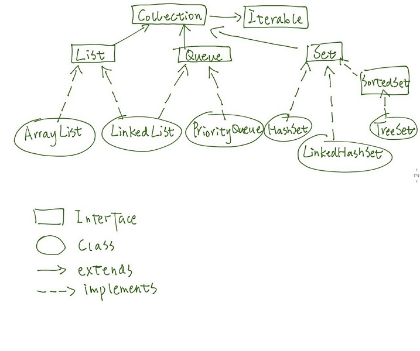
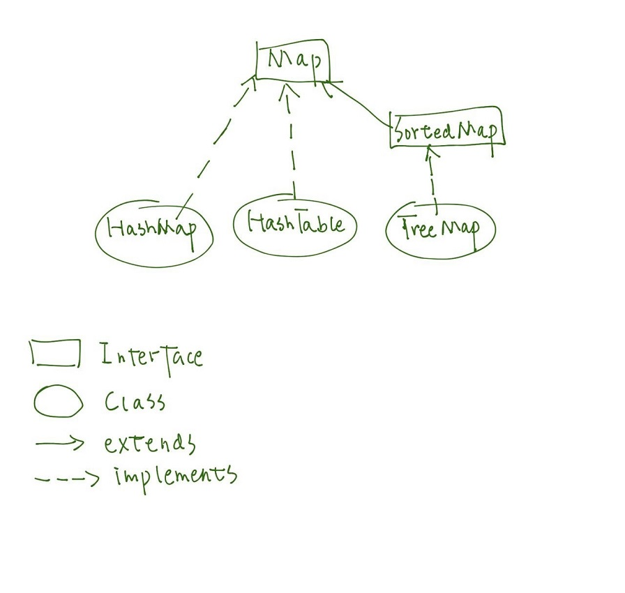
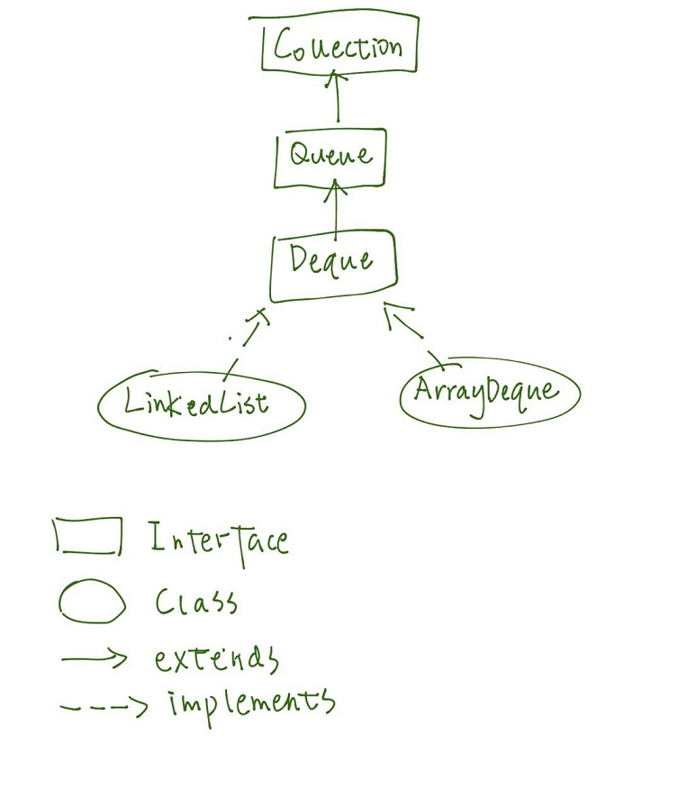

Java 基础

### 普通集合

#### 讲述一下集合类的类继承关系？TreeSet 继承了哪些接口？TreeMap 继承了哪些接口？

- Collection 集合继承关系


- Map 继承关系


- Deque 继承关系


#### ArrayList 与 LinkedList 的实现和区别？

    1. ArrayList 基于动态数组，而 LinkedList 是基于双向链表；
    2. 各个操作的时间复杂度如下：

操作 |          ArrayList 时间复杂度 |　　LinkedList 时间复杂度
---|---|---
get(int index)|　O(1) | O(n) |
add(E element)| 在不需要进行扩容的时候是 O(1)，需要扩容的话是 O(n) | O(1) |
add(int index, E element)| O(n)，因为需要移动 index 之后的数据 | O(n)，因为需要定位到 index，如果 index=0 则为 O(1) |
remove(int index)| O(n)，因为需要将 index 之前的数据往前移动 | O(n)，因为需要定位到 index |
Iterator.remove()| O(n)，因为需要将 index 之前的数据往前移动 | O(1)，无需定位，直接修改指针即可|
ListIterator.add(E element)|O(n)，因为需要移动 index 之后的数据 | O(1)，无需定位，直接修改指针即可|

#### ArrayList 的默认容量？

若在实例化 ArrayList 的时候没有指定容量，则会在第一次执行 `add` 的时候将内部数组初始化为长度 10。

#### LinkedList 在 `get(int index)` 操作时的优化？

会先判断 index 是在链表的左半部份还是右半部份，如果是左半部份则从头节点开始往后查找；否则从尾节点开始往前查找。
```java
private Entry<E> entry(int index) {
    if (index < 0 || index >= size)
        throw new IndexOutOfBoundsException("Index: "+index+
                                            ", Size: "+size);
    Entry<E> e = header;
    if (index < (size >> 1)) {
        for (int i = 0; i <= index; i++)
            e = e.next;
    } else {
        for (int i = size; i > index; i--)
            e = e.previous;
    }
    return e;
}
```

#### HashMap：jdk1.8 之前并发操作 HashMap 时为什么会有死循环的问题？

- 了解其数据结构、hash 冲突如何解决（链表和红黑树）

HashMap 内部维护了一个 `Entry<K,V>[]` 数组，其中 Entry 是一个键值对结构，它的 key 和 value 对应的是 HashMap.put 的 key 跟 value，同时 Entry 中还包含了一个指向下一节点的 next 属性，所以可以将 Entry 数组看作是一个链表数组。当往 HashMap 中添加数据的时候，会将给定 key 的 hash 映射到 Entry 数组的下标，新建一个 Entry 对象，并将 Entry 对象添加到链表的末尾。但是如果有过多元素都被映射到了同一个数组下标，就会导致链表的长度过长，从而在获取元素的时候时间变长，因此在 Java 8 中做了一个判断，如果链表的长度超过了 8，就会将链表转换为一棵**红黑树**（==添加红黑树的描述==），其中树的排序默认按照 key 的 hashcode，而如果 key 的类实现了 `Comparator` 接口的话，则会按照 `compareTo` 的结果进行排序；另外如果树的元素被删除到小于等于 6 个的话，就会将树转换回链表。

- 对 key.hashCode 做了哪些操作来减少哈希冲突？

因为 key 的 hash 在是通过对数组长度进行取余来映射到某个下标的，所以为了尽量避免多个 hash 映射到同一个下标，从而造成哈希冲突，HashMap 采取了一些方法来对 key.hashCode 进行重新计算，使得它们的分布会更平均。本质上都是将 hashCodee 的高位比特与低位比特进行异或操作，从而使得低位比特的值更加平均，因为取余时决定结果的只是低位比特的值。

- HashMap 的数组长度为什么要保证是 2 的幂？

HashMap 选择将数组的大小设置为 2 的幂次方，这样在进行取余的时候，可以直接使用 `hash & (数组长度-1)`，提高了效率。

- 什么时候会触发扩容、扩容时避免 rehash 的优化

为了减少哈希冲突，当 HashMap 中的元素个数，也就是 size 属性大于等于一定大小的时候，会选择将 Entry 数组进行扩容，这个大小为 `loadFactor*数组长度`，其中 `loadFactor` 默认为 0.75。当进行数组扩容的时候，会新建一个原来数组长度 2 倍的新数组，并将旧数组的元素迁移到新数组上。在 Java 7 中，迁移的过程就是直接对旧数组的每一个链表计算它们在新数组的下标，然后拷贝到新数组对应下标，而在 Java 8 中，对迁移过程做了优化。

因为新的数组大小（newLength）是旧数组（oldLength）的两倍，且都是 2 的幂次方，所以 hash 在对 oldLength 和对 newLength 取余时的结果差异只取决于 hash 在 oldLength 的 1 比特所在位的比特值，例如：

```
oldLength=4 -> 0100
newLength=8 -> 1000
hash = 5    -> 0101
oldIndex = hash%oldLength = hash&(oldLength-1) = 0101 & 0011 = 0001
newIndex = hash%newLength = hash&(newLength-1) = 0101 & 0111 = 0101
```

因为 hash 的第一位比特是 1，所以 newIndex 与 oldIndex 不一样，并且比 oldIndex 大了 oldLength，因此可以直接通过：

`hash & oldLength==0` 来判断该元素的新下标是否与原来相同，并且如果不同，可以直接通过 `newIndex=oldIndex+oldLength` 来决定新的数组下标。

- `put(key, val)` 的时候是前插还是后插？

作为链表的最后一个节点插入（如果还没有 treeify 的话）。

- rehash 的时候是前插还是后插？

rehash 时将每个节点作为链表的头插入。

- 并发操作 HashMap 时为什么会有死循环的问题？

存在并发操作导致 map 中的链表出现环的情况。

- 一些默认值

参数 | 默认值
---|---
loadFactor | 0.75
initialCapacity | 16
threshold | loadFactor*initialCapacity = 12

#### LinkedHashMap：了解基本原理、哪两种有序、如何用它实现 LRU？

另外维护了一个双向链表，链表元素为 Map 中的每一个 Entry，从而保持有序性。默认排序是按照元素的插入顺序，也可以指定使用元素的访问顺序进行排序。

LinkedHashMap 有一个构造方法，允许接收一个 Map 对象 ，并返回它的拷贝，同时保持接收 Map 对象元素的插入顺序。

构造一个按照访问顺序排序的 Map：

`LinkedHashMap(int initialCapacity, float loadFactor, boolean accessOrder)`

- 当 accessOrder 为 true，表示按照元素的*访问顺序*进行排序；
- 当 accessOrder 为 false，表示按照元素的*插入顺序*进行排序。

会修改访问顺序的操作：

- put
- get
- putAll

LinkedHashMap 继承了 HashMap，在执行了 put 等方法之后会调用 `afterNodeAccess` 方法，LinkedHashMap 实现了 `afterNodeAccess` 方法，用于对元素按照访问顺序进行排序。

```java
// 将最近一次访问的节点 e 移到链表最后
void afterNodeAccess(Node<K,V> e) { // move node to last
    LinkedHashMap.Entry<K,V> last;
    if (accessOrder && (last = tail) != e) {
        LinkedHashMap.Entry<K,V> p =
            (LinkedHashMap.Entry<K,V>)e, b = p.before, a = p.after;
        p.after = null;
        if (b == null)
            head = a;
        else
            b.after = a;
        if (a != null)
            a.before = b;
        else
            last = b;
        if (last == null)
            head = p;
        else {
            p.before = last;
            last.after = p;
        }
        tail = p;
        ++modCount;
    }
}
```

LinkedHashMap 还提供了一个 `removeEldestEntry` 方法，可以选择覆盖该方法，当该方法返回 true 的时候会移除掉链表头的元素，配合 `accessOrder` 一起使用，则可以实现移除最久没有被访问的元素。

- 使用 LinkedHashMap 实现 LRU，[Leetcode 相关问题](https://leetcode.com/problems/lru-cache/)

```java
public class LRUCache<K, V> {
    private int capacity;
    private Map<K, V> cache;
    private static int DEFAULT_INIT_CAPACITY = 16;
    private static float DEFAULT_LOAD_FACTOR = 0.75F;

    public LRUCache(int capacity) {
        this.capacity = capacity;
        this.cache = new LinkedHashMap<K, V>(DEFAULT_INIT_CAPACITY, DEFAULT_LOAD_FACTOR, true) {
            @Override
            protected boolean removeEldestEntry(Map.Entry<K, V> eldest) {
                return size() > capacity;
            }
        };
    }

    /**
     * return value or null if not contains key
     * @param key
     * @return
     */
    public V get(K key) {
        return cache.get(key);
    }

    /**
     * add {key, value} to cache
     * @param key
     * @param value
     */
    public void put(K key, V value) {
        cache.put(key, value);
    }
}
```

#### TreeMap：了解数据结构、了解其 key 对象为什么必须要实现 Compare 接口、如何用它实现一致性哈希？
#### 修改 Iterator.next() 返回的对象有问题吗？