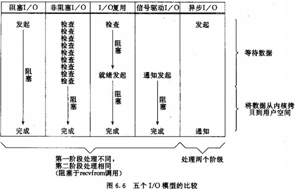

### IO
- 了解 BIO 和 NIO 的区别、了解多路复用机制

读取动作可以分为两个阶段：

1. 等待数据到达的过程；
2. 数据到达之后真正的读取过程，也就是下图中“将数据从内核拷贝到用户空间”的过程。



其中：

1. BIO 在阶段 1、2 都会被阻塞；
2. NIO **在阶段 1 不被阻塞**，但是需要进行轮询（polling）来查看数据到达状态，在阶段 2 仍然是要被阻塞的；
3. 而 I/O 复用通过在阶段 1 调用一个 `select` 函数来阻塞自己，该函数**等待其监控的多个 socket 中的任意一个变为可读**，I/O 复用可以通过一个线程来管理多个 socket，从而提高了效率。

- 同步阻塞、同步非阻塞、异步的区别？

同步：指的是一个进程（线程）在进行了方法调用之后，需要等待调用结果返回才能继续别的任务（这里的等待可以是直接进入阻塞状态，或者不进入阻塞，而通过自身的不断轮询去查询调用结果）；

异步：指的是一个进程（线程）在进行了方法调用之后，可以马上继续别的任务，之后该方法调用的结果会通过回调的方式通知给调用进程（线程）；

阻塞：进程（线程）在进行了方法调用之后，自己会被设置为睡眠状态（不能被 CPU 调度运行）；

非阻塞：进程（线程）在进行了方法调用之后，不会被设置为睡眠状态（仍能被 CPU 调度运行）；

> synchronous generally means an activity that must wait for a reply before the thread can move forward. Blocking refers to the fact that the thread is placed in a wait state (generally meaning it will not be scheduled for execution until some event occurs). From here you can conclude that a synchronous call may involve blocking behavior or may not, depending on the underlying implementation (i.e. it may also be spinning, meaning that you are simulating synchronous behavior with asynchronous calls).
> 
> https://stackoverflow.com/questions/8416874/whats-the-differences-between-blocking-with-synchronous-nonblocking-and-asynch

因此，**阻塞 IO 一定是同步的；非阻塞 IO 也是同步的（因为需要进行不断的轮询）**。

- select、poll、eopll 的区别？

1. select

```c
int select(int maxfdp1, fd_set *readset, fd_set *writeset, fd_set *exceptset, nconst struct timeval *timeout)
返回值：就绪描述符的数目，超时返回 0，出错返回 -1
```

select 的几大缺点：

（1）每次调用 select，都需要把 fd 集合从用户态拷贝到内核态，这个开销在 fd 很多时会很大

（2）同时每次调用 select 都需要在内核遍历传递进来的所有fd，这个开销在 fd 很多时也很大

（3）select 支持的文件描述符数量太小了，默认是1024

2. poll

3. epoll

epoll 包含了三个函数。

- reactor 线程模型是什么?

1. 单请求单线程
2. 线程池
3. reactor


