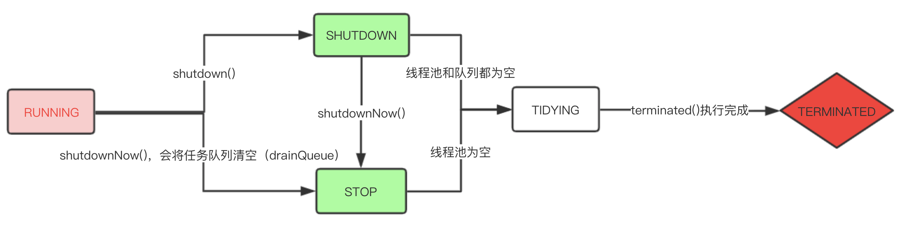

### 线程池 Executors

- 线程池参数

Executors 作为一个工厂类，实际调用的是 ThreadPoolExecutor 的构造方法，例如：

```java
public ThreadPoolExecutor(int corePoolSize,
                              int maximumPoolSize,
                              long keepAliveTime,
                              TimeUnit unit,
                              BlockingQueue<Runnable> workQueue,
                              ThreadFactory threadFactory) 
```

1. corePoolSize：指定核心线程的数量，默认不被空闲回收；
2. maximumPoolSize：指定最大线程数，当与 corePoolSize 相等时即为 fixedThreadPool；
3. keepAliveTime：线程空闲保持时间，非 core 线程在空闲超过这个时间后会被回收；
4. workQueue：任务队列，可以是无限队列，也可以是有限队列，初始时队列内可以有任务；
5. threadFactory：用于创建线程池中线程的工厂类。

- 线程池类型

1. `Executors.newSingleThreadExecutor()`：单线程的线程池，所有任务会依次执行；
2. `Executors.newFixedThreadPool(int nThreads)`：指定线程数量的线程池，所有任务根据调度被获取执行；
3. `Executors.newCachedThreadPool()`：缓存线程池，在需要的时候会新创建线程，如果一个线程空闲超过 60s，则会被销毁，从而回收资源；
4. `Executors.newWorkStealingPool()`：1.8 新增，工作窃取线程池。
5. `Executors.newScheduledThreadPool(int corePoolSize)`：延时线程池，用于执行定时或延迟执行的任务；
6. `Executors.newSingleThreadScheduledExecutor()`：延时线程池，只有一个线程，所有任务顺序执行，如果任务执行报错导致线程终止，会自动新建一个线程。

- 为什么不推荐使用 Executors 来创建线程池？

1. CachedThreadPool 和 ScheduledThreadPool 最大线程数为 Integer.MAX_VALUE，如果线程无限地创建，会造成 OOM 异常；
2. FixedThreadPool 和 SingleThreadPool 使用的任务队列是 LinkedBlockingQueue，是无界的，默认大小是 Integer.MAX_VALUE，如果队列被无限地堆积任务，会造成OOM异常。

- 线程池生命周期

ThreadPoolExecutor 内部使用了一个 AtomicInteger 来维护线程池状态以及工作线程数（workerCount），将 32 位的 int 类型的**低 29 位**用于线程计数，**高 3 位**用于表示线程池状态。线程池可以有以下状态：

线程池状态 | 代表的数字 |
---|---|
RUNNING|-1|
SHUTDOWN|0|
STOP|1|
TIDYING|2|
TERMINATED|3|

其中，线程池状态的值只能是递增的，但不需要经过每一个状态。状态转移过程如下：



- 当向线程池提交一个任务时会发生什么？

1. 当线程数 < corePoolSize 的时候，会创建一个新的线程来执行该任务；
2. 当线程数 >= corePoolSize 的时候，如果：
    1. 任务队列未满（或者是无限队列），将任务入队列，等待被执行；
    2. 任务队列已满（或者是 SynchronousQueue），如果：
        1.  线程数 < maximumPoolSize：创建新的线程来执行该任务；
        2.  否则，根据 RejectPolicy 来处理该任务。

- 如何提前创建 core thread？

可以通过 `prestartCoreThread()` 来提前创建一个 core thread；或者通过 `prestartAllCoreThreads()` 来提前创建所有 core thread。这在任务队列初始不为空的时候会很有用。

- 任务拒绝

出现场景：

1. 线程池已被关闭；
2. 使用了有限队列以及 maximumPoolSize 不为 MAX_VALUE，且都已达到容量最大值；

通过调用 ThreadPoolExecutor 的 `RejectedExecutionHandler` 对象的 `rejectedExecution` 方法来拒绝一个任务。

拒绝策略有以下几种：

1. AbortPolicy：抛出异常，**默认**；
2. CallerRunsPolicy：使用调用 execute 方法的线程来执行该任务，从而降低新任务的提交速度（因为提交任务的线程已经被占用来处理任务了）；
3. DiscardPolicy：直接丢弃该任务；
4. DiscardOldestPolicy：丢弃队列头的任务，也就是等待了最久时间的任务，然后重新尝试提交当前任务。

- 线程池创建一个线程的流程是怎样的？

线程池在新的任务被提交时决定是否增加新的线程来处理该任务。

线程池内部通过 Worker 类来封装一个线程，同时 Worker 也实现了 Runnable 接口。

在 addWorker 方法中初始化一个 Worker，而 Worker 在初始化的时候会通过 ThreadFactory 创建一个新的线程，同时将自己作为 Runnable 对象传入。

当该线程的 start 方法被调用的时候，就会执行 Worker 的 run() 方法。该 run 方法的逻辑就是不断从任务队列获取任务，並执行。

- 线程池中的哪些线程会被在什么时候被回收？是如何实现的？

1. 非 core 线程：等待任务时间超过 `keepAliveTime` 的线程会被回收； 
2. core 线程默认不进行回收，但也可以通过方法 `allowCoreThreadTimeOut(boolean value)` 设置进行 core 线程的回收，等待时间一样使用 `keepAliveTime`。