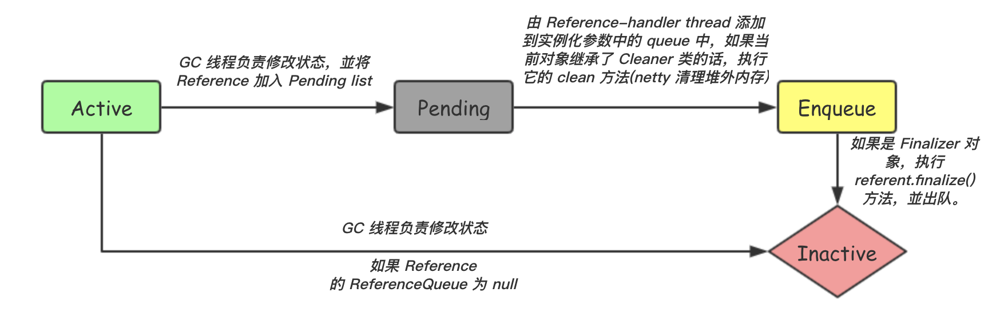

### 内存分配

- 所有对象都是在堆上创建的吗?

不是的，随着 JIT 编译器的发展，在编译期间，如果 JIT 经过逃逸分析，发现有些对象没有逃逸出方法，那么有可能堆内存分配会被优化成栈内存分配。

- 逃逸分析

逃逸分析就是 分析Java对象的动态作用域。当一个对象被定义之后，可能会被外部对象引用，称之为“方法逃逸”；也有可能被其他线程所引用，称之为“线程逃逸”。

利用逃逸分析，编译器可以对代码做如下优化：

1. 同步省略：即锁消除；
2. 标量替换：不分配对象，而只是分配对象的基本数据类型属性，如：
```java
// 标量替换前
private static void getUser() {
    User user = new User("张三", 18);
    System.out.println("user name is " + user.name + ", age is " + user.age);
}

// 标量替换后
private static void getUser() {
    String name = "张三";
    int age = 18;
    System.out.println("user name is " + name + ", age is " + age);
}
```

-XX:+DoEscapeAnalysis 开启逃逸分析，jdk1.8 默认开启；

-XX:-DoEscapeAnalysis 关闭逃逸分析

3. 栈上分配：指对象和数据不是创建在堆上，而是创建在栈上，随着方法的结束自动销毁。但实际上，JVM 例如常用的 HotSpot 虚拟机并没有实现栈上分配，实际是用标量替换代替实现的。

- 基本数据类型在哪里分配？

取决于该变量是在哪里被声明的。

1. 对于类变量和静态变量的基本数据类型，是存储在堆上（类静态变量分配在方法区上？）的。而对于方法的局部变量基本数据类型，是存储在栈上的。
2. 对于引用类型中的基本数据类型，一般是跟随着该引用类型一起分配在堆上的，但是由于逃逸分析的原因，该引用类型对应的对象可能被分配在栈上，从而其含有的基本数据类型也就分配在栈上了。

#### 虚拟机分区


虚拟机的内存可分为：程序计数器、虚拟机栈、本地栈、堆、方法区，

各个区的作用如下：

1. 程序计数器：当前线程执行的字节码的行号指示器；
2. 虚拟机栈：**它的生命周期与线程相同，虚拟机栈描述的是 Java 方法执行的内存模型**。每个方法在执行的同时都会创建一个栈帧用于存储局部变量表（方法参数和方法内部定义的局部变量）、操作数栈、动态链接、方法返回地址等信息。**每一个方法从调用直至执行完成的过程，就对应着一个栈帧在虚拟机栈中入栈到出栈的过程**；
3. 本地栈：即对本地方法调用的方法栈；
4. 堆：是虚拟机中最大的一块内存，用于存放对象实例，虚拟机内的对象都在这块区域上进行分配，也是垃圾回收的主要关注区域；
5. 方法区：用于存储已被虚拟机加载的类信息、常量、静态变量、JIT 编译后的代码等。

其中，程序计数器、虚拟机栈、本地栈是线程私有的；堆、方法区是线程共享的。

- 为什么要把堆和栈区分出来呢？栈中不是也可以存储数据吗？

1. 栈是线程私有的，代表了一个线程执行过程中方法的调用；而堆是线程共享的，堆上的内存可以被多个线程访问（线程通信的内存共享方式）；
2. 程序需要事先知道栈所需内存的大小，且栈只能向上增长，栈内存储的是对应每一个方法调用的栈帧，栈帧上的变量生命周期短，方法执行完了该栈帧就被 pop 了，因此会限制住栈存储内容的能力。而堆不同，堆的大小可以根据需要动态增长；
3. 栈上内存的分配和回收比堆快很多（只需要移动栈顶指针），因此可以加快程序调用。

总结：栈主要用来执行程序，堆主要用来存放对象，为栈提供数据存储服务。也正是因为堆与栈分离的思想才使得 JVM 的垃圾回收成为可能。

- 方法区会不会发生内存溢出？

会的，例如当虚拟机加载的类过多的时候，方法区就无法放下所有的类信息从而发生溢出（例如 cglib 动态生成类的场景）。方法区发生溢出的几种场景：

1. 加载过多的类；
2. 存在过多的常量，导致常量池溢出；

- 方法区会进行动态拓展吗？

JVM使用 -XX:PermSize 设置非堆内存初始值，默认是物理内存的 1/64；由XX:MaxPermSize 设置最大非堆内存的大小，默认是物理内存的 1/4。MaxPermSize 缺省值和 -server -client 选项相关，-server 选项下默认 MaxPermSize 为 64m，-client 选项下默认 MaxPermSize 为 32m。

- 通过 `Xss128K` 设置每个线程的堆栈大小，将方法栈的大小设置为为 128K。JDK5 以后每个线程堆栈大小为 1M，以前每个线程堆栈大小为 256K。
- [对象大小的计算](object_size.md)
- 方法栈中的引用如何定位到堆中的对象？

1. 使用句柄访问


2. 使用指针定位


优缺点：

1. 使用句柄来访问的最大好处就是 reference 中存储的是稳定的句柄地址，在对象被移动（垃圾收集时移动对象是非常普遍的行为）时只会改变句柄中的实例数据指针，而 reference 本身不需要修改。

2. 使用直接指针访问方式的最大好处就是速度更快，它节省了一次指针定位的时间开销，由于对象的访问在 Java 中非常频繁，因此这类开销积少成多后也是一项非常可观的执行成本。

- Hotspot 虚拟机在 Java 7 和 Java 8 做了哪些改动？为什么做这些变动？

*在 Java 7 中将方法区的字符串常量池移动到了堆内*；在 Java 8 中移除了原有的永久代，改用 MetaSpace 替代，並使用了本地内存。

移除的原因如下：

> This is part of the JRockit and Hotspot convergence effort. JRockit customers do not need to configure the permanent generation (since JRockit does not have a permanent generation) and are accustomed to not configuring the permanent generation.
>
> http://openjdk.java.net/jeps/122

也就是为了 Hotspot 与 JRockit 的融合，因为 JRockit 是没有使用永久代的；另外，持久代大小受到 `-XX：MaxPermSize` 和 JVM 设定的内存大小限制，这就导致在使用中可能会出现持久代内存溢出的问题，因此在 `Java 8` 及之后的版本中彻底移除了持久代而使用 `Metaspace` 来进行替代。

- MetaSpace 的说明

元数据区默认使用操作系统所有可用内存。

从 Java 8 开始的元数据区默认是没有最大空间限制的，这是因为在 Java 代码稳定运行前，很难确定需要加载多少类，因此也就很难确定元数据区的大小。

正因为没有设置最大值，所以会有耗尽内存的潜在可能。当应用程序大概知道需要使用多少元数据的时候，为了让元数据区内存保持在合理的大小范围之内，不至于耗尽所有可用内存，可以设置 `-XX:MaxMetaspaceSize =***M`。

- metaspace 的动态拓展

### [javac 编译过程](javac.md)
### [类加载](类加载.md)

### GC
- 垃圾回收基本原理

可达性分析：通过判断从 GC Root 到目标对象之间有没有一条引用链相连，来判断该对象可否被回收。其中可以做为 GC Roots 的对象有：

1. 虚拟机栈（栈帧中的局部变量表）中引用的对象；
2. 方法区中引用类型静态变量；
3. 方法区中引用类型常量；
4. 本地方法栈中 JNI（即一般说的 Native 方法）引用的对象。

- 了解 Java 中的强引用、软引用、弱引用、虚引用的适用场景以及释放机制

> 强引用就是指在程序代码之中普遍存在的，类似 "Object obj = new Object()" 这类的引用，只要强引用还存在，垃圾收集器永远不会回收掉被引用的对象。
>
> 软引用是用来描述一些还有用但并非必需的对象。*对于软引用关联着的对象，在系统将要发生内存溢出异常之前，将会把这些对象列进回收范围之中进行第二次回收。如果这次回收还没有足够的内存，才会抛出内存溢出异常*。在 JDK1.2 之后，提供了 SoftReference 类来实现软引用。
>
> 弱引用也是用来描述非必需对象的，但是它的强度比软引用更弱一些，*被弱引用关联的对象只能生存到下一次垃圾收集发生之前。当垃圾收集器工作时，无论当前内存是否足够，都会回收掉只被弱引用关联的对象*。在 JDK1.2 之后，提供了 WeakReference 类来实现弱引用。还有 WeakHashMap ，其 key 是一个 WeakReference，当内存中的引用只剩下这个 WeakReference 的 key 的时候，虚拟机就能够自动将其对应的内存进行回收。（**补充 WeakHashMap 中 value 回收的过程**）
>
> 虚引用也称为幽灵引用或者幻影引用，它是最弱的一种引用关系。一个对象是否有虚引用的存在，完全不会对其生存时间构成影响，也无法通过虚引用来取得一个对象实例。为一个对象设置虚引用关联的唯一目的就是能在这个对象被收集器回收时收到一个系统通知。在 JDK1.2 之后，提供了 PhantomReference 类来实现虚引用。
>
> 周志明. 深入理解Java虚拟机：JVM高级特性与最佳实践

- `System.gc()` 方法执行的是哪一类 gc？

在 hotspot 上触发的是 full gc，可以通过参数 `-XX:+DisableExplicitGC` 来禁用它。

- Reference 类型及其状态转换


其中，Finalizer 对应强引用，SoftReference 对应软引用，WeakReference 对应弱引用，PhantomReference 对应虚引用。

在实例化一个 `java.lang.ref.Reference` 时可以指定一个 ReferenceQueue，该 ReferenceQueue 会影响后续 Reference 对象的回收过程。

Reference 对象的状态转换：



其中，[ReferenceHandler](tryHandlePending.md) 线程会在 Reference 类加载的时候启动，负责调用 Cleaner 类的 clean 方法，以及将 Reference 对象移入 ReferenceQueue（状态变为 Enqueue）。

ReferenceQueue 的作用是存储那些将被回收的 Reference，用户代码可以遍历队列，来进行例如清理的工作，当 Reference 对象被移出 ReferenceQueue 的时候就变为 Inactive。

强引用 Finalizer 类会在类加载的时候启动一个 FinalizerThread 线程，**来对 ReferenQueue 中的 Reference 对象逐一执行它们的 referent 的 `finalize()` 方法**，并且将其移出队列。

而对于非 Finalizer 类的 Reference 对象，则需要自己实现将 Reference 对象移出队列的过程（**存疑**），例如：[WeakHashMap.expungeStaleEntries](expungeStaleEntries.md) 方法对继承了 WeakHashMap 的 Entry 对象进行了移出队列操作，并且将 Entry 移出数组链表。

- 几种垃圾回收算法

1. 标记清除（Mark-Sweep）：先标记然后直接清除掉被标记的内存区域，会造成内存碎片；
2. 复制算法（Copying）：需要划分为两个区域，然后将一个区域的存活对象复制到另一个区域，使得其中总是有一块区域不能够被使用，造成浪费且在存活对象较多的情况下需要做大量复制操作，效率降低；
3. 标记整理（Mark-Compact）：在标记完之后不是直接进行清除，而是让所有存活的对象都向一端移动，然后直接清理掉端边界意外的内存。

存活对象比例低的新生代适合复制算法，而存活比例高的老年代则适合标记清除或标记整理算法。

- 垃圾回收的 3 个关键指标

1. 吞吐量：衡量垃圾回收器运行在性能峰值的时候不需要关心垃圾回收器暂停的时间或者需要占用内存的能力；
2. 延迟：衡量垃圾回收器最小化甚至消灭由垃圾回收器引起的暂停时间和应用抖动的能力；
3. 内存占用：衡量为了高效的运行，垃圾回收器需要的内存。

- 几种常见的垃圾回收器的特性、重点了解 CMS（或 G1）以及一些重要的参数

1. 按照单/多线程划分：

单线程：Serial（STW）、Serial Old（STW）

多线程：ParNew（STW）、Parallel Scavenge、Parallel Old（STW）、CMS、G1

2. 按照垃圾回收区域划分

新生代：Serial、ParNew、Parallel Scavenge

老年代：Serial Old、Parallel Old、CMS

其中 G1 收集器没有使用新生代/老年代的概念，而是对整个堆内存进行回收。

3. 按照采用的垃圾回收算法划分

标记清除（Mark-Sweep）：CMS、

复制（Copying）：Serial、ParNew、Parallel Scavenge、

标记整理（Mark-Compact）：Serial Old、Parallel Old

其中，G1 从整体来看是基于“标记-整理”算法实现的收集器，从局部（两个 Region 之间）上看是基于“复制”算法的。

CMS（Concurrent Mark Sweep）

针对老年代的并发的标记清除算法。

- [如何选择垃圾收集器？](http://novoland.github.io/jvm/2014/07/27/gc.html)

1. 单 CPU 或小内存，单机程序：

-XX:+UseSerialGC

2. 多 CPU，需要最大吞吐量，如后台计算型应用：

-XX:+UseParallelGC 或 -XX:+UseParallelOldGC

3. 多 CPU，追求最低停顿时间，需要快速响应如互联网应用：

-XX:+UseConcMarkSweepGC -XX:+UseParNewGC

4. 自动选择

	1. 吞吐量优先：-XX:GCTimeRatio=n
	2. 暂停时间优先：-XX:MaxGCPauseMills=n

- CMS GC 回收分为哪几个阶段？分别做了什么事情？

1. 初始标记

初始标记仅仅只是标记一下老年代中 GCRoots 能直接关联到的对象或者是被新生代指向的对象，速度很快，**需要停止其他正在运行的线程**。

2. 并发标记

并发标记阶段就是进行 GCRoots Tracing 的过程，可以与其他用户线程一起并发。在此过程中，如果有新生代对象被修改，指向了老年代对象，对应的 card table 会被更新。

3. 并发预清理：Concurrent Preclean

根据步骤 2 的 card table 来更新老年代中的对象可达性。此阶段执行完后，清空 card table。

**在新生代找指向老年代的对象，需要扫描新生代的所有对象。在老年代找指向新生代的对象，因为老年代持有新生代对象引用的情况不足 1%，可以使用 card table 来记录每个老年代对象的跨区引用**。卡表的具体策略是将老年代的空间分成大小为 512B 的若干张卡（card）。卡表本身是单字节数组，数组中的每个元素对应着一张卡，当发生老年代引用新生代时，虚拟机将该卡对应的卡表元素设置为适当的值。GC时通过扫描卡表就可以很快的识别哪些卡中存在老年代指向新生代的引用。这样虚拟机通过空间换时间的方式，避免了全堆扫描。

> Precleaning is also a concurrent phase. Here in this phase we look at the objects in CMS heap which got updated by promotions from young generation or new allocations or got updated by mutators while we were doing the concurrent marking in the previous concurrent marking phase. By rescanning those objects concurrently, the precleaning phase helps reduce the work in the next stop-the-world “remark” phase.

4. 并发可中断预清理：Concurrent Abortable Preclean

新生代垃圾回收完剩下的对象全是活着的，并且活着的对象很少。如果能在并发可中断预清理阶段发生一次 Minor GC，那重新标记 STW 时间就会缩短很多。

CMS 有两个参数：CMSScheduleRemarkEdenSizeThreshold、CMSScheduleRemarkEdenPenetration，默认值分别是2M、50%。

`-XX:CMSScheduleRemarkEdenSizeThreshold`（默认2m）：控制并发可中断预清理阶段什么时候开始执行，即当 Eden 区使用超过此值时，才会开始此阶段。

`-XX:CMSScheduleRemarkEdenPenetratio`（默认50%）：控制并发可中断预清理阶段什么时候结束执行。

所以两个参数组合起来的意思是 Eden 空间使用超过 2M 时启动可中断的并发预清理，直到 Eden 空间使用率达到 50% 时中断，进入重新标记阶段。

那可终止的预清理要执行多长时间来保证发生一次 Minor GC 呢？答案是没法保证。道理很简单，因为垃圾回收是 JVM 自动调度的，什么时候进行 GC 我们控制不了。

但此阶段总有一个执行时间吧。CMS 提供了一个参数 CMSMaxAbortablePrecleanTime ，默认为 5S。只要到了 5S，不管发没发生 Minor GC，有没有到 CMSScheduleRemardEdenPenetration 都会中止此阶段，进入下一阶段。

如果在 5S 内还是没有执行 Minor GC 怎么办？CMS 提供 CMSScavengeBeforeRemark 参数，使重新弄标记前强制进行一次 Minor GC。

这样做利弊都有：
	1. 好的一面是减少了重新标记阶段的停顿时间；
	2. 坏的一面是 Minor GC 后紧跟着一个重新标记的 STW，如此一来，停顿时间也比较久。

5. 重新标记：多线程进行

重新标记阶段则是为了修正并发标记期间因用户程序继续运作而导致标记产生变动的那一部分对象的标记记录，这个阶段的停顿时间一般会比初始标记阶段稍长一些，但远比并发标记的时间短，**需要停止其他正在运行的线程**。

> Usually CMS tries to run final remark phase when Young Generation is as empty as possible in order to eliminate the possibility of several stop-the-world phases happening back-to-back：所以引入了 abortable preclean。

6. 并发清除

清除不可达对象，将空闲内存加入到 free list。

7. Concurrent Reset

> Concurrently executed phase, resetting inner data structures of the CMS algorithm and preparing them for the next cycle.

- CMS 的垃圾收集日志说明

> CMS-initial-mark indicates the start of the concurrent collection cycle, CMS-concurrent-mark indicates the end of the concurrent marking phase, and CMS-concurrent-sweep marks the end of the concurrent sweeping phase. Not discussed previously is the precleaning phase indicated by CMS-concurrent-preclean. Precleaning represents work that can be done concurrently in preparation for the remark phase CMS-remark. The final phase is indicated by CMS-concurrent-reset and is in preparation for the next concurrent collection.

> the CMS collector is generational; thus both minor and major collections occur.

> The CMS collector throws an OutOfMemoryError if too much time is being spent in garbage collection: if more than 98% of the total time is spent in garbage collection and less than 2% of the heap is recovered, then an OutOfMemoryError is thrown. This feature is designed to prevent applications from running for an extended period of time while making little or no progress because the heap is too small. If necessary, this feature can be disabled by adding the option -XX:-UseGCOverheadLimit to the command line.
>
> The policy is the same as that in the parallel collector, except that time spent performing concurrent collections is not counted toward the 98% time limit. In other words, only collections performed while the application is stopped count toward excessive GC time. Such collections are typically due to a concurrent mode failure or an explicit collection request (for example, a call to System.gc).

- CMS 什么时候触发回收？

> Based on recent history, the CMS collector maintains estimates of the time remaining before the tenured generation will be exhausted and of the time needed for a concurrent collection cycle. Using these dynamic estimates, a concurrent collection cycle is started with the aim of completing the collection cycle before the tenured generation is exhausted. These estimates are padded for safety, because concurrent mode failure can be very costly.

> A concurrent collection also starts if the occupancy of the tenured generation exceeds an initiating occupancy (a percentage of the tenured generation). The default value for this initiating occupancy threshold is approximately 92%, but the value is subject to change from release to release. This value can be manually adjusted using the command-line option -XX:CMSInitiatingOccupancyFraction=<N>, where <N> is an integral percentage (0 to 100) of the tenured generation size.

在 JDK 1.5 中预留空间为 68%，也就是老年代空间使用了 68% 之后会触发 CMS 进行回收。在 1.6 中提高到 92%。

- CMS 有哪些重要参数？

1. 设置使用 CMS 收集器：`-XX：+UseConcMarkSweepGC`，默认 HotSpot JVM 使用的是并行收集器；
2. 设置预留给用户线程执行所需的内存空间，预留的空间大小可以通过参数 `-XX:CMSInitiatingOccupancyFraction=N(0-100)` 设置；
3. 使用增量回收模式：`-XX:+CMSIncrementalMode`，在并发标记、清理的时候让 GC 线程、用户线程交替执行，尽量减少 GC 线程独占资源的时间，同时也会使得 GC 的时间变长；
4. 设置开启合并整理过程：`-XX:+UseCMSCompactAtFullCollection`，用于开启内存整理，默认是开启的，但会使得停顿时间变长，因为整理过程是不能并发的；
5. `-XX:CMSFullGCsBeforeCompaction=N`，设置进行多少次不整理的回收后就会进行一次带整理的回收，默认为 0，即每次回收都会进行内存整理。

- Concurrent Mode Failure 的出现场景

CMS 的回收线程因为是与用户线程并发执行的，所以需要预留足够的内存空间给用户线程执行所需，CMS 会在老年代使用了预留空间大小的内存后被激活，可以通过参数 `-XX:CMSInitiatingOccupancyFraction` 来设置，在 JDK 1.5 中预留空间为 68%，也就是老年代空间使用了 68% 之后会触发 CMS 进行回收。在 1.6 中提高到 92%。要是 CMS 运行期间预留的内存无法满足程序需要，就会出现一次 "Concurrent Mode Failure" 失败，这时虚拟机将启动后备预案：*临时启用 SerialOld 收集器来重新进行老年代的垃圾收集*，这样停顿时间就很长了。

- CMS 的优缺点？

优点：并发收集，低停顿。

缺点：

1. 不能处理浮动垃圾，也就是在并发清除过程中用户线程产生的垃圾，因为这部分垃圾并没有被标记到，所以无法进行回收；
2. 在并发阶段，它虽然不会导致用户线程停顿，但是会因为占用了一部分线程（或者说CPU资源）而导致应用程序变慢，总吞吐量会降低。CMS默认启动的回收线程数是（CPU数量+3）/4，也就是当CPU在 4 个以上时，并发回收时垃圾收集线程不少于 25% 的CPU资源，并且随着 CPU 数量的增加而下降；
3. CMS 使用的是标记清除算法，在垃圾收集完成后会产生大量空间碎片；
4. 在堆空间比较大的情况下，标记垃圾的时间会变长，使得停顿时间变久。

#### G1

G1 相比 CMS，其停顿时间可预测。

G1 的回收过程大致分为四个阶段：

1. 初始标记：STW，只标记 GC Roots 直接可达的对象；
2. 并发标记：与用户线程并发执行，从 GC Roots 对堆对象进行可达性分析，这阶段发生的引用变动记录到 Remember Set Logs 中；
3. 最终标记：STW，可并行执行，根据 Remembet Set Logs 对 Remember Set 进行更新；
4. 筛选回收：对各个 Region 的回收价值和成本进行排序，根据用户所期望的 GC 停顿时间来制定回收计划，这个阶段可以并发进行，也可以 STW 和并行执行，从而提高回收效率。

> G1 has a cleanup phase at the end of a collection which is partly STW and partly concurrent. The STW part of the cleanup phase identifies empty regions and determines old regions that are candidates for the next collection. The cleanup phase is partly concurrent when it resets and returns the empty regions to the free list.

- Region 的概念

G1 将整个堆内存分为多个大小相等的独立区域 Region，Region 的大小可以在 1MB-32MB 之间，最多不超过 1024 个 Region，每次回收都在 Region 上进行。新生代和老年代不再是物理隔离的，而是一部分 Region 的集合（不需要连续）。每个 Region 对应有一个 Remember Set，用于记录其他 Region 指向本 Region 内对象的记录。

G1 会将其他 Region 上存活的对象拷贝到另一个 Region 上，从而减少内存碎片。

- 按回收效益和停顿时间来确定回收的 Region

G1 跟踪各个 Region 里面的垃圾堆积的价值大小（回收所获得的的空间大小以及回收所需时间的经验值），在后台维护一个优先列表，每次根据允许的收集时间，优先回收价值最大的 Region。

- G1 的使用场景

1. 大堆内存：在单 Region 上的回收依然很快；
2. 多核多 CPU：可以并发进行收集，降低停顿时间；
3. 追求低停顿时间。
- 分代是如何实现的
- 大对象的分配

> For G1 GC, any object that is more than half a region size is considered a humongous object. Such an object is allocated directly in the old generation into humongous regions. These humongous regions are a contiguous set of regions. StartsHumongous marks the start of the contiguous set and ContinuesHumongous marks the continuation of the set.
>
> Before allocating any humongous region, the marking threshold is checked, initiating a concurrent cycle, if necessary.
>
> Dead humongous objects are freed at the end of the marking cycle during the cleanup phase and also during a full garbage collection cycle.
>
> To reduce copying overhead, the humongous objects are not included in any evacuation pause. A full garbage collection cycle compacts humongous objects in place.
>
> Because each individual set of StartsHumongous and ContinuesHumongous regions contains just one humongous object, the space between the end of the humongous object and the end of the last region spanned by the object is unused. For objects that are just slightly larger than a multiple of the heap region size, this unused space can cause the heap to become fragmented.
>
> If you see back-to-back concurrent cycles initiated due to humongous allocations and if such allocations are fragmenting your old generation, then increase the value of -XX:G1HeapRegionSize such that previous humongous objects are no longer humongous and will follow the regular allocation path.

- [G1 的缺点](http://mail.openjdk.java.net/pipermail/hotspot-gc-use/2012-November/001430.html)

1. 追求低停顿时间，因而吞吐量比较低：不适合计算型应用（93% 相比 ParallelGC 的 98.7%）；
2. 不适合小堆：G1 带来的复杂度高于其收益；
3. 只能在 JDK 6 以上版本使用：first available in Java 6u20；
4. 平均停顿时间长：200-500ms，默认是 200ms，而 ParallelGC 的 minor gc 停顿时间则小于 100ms（**跟 CMS 比较**）。

- G1 的虚拟机参数

|参数| 作用|
---|---|
-XX:G1HeapRegionSize=n|设置 Region 的大小，单位 MB|
-XX:MaxGCPauseMillis=200|设置回收最长停顿时间，默认 300ms|
-XX:InitiatingHeapOccupancyPercent=45|设置触发垃圾回收的空间占用比率，默认 45%|
-XX:G1ReservePercent=10|设置用于 to 空间的内存比率，回收后存活的对象被拷贝到这个空间，默认为 10%|

- 其他注意点

1. 不要设置 G1 新生代的大小

- Java 8 的默认垃圾收集器：Parallel Scavenge + Serial Old
- 有做过哪些 GC 调优？
- 为什么要划分成年轻代和老年代？

> 一般是把 Java 堆分为新生代和老年代，这样就可以根据各个年代的特点采用最适当的收集算法。在新生代中，每次垃圾收集时都发现有大批对象死去，只有少量存活，那就选用复制算法，只需要付出少量存活对象的复制成本就可以完成收集。而老年代中因为对象存活率高、没有额外空间对它进行分配担保，就必须使用“标记—清除”或者“标记—整理”算法来进行回收。
>
> 周志明. 深入理解Java虚拟机：JVM高级特性与最佳实践（第2版）

- 年轻代和老年代的比例

默认的，年轻代与老年代的比例的值为 1:2 ( 该值可以通过参数 `–XX:NewRatio` 来指定），即：年轻代= 1/3 的堆空间大小。老年代= 2/3 的堆空间大小。其中，新生代被细分为 Eden 和 两个 Survivor 区域，这两个 Survivor 区域分别被命名为 from 和 to，以示区分。

默认的，Edem:from:to = 8:1:1（可以通过参数 `–XX:SurvivorRatio` 来设定），即：Eden = 8/10 的新生代空间大小，from = to = 1/10 的新生代空间大小。

堆大小 = 新生代 + 老年代。其中，堆的大小可以通过参数 –Xms、-Xmx 来指定，新生代的大小用 -Xmn 指定，-XX:NewSize 指定新生代初始大小，-XX:MaxNewSize=1024MB 指定新生代最大值。

*增大新生代的大小，可以降低 minor gc 的频率，但不一定会增大 minor gc 的时间，因为 minor gc 的耗时和要拷贝的对象数量相关*。

- 年轻代对象什么时候会进入老年代？

1. 大对象：虚拟机提供了一个 `-XX:PretenureSizeThreshold` 参数，令大于这个设置值的对象直接在老年代分配。这样做的目的是避免在 Eden 区及两个 Survivor 区之间发生大量的内存复制；
2. 存活超过一定时间的对象：通过设置 `以XX:MaxTenuringThreshold=1` 来指定对象存活过多少次 minor gc 就移入老年代，默认是 15；
3. 如果在 Survivor 空间中相同年龄所有对象大小的总和大于 Survivor 空间的一半，年龄大于或等于该年龄的对象就可以直接进入老年代，无须等到 MaxTenuringThreshold 中要求的年龄；
4. minor gc 后 to 区无法存放下所有存活对象，则一部分被分配担保到老年代。

- JVM引入动态年龄计算的原因

主要基于如下两点考虑：

1. 如果固定按照 MaxTenuringThreshold 设定的阈值作为晋升条件：
	1. MaxTenuringThreshold 设置的过大，原本应该晋升的对象一直停留在 Survivor 区，直到 Survivor 区溢出，一旦溢出发生，Eden+Svuvivor 中对象将不再依据年龄全部提升到老年代，这样对象老化的机制就失效了；
	2. MaxTenuringThreshold 设置的过小，“过早晋升”即对象不能在新生代充分被回收，大量短期对象被晋升到老年代，老年代空间迅速增长，引起频繁的 Major GC。分代回收失去了意义，严重影响GC性能；
2. 相同应用在不同时间的表现不同：特殊任务的执行或者流量成分的变化，都会导致对象的生命周期分布发生波动，那么固定的阈值设定，因为无法动态适应变化，会造成和上面相同的问题。

- ParNew promotion failed 的出现场景

在进行 minor gc 时，因为 survivor 区域不足以放下所有存活的对象，因此需要将一部分对象放入老年代中，而如果这时候老年代的空间也不足的话，就会出现 “ParNew promotion failed”。

- 什么时候会触发垃圾回收？

触发 GC 运行的条件要分新生代和老年代的情况来进行讨论，有以下几点会触发GC：

1. 当 Eden 区和 From Survivor 区满时；
2. 调用 `System.gc()` 时，系统建议执行 Full GC，但是不必然执行；
3. 老年代空间不足；
4. 方法区空间不足；
5. 老年代的可用内存小于历次晋升的新生代对象的平均大小；
6. 由 Eden 区、From Space 区向 To Space 区复制时，对象大小大于 To Space 可用内存，则把该对象转存到老年代，且老年代的可用内存小于该对象大小。

- [手动触发 3 次 minor gc、2 次 full gc，再 2 次 minor gc](手动触发GC.md)

- 什么情况下使用堆外内存？要注意些什么？使用堆外空间的好处是什么？

NIO、Java 8 中的 MetaSpace。用参数 `-XX:MaxDirectMemorySize` 来指定可用堆外内存的最大值。	

好处如下：

1. 减少了垃圾回收的工作，因为不是在堆上分配的内存；
2. 避免了系统调用时要将堆上内存拷贝到本地内存的过程，提升效率；
3. 可以在进程间共享，减少 JVM 间的对象复制，使得 JVM 的分割部署更容易实现；
4. 可以扩展至更大的内存空间。比如超过 1TB 甚至比主存还大的空间。

坏处如下：

1. 堆外内存难以控制，如果内存泄漏，那么很难排查；
2. 堆外内存相对来说，不适合存储很复杂的对象。一般简单的对象或者扁平化的比较适合。

- 堆外内存如何被回收？DirectByteBuffer 是如何回收堆外内存的？

1. PhantomReference 的回收过程

PhantomReference 在被 GC 线程判定为不可达对象之后，会将其状态从 Active 改为 Pending（前提是 PhantomReference 实例化时指定了 ReferenceQueue），並且 Reference 类在类加载时会启动一个线程来负责对 Pending 状态的对象进行处理，该线程就是负责不停地执行一个 `tryHandlePending` 方法，它会判定当前 Pending 状态的对象是不是 Cleaner 类的实例，如果是的话，就执行 Cleaner 的 clean 方法，而 `Cleaner.clean` 方法的作用就是运行 Cleaner 构造方法传入的 Runnable 任务。

2. DirectByteBuffer 实例化的参数说明，Cleaner 的构造参数说明

继承了 PhantomReference 的 Cleaner 在被 GC 的时候会执行其 clean 方法;

在实例化一个 DirectByteBuffer 对象的时候会通过 `unsafe.allocateMemory(size);` 申请本地内存，同时会通过调用 `Cleaner.create(this, new Deallocator(base, size, cap))` 来初始化一个 Cleaner 对象。Cleaner 继承自 PhantomReference，其中参数 this 是当前的 DirectByteBuffer 实例，Deallocator 则是实现了 Runnable 接口的一个 Task。

当 DirectByteBuffer 被回收的时候，其引用的 Cleaner 也会被回收。因为 Cleaner 是一个 PhantomReference，所以要遵循 PhantomReference 的回收规则。

根据“1. PhantomReference 的回收过程”可以知道 tryHandlePending 方法最终会执行到 Deallocator.run 方法，而 Deallocator.run 的作用就是调用 `unsafe.freeMemory(address);`  来释放申请的本地内存。

另外，除了通过 GC 回收，DirectByteBuffer 在实例化的时候还会调用 `Bits.reserveMemory(size, cap);` 来尝试回收堆外空间，而该方法最终调用的也是 Cleaner.clean 方法。（**补充一个完整流程**）

- oom了怎么办

通过添加启动参数让JVM在遇到OOM(OutOfMemoryError)时生成Dump文件

`-XX:+HeapDumpOnOutOfMemoryError -XX:HeapDumpPath=/path/to/file`

- 如何查看 GC 日志

通过设置VM参数 `XX:+PrintGCDetails` 就可以打印出 GC 日志。

参数| 意义
---|---
-verbose:gc  | 开启 GC 日志打印
-XX:+PrintGCDetails  | 打印详细的 GC 日志
-XX:+PrintGCDateStamps | 打印出 GC 时间
-Xloggc:/path/to/gc.log| GC 日志路径
-XX:+UseGCLogFileRotation |  启用GC日志文件的自动转储 (Since Java)
-XX:NumberOfGClogFiles=1 |  GC日志文件的循环数目 (Since Java)
-XX:GCLogFileSize=1M |  控制GC日志文件的大小 (Since Java)

-XX:+PrintGC 包含-verbose:gc，-XX:+PrintGCDetails //包含-XX:+PrintGC；

只要设置 -XX:+PrintGCDetails 就会自动带上 -verbose:gc 和 -XX:+PrintGC

-XX:+PrintGCDateStamps/-XX:+PrintGCTimeStamps 输出gc的触发时间

---
参考资料：

- [Garbage-First Garbage Collector Tuning](https://docs.oracle.com/javase/8/docs/technotes/guides/vm/gctuning/g1_gc_tuning.html)
- [Concurrent Mark Sweep (CMS) Collector](https://docs.oracle.com/javase/8/docs/technotes/guides/vm/gctuning/cms.html)
- [从实际案例聊聊Java应用的GC优化](https://tech.meituan.com/2017/12/29/jvm-optimize.html)