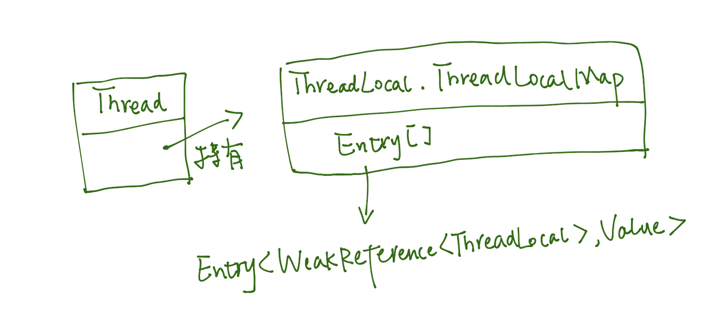

- 死锁的条件

1. 互斥条件：一个资源每次只能被一个进程使用。
2. 占有且等待：一个进程因请求资源而阻塞时，对已获得的资源保持不放。
3. 不可强行占有:进程已获得的资源，在末使用完之前，不能强行剥夺。
4. 循环等待条件:若干进程之间形成一种头尾相接的循环等待资源关系。

- 如何排查死锁？

1. 先获取当前运行 JAVA 进程：`jps -l`；
2. 查看指定进程的线程信息：`jstack -l PID`；

或者使用 jconsole 的可视化界面，查看死锁信息。

- 乐观锁、悲观锁

乐观锁：认为操作不会发生并发问题，因此不会上锁。但是在更新时会判断数据有没有被其他线程修改了，乐观锁的实现方式有：版本号机制、MVCC、CAS（compare and swap）；

悲观锁：在读取数据之前会先进行加锁。例如：Java 的 synchronized 关键字、MySQL 的读锁（`select .. for share`）等。

乐观锁适用于**写比较少的情况下（多读场景）**，即冲突真的很少发生的时候，这样可以省去了锁的开销，加大了系统的整个吞吐量。但如果是多写的情况，一般会经常产生冲突，这就会导致上层应用会不断的进行重试，这样反倒是降低了性能，所以一般**多写的场景下用悲观锁就比较合适**，但是悲观锁的吞吐量就比较低。

- CAS 的缺陷，以及如何解决？

1. 在多写的情况下，会经常发生冲突，导致 CAS 需要进行多次尝试，降低性能：在多写场景改用悲观锁或者失败一定次数后升级为悲观锁；
2. 无法解决 ABA 问题：可以改用 1.5 后引入的 `java.util.concurrent.atomic.AtomicStampedReference`；
3. 只能保证一个共享变量的原子操作：可以将多个变量封装到对象中，然后使用 `java.util.concurrent.atomic.AtomicReference`。

- 什么是内存模型 Java Memory Model（JMM）

Java 语言的内存模型由一些规则组成，这些规则确定线程对内存的访问如何排序以及何时可以确保它们对线程是可见的。

- 重排序

根据 JCIP 16.1 的说法，

> "Compilers may generate instructions in a different order than the “obvious” one suggested by the source code, or store variables in registers instead of in
memory; processors may execute instructions in parallel or out of order; caches
may vary the order in which writes to variables are committed to main memory;
and values stored in processor-local caches may not be visible to other processors.
These factors can prevent a thread from seeing the most up-to-date value for a
variable and can cause memory actions in other threads to appear to happen out
of order—if you don’t use adequate synchronization.
In a single-threaded environment, all these tricks played on our program by
the environment are hidden from us and have no effect other than to speed up
execution. The Java Language Specification requires the JVM to maintain withinthread as-if-serial semantics: as long as the program has the same result as if it
were executed in program order in a strictly sequential environment, all these
games are permissible."


只要在单线程条件下，执行的结果不发生变化，虚拟机便允许指令的重排序，以提高运行效率。

- 解释一下 happens-before 原则

Java 语言的内存模型由一些规则组成，这些规则确定线程对内存的访问如何排序以及何时可以确保它们对线程是可见的。如果两个操作未按 happens-before 排序，JVM 将可以对他们任意重排序。

happens-before 规则规定了一个操作对另一个操作的可见性，包括以下几条：

1. 程序顺序性原则

在一个线程中，按照程序执行的顺序，前面的操作 happens-before 后续的任意操作。

2. volatile 变量规则

对一个 volatile 变量的写操作，happens-before 后续对这个变量的读操作。

3. 传递性

如果 A happens-before B，B happens-before C，那么 A happens before C。

4. 管程的锁规则

对一个锁的解锁 happens-before 后续对这个锁的加锁。

5. 线程 start() 规则

主线程 A 调用线程 B 的 start() 方法（即在线程 A 中启动线程 B），那么该 start() 操作 happens-before 线程 B 中的任何操作。

6. 线程终止规则

一个线程运行过程的所有操作 happens-before 其它线程发现该线程已经结束，其它线程可以是通过 join() 方式发现，或者是 `Thread.isAlive()` 返回 false。

7. 中断规则

线程 A 对线程 B 调用 interrupt() happens-before 线程 B 发现自己被中断（通过抛出 InterruptedException 或者调用 isInterrupted/interrupted 方法）。

8. Finalizer 规则

一个对象构造方法的结束 happens-before 该对象 finalizer() 方法的开始。

- volatile 的意义

1. 禁用 CPU 缓存，对 volatile 变量的读写，都必须从内存中读取或者写入；
2. 禁止对 volatile 变量进行指令重排序；
3. 对于使用 volatile 修饰的 64 位的 long/double 基本数据类型，读/写是原子性的（不包括 i++ 的情况）：JVM 规范中並没有规定对于 long/double 的读写需要是原子性操作。
- 1.5 版本之前的 volatile 缺陷

在 1.5 版本之前的 JDK，以下的单例模式是有问题的。

```java
public class Singleton {
	private volatile Singleton instance;

	public Singleton getInstance() {
		if (instance == null) {
			synchronized (Singleton.class) {
				if (instance == null) {
					instance = new Singleton();
				}
			}
		}
		return instance;
	}
}
```
> A field may be declared volatile, in which case the Java Memory Model ensures that all threads see a consistent value for the variable.

- [final 与可见性](http://www.cs.umd.edu/~pugh/java/memoryModel/jsr-133-faq.html#finalWrong)

被 final 修饰的属性，在*正确初始化*后，即使不进行加锁，对于所有线程都是可见的，而对于非 final 修饰的属性，即使在初始化完成后，也不能保证对所有线程的可见性。

```java
public class FinalFieldExample {
	final int x;
	int y;

	static FinalFieldExample finalFieldExample;

	public FinalFieldExample() {
		x = 4;
		y = 3;
	}

	static void writer() {
		finalFieldExample = new FinalFieldExample();
	}

	static void reader() {
		if (finalFieldExample != null) {
			// 保证看到的是 4
			int i = finalFieldExample.x;
			// 可能看到是 0。
			int j = finalFieldExample.y;
			System.out.println("x= "+i+" ,y= "+j);
		}
	}
}
```

“正确初始化”指的是在构造方法中不能够将 `this` 对象暴露：
```java
final int x;
public FinalFieldExample() { // bad!
	x = 3;
	y = 4;
	// 在构造方法还没执行完成的时候就已经暴露了 this 对象
	global.obj = this;
}
```

- synchronized 的几种用法

1. 用在类的静态方法上，表示对该类的 Class 对象进行加锁；
2. 用在类的实例方法上，表示对当前实例对象进行加锁；
3. 用在代码块上，表示对指定对象进行加锁；

- `synchronized(null)`  的后果

根据 《Java 语言规范》第九版 14.19 节，会抛出 NPE。

`synchronized ( Expression ) Block`

The type of Expression must be a reference type, or a compile-time error occurs.
A synchronized statement is executed by first evaluating the Expression.
Then:

- If evaluation of the Expression completes abruptly for some reason, then the
synchronized statement completes abruptly for the same reason.

- Otherwise, if the value of the Expression is null, a NullPointerException is
thrown.

- Otherwise, let the non-null value of the Expression be V. The executing thread
locks the monitor associated with V. Then the Block is executed, and then there
is a choice:
    
    - If execution of the Block completes normally, then the monitor is unlocked
and the synchronized statement completes normally.

    - If execution of the Block completes abruptly for any reason, then the monitor
is unlocked and the synchronized statement completes abruptly for the same
reason.

- synchronized 的实现

通过 monitors 实现，Java 中的每个对象都与一个 monitor 相关联，线程可以对 monitor 进行加锁和解锁。

1. 当 synchronized 用在代码块上时：

当前线程需要获取指定对象的 monitor 才能进入同步代码块（通过 `monitorenter` 和 `monitorexit` 指令）；

2. 当 synchronized 用在方法（静态和实例方法）上时：

编译后的文件会保留方法签名的 `synchronized`（1.8.0_131 版本），修饰符 `synchronized` 会使得方法字节码多了 `ACC_SYNCHRONIZED` 标志位，本质上仍然是通过获取和释放 monitor 来进行加锁和释放锁。

> Synchronization in the Java Virtual Machine is implemented by monitor entry and
exit, either explicitly (by use of the monitorenter and monitorexit instructions) or
implicitly (by the method invocation and return instructions).
>
> 《java virtual machine specification SE-8》3.14

> The monitorenter and monitorexit instructions are not
used in the implementation of synchronized methods, although
they can be used to provide equivalent locking semantics. Monitor
entry on invocation of a synchronized method, and monitor exit on its return, are handled implicitly by the Java Virtual Machine's
method invocation and return instructions, as if monitorenter and
monitorexit were used.
>
> 《java virtual machine specification SE-8》 6.5 monitorenter

- 偏向锁、轻量级锁、重量级锁的概念以及升级机制

因为 Java 中的线程与操作系统的线程是一一对应的关系，对线程的唤醒或阻塞都需要在用户态和核心态之间切换，开销较大。因此在 JDK 6 中引入了许多对锁的优化，例如：适应性自旋、锁消除、锁粗化、轻量级锁和偏向锁等。

1. 适应性自旋

在线程持有锁的时间很短的情况下，通过让其他想要获取锁的线程进行一段短暂的循环就能避免线程阻塞的消耗。

> 自旋锁在 JDK1.4.2 中就已经引入，只不过默认是关闭的，可以使用 `-XX:+UseSpinning` 参数来开启，在 JDK1.6 中就已经改为默认开启了。自旋等待不能代替阻塞，且先不说对处理器数量的要求，自旋等待本身虽然避免了线程切换的开销，但它是要占用处理器时间的，因此，*如果锁被占用的时间很短，自旋等待的效果就会非常好，反之，如果锁被占用的时间很长，那么自旋的线程只会白白消耗处理器资源，而不会做任何有用的工作，反而会带来性能上的浪费*。因此，自旋等待的时间必须要有一定的限度，如果自旋超过了限定的次数仍然没有成功获得锁，就应当使用传统的方式去挂起线程了。自旋次数的默认值是 10 次，用户可以使用参数 `-XX:PreBlockSpin` 来更改。
>
> 在 JDK1.6 中引入了自适应的自旋锁。自适应意味着自旋的时间不再固定了，而是由前一次在同一个锁上的自旋时间及锁的拥有者的状态来决定。如果在同一个锁对象上，自旋等待刚刚成功获得过锁，并且持有锁的线程正在运行中，那么虚拟机就会认为这次自旋也很有可能再次成功，进而它将允许自旋等待持续相对更长的时间，比如 100 个循环。另外，如果对于某个锁，自旋很少成功获得过，那在以后要获取这个锁时将可能省略掉自旋过程，以避免浪费处理器资源。有了自适应自旋，随着程序运行和性能监控信息的不断完善，虚拟机对程序锁的状况预测就会越来越准确，虚拟机就会变得越来越“聪明”了。
>
> 周志明. 深入理解Java虚拟机：JVM高级特性与最佳实践

2. 锁消除

> 锁消除是指虚拟机即时编译器在运行时，对一些代码上要求同步，但是被检测到不可能存在共享数据竞争的锁进行消除。锁消除的主要判定依据来源于逃逸分析的数据支持（第11章已经讲解过逃逸分析技术），如果判断在一段代码中，堆上的所有数据都不会逃逸出去从而被其他线程访问到，那就可以把它们当做栈上数据对待，认为它们是线程私有的，同步加锁自然就无须进行。
>
> 周志明. 深入理解Java虚拟机：JVM高级特性与最佳实践

3. 锁粗化 

> 如果一系列的连续操作都对同一个对象反复加锁和解锁，甚至加锁操作是出现在循环体中的，那即使没有线程竞争，频繁地进行互斥同步操作也会导致不必要的性能损耗。
>
> 周志明. 深入理解Java虚拟机：JVM高级特性与最佳实践

因此，虚拟机会将这多次加锁操作拓展为一个大的加锁范围。

4. 轻量级锁

轻量级锁是在 JDK 1.6 中引入的新型锁机制，是为了在没有多线程竞争的条件下，避免对重量级锁的使用来减少消耗。主要的实现是通过在锁对象头的 mark word 中记录当前获取到轻量级锁线程的 Lock Record，而当发现有多个线程在竞争这个锁的时候，轻量级锁会升级为重量级锁，並使得后续获取锁的线程进入阻塞。

> 轻量级锁能提升程序同步性能的依据是“对于绝大部分的锁，在整个同步周期内都是不存在竞争的”，这是一个经验数据。如果没有竞争，轻量级锁使用 CAS 操作避免了使用互斥量的开销，但如果存在锁竞争，除了互斥量的开销外，还额外发生了 CAS 操作，因此在有竞争的情况下，轻量级锁会比传统的重量级锁更慢。

5. 偏向锁

> 偏向锁的“偏”，就是偏心的“偏”、偏袒的“偏”，它的意思是这个锁会偏向于第一个获得它的线程，如果在接下来的执行过程中，该锁没有被其他的线程获取，则持有偏向锁的线程将永远不需要再进行同步。
>
> 当锁对象第一次被线程获取的时候，虚拟机将会把对象头中的标志位设为“01”，即偏向模式。同时使用CAS操作把获取到这个锁的线程的ID记录在对象的MarkWord之中，如果CAS操作成功，持有偏向锁的线程以后每次进入这个锁相关的同步块时，虚拟机都可以不再进行任何同步操作（例如Locking、Unlocking及对MarkWord的Update等）。
>
> 周志明. 深入理解Java虚拟机：JVM高级特性与最佳实践

JDK 1.6 默认开启 `-XX:-UseBiasedLocking` 来使用偏向锁。

锁类型 | 优点 | 缺点 | 适用场景
---|---|---|---|
轻量级锁|加锁和解锁不需要额外的消耗，和执行非同步方法比仅存在纳秒级的差距。|如果线程间存在锁竞争，会带来额外的锁撤销的消耗。|适用于只有一个线程访问同步块场景。|
偏向锁|竞争的线程不会阻塞，提高了程序的响应速度。|如果始终得不到锁竞争的线程使用自旋会消耗CPU。|追求响应时间。同步块执行速度非常快。|
重量级锁|线程竞争不使用自旋，不会消耗CPU。|线程阻塞，响应时间缓慢。|追求吞吐量。同步块执行速度较长。|

随着锁的竞争，锁可以从偏向锁升级到轻量级锁，再升级到重量级锁。

- 锁的转换流程

偏向锁、轻量级锁的状态转化及对象 MarkWord 的关系


- 能否从偏向锁直接升级成重量级锁？

- synchronized 与 ReentrantLock 的区别

1. synchronized 是虚拟机自身支持的（通过 monitorenter 和 monitorexit 字节码），而 ReentrantLock 是通过对 AQS 的封装实现的；
2. 两者都支持可重入，及当前持有锁的线程可以再次获取锁；
3. ReentrantLock 支持超时取消的加锁操作，且加锁操作和释放锁操作可以拆开（例如在一个方法里进行加锁，在另一个方法里释放锁）；
4. ReentrantLock 通过 `lockInterruptibly()` 方法加锁可以影响中断，而 synchronized 不可以；
5. ReentrantLock 可以非阻塞地获取锁，例如：`tryLock()`。

- synchronized collection 和 concurrent collection

synchronized 表示不允许多个线程同时进行操作，即互斥；而 Concurrent 则表示可以允许多个线程的操作同时进行。synchronized collection 会对整个对象进行加锁，因此不同线程的读和写操作需要排队，concurrent collection 例如 ConcurrentHashMap 则允许同时进行读和写操作。

#### Thread

- Java 实现多线程有哪几种方式？

1. 继承 Thread 並覆盖 run() 方法；
2. 实现 Runnable 接口，将其作为线程的构造参数，並调用线程的 start() 来执行它；
3. 实现 Callable 接口，将其作为 FutureTask 的构造参数，並使用新的线程来执行 FutureTask；

```java
// Callable 方式
public class Task implements Callable<Integer> {
	@Override
	public Integer call() {
		return 1;
	}
}

// Application.main
public static void main(String[] args) throws ExecutionException, InterruptedException {
	FutureTask<Integer> task = new FutureTask<Integer>(new Task());
	new Thread(task).start();
	int result = task.get();
}
```
- 线程状态


> 线程调用阻塞式 API 时，在操作系统层面，线程是会转换到休眠状态的，但是在 JVM 层面，Java 线程的状态不会发生变化，也就是说 Java 线程的状态会依然保持 RUNNABLE。**JVM 层面並不关心操作系统调度相关的状态**，因为在 JVM 看来，等待 CPU 使用权（操作系统层面此时处于可执行状态）与等待 I/O（操作系统层面此时处于休眠状态）没有区别，都是在等待某个资源，所以都归入了 RUNNABLE 状态。
>
> 极客时间 《Java 并发编程实战》09

- Thread.stop 和 Thread.interrupt

> stop 方法会真的杀死线程，不给线程喘息的机会，如果线程持有 ReentrantLock 锁，被 stop 的线程并不会自动调用 ReentrantLock 的 unlock 方法去释放锁，那其他线程就再也没机会获得 ReentrantLock 锁，这实在是太危险了。所以该方法也就不建议使用了，类似的方法还有 suspend() 和 resume() 方法，这两个方法同样也都不建议使用了。
> 而 interrupt() 方法也就温柔多了，interrupt() 方法仅仅是通知线程，线程有机会执行一些后续操作，同时也可以无视这个通知。被 interrupt 的线程，可以通过异常（正处于 WAITING/TIMED_WAITING/ 状态时）或者主动监测（在 RUNNABLE 时）来得到这个通知。
>
> 极客时间 《Java 并发编程实战》09

另外，根据 javadoc，stop() 方法会抛出一个 ThreadDeath 异常，在异常抛出的时候，会释放该线程持有的 monitor（原生锁而不是 juc 中的 Lock 类），此时 monitor 保护的对象可能正处于读写的中间状态，从而造成其他线程访问到这个不合理的数据状态。

- wait 跟 sleep 的区别

1. sleep 是 Thread 的静态方法，调用方式 `Thread.sleep()`；wait 是 Object 类的方法，调用的是加锁对象；
2. Thread.sleep 不释放锁；wait 会释放锁，当被 notify 时需要重新获取锁；
3. wait 要在同步块内调用；
4. sleep 方法有时间限制；wait 可以选择是否加上时间参数。

- notify 和 notifyAll 的比较

`obj.notify()` 只会选择其中一个调用了 `obj.wait` 的线程进行唤醒，而 `obj.notifyAll()` 则会唤醒所有调用了 `obj.wait` 的线程。建议使用 notifyAll，从而避免 notify 唤醒了一个错误的线程的情况（例如生产者-消费者模式中，有多个生产者和多个消费者，生产者调用 notify 却是唤醒了另一个生产者的情况）。

- Callable 和 Future 的了解

1. Callable 用于定义一个有返回值的任务，相对于 Runnable 接口；
2. Future 就是对于具体的 Runnable 或者 Callable 任务的执行结果进行取消、查询是否完成、获取结果。可以通过 get 方法获取执行结果，该方法会阻塞直到任务返回结果。

Future 提供了三种功能：

　　1. 判断任务是否完成；

　　2. 能够中断任务；

　　3. 能够获取任务执行结果。

#### [AQS](juc/AQS.md)
juc 包中使用了 AQS 的并发类：

- [ReentrantLock](juc/ReentrantLock.md)
- [ReentrantReadWriteLock](juc/ReentrantReadWriteLock.md)
- [Semaphore](juc/Semaphore.md)
- [CountDownLatch](juc/CountDownLatch.md)
- [CyclicBarrier](juc/CyclicBarrier.md)

- CountDownLatch 和 CyclicBarrier 的区别？各自适用于什么场景？

1. CountDownLatch 用于一个线程等待多个线程的情况，类似于导游需要等到所有团员才能去下一个景点；CyclicBarrier 用于多个线程*互相等待*的情况，类似于几个驴友之间需要互相等待；
2. CountDownLatch 的计数器是不能循环利用的，一旦计数器减到 0，再有线程调用 `await()`，该线程会直接通过；
3. CyclicBarrier 的计数器是可以循环利用的，而且具备自动重置的功能，一旦计数器减到 0 会自动重置到你设置的初始值。而且，CyclicBarrier 还可以设置回调函数，当计数器减到 0 的时候会调用该函数；
4. CountDownLatch 在使用的时候建议设置超时时间，避免线程过长时间的等待；

- Lock 接口的实现有哪些？使用场景是什么？

Lock 接口中定义了以下方法：

1. lock()：尝试获取锁，获取失败则进入阻塞状态；
2. lockInterruptibly()：与 lock 类似，但可以被中断；
3. tryLock()：尝试获取锁，如果获取成功返回 true，否则返回 false；
4. tryLock(long time, TimeUnit unit)：带超时时间的 tryLock；
5. unlock()：释放锁；
6. newCondition()：创建一个与该锁关联的 Condition 对象，可以用于唤醒或使线程进入休眠状态。

Lock 接口有以下实现类：

1. ReentrantLock：可重入锁，支持以可中断、非阻塞的方式获取锁；
2. ReentrantReadWriteLock 的内部类 ReadLock 和 WriteLock：支持读锁和写锁的分离，可以同时加多个读锁，适用于读多写少的场景。

#### 原子类以及 ABA 问题

1. 了解 AtomicInteger 实现原理、CAS 适用场景、如何实现乐观锁

AtomicInteger 内部维护了一个 `volatile int value;`，然后通过 CAS 操作来实现对其的更新，从而避免了加锁操作。

#### 同步集合以及并发集合

1. Collections.synchronizedMap、Collections.synchronizedList 等的实现原理；

`Map<K,V> synchronizedMap(Map<K,V> m)` 方法会接收一个 Map 对象，并返回一个线程安全的 SynchronizedMap 对象，它主要是通过包装了传入的 Map 对象，并对它的方法进行了同步，从而实现了线程安全。

`List<T> synchronizedList(List<T> list)` 同理。

2. CopyOnWriteArrayList：了解写时复制机制、了解其适用场景、思考为什么没有 ConcurrentArrayList？

通过拷贝数组来实现所有写操作（add、set 等），所以写操作的数组与之前读操作的数组是不同的对象，从而保证每次修改操作不会影响到之前的读操作（get、遍历等），同时读操作不需要进行加锁。

因为在每次写操作的时候都要进行一次拷贝，消耗较大，因此该集合适合读多写很少的情况下使用，另外，它也不允许通过 iterator 做写操作。

3. ConcurrentHashMap：了解实现原理、扩容时做的优化、与 HashTable 对比、ConcurrentHashMap 是如何让多线程同时参与扩容？

通过分段锁（lock strping）来提高并发。

HashTable 的线程安全是通过锁整个对象来实现的，而 ConcurrentHashMap 在读的时候不需要加锁，而且不同线程允许同时写不同的 Segment。

1.7 采用了 `Segment extends ReentrantLock` 实现分段锁，而 1.8 采用 CAS + synchronized，当链表未被初始化时使用 CAS 初始化链表，否则使用 synchronized 锁住链表，当元素分布均匀的情况下，不同线程会操作不同的数组元素，CAS 可以降低加锁的概率，synchronized 也只会锁定某一个 bucket，相比起 1.7 的 Segment 锁定了若干个 bucket，减少了锁竞争。

[`ConcurrentHashMap`](https://www.ibm.com/developerworks/cn/java/java-lo-concurrenthashmap/index.html)

节点添加到链表的头。

3.1 Java 7 中 ConcurrentHashMap 扩容与 Java 8 中有什么区别？

3.2 Java 8 中的 ConcurrentHashMap 什么情况下会触发扩容操作？

1. 在新增节点之后，会调用 addCount 方法记录元素个数，并检查是否需要进行扩容，当数组元素个数达到阈值（loadFactor*capacity）时，会触发 transfer 方法，重新调整节点的位置；
2. 在新增节点之后，所在链表的元素个数达到了阈值 8，则会调用 treeifyBin 方法把链表转换成红黑树，不过在结构转换之前，会对数组长度进行判断，如果数组长度小于阈值 MIN_TREEIFY_CAPACITY（默认是 64），则会调用 tryPresize 方法把数组长度扩大到原来的两倍，并触发 transfer 方法，重新调整节点的位置。

3.3 Java 8 的 ConcurrentHashMap 如何使用多个线程协助扩容？

当 Map 新增节点触发扩容的时候，需要将旧的 Entry 数组重新分布到新数组上去。第一个开始扩容的线程会获取旧 Entry 数组的一部分范围（最小是 16），並由数组高位到数组地位进行重分布，对于处理完的数组元素会将其置为 ForwardingNode（其 hash 为 MOVED，即 -1，并且关联到新的 Entry 数组），于是当其他正在进行 put/remove 操作的线程看到 Entry 数组的元素 hash==MOVED 的时候就知道当前正在进行扩容操作，于是该线程也可以参与到其中，通过认领自己的一部分 Entry 数组区间并对认领的 Entry 数组区间逐个进行重分布，从而实现多个线程共同进行扩容操作。另外，如果其他线程是在扩容过程中执行 get 操作並发现定位到的 Entry 元素为 ForwardingNode 的话，就通过 ForwardingNode.find 方法去新的 Entry 数组中查找所需 value。

3.4 ConcurrentHashMap 读需要加锁吗？

1.7 和 1.8 的 get 方法都不需要进行加锁。

3.5 1.7 的 DEFAULT_CONCURRENCY_LEVEL

DEFAULT_CONCURRENCY_LEVEL 定义了 map 的并发度，默认为 16，代表会创建长度为 16 的 Segment 数组，也就是最多允许 16 个线程同时更新 map，限制最大值为 1<<16。初始化后的 Segment 数组不会随着 map 数组的扩容而扩容。当指定的 concurrencyLevel 不是 2 的整数方时，会将其设置为第一个大于该值的 2 的整数方。每个 Segment 中维护的 HashEntry 数组最小长度是 2，以避免在初始化之后下一次 put 操作就需要进行扩容。HashMap 中是对整个数组进行扩容，而在 ConcurrentHashMap 中是每个 Segment 对自己拥有的 HashEntry 数组进行扩容，扩容阈值也相应的变成 `Segment.table.length*loadFactor`。

4. BlockingQueue

了解 DelayQueue、SynchronousQueue。

LinkedBlockingQueue、DelayQueue 是如何实现的？

4.1 ArrayBlockingQueue

用一个可重入锁和这个锁生成的两个条件对象（notFull/notEmpty）进行并发控制，当队列不为空时，通过 notEmpty 唤醒等待 take 的线程；当队列有足够空间时，通过 notFull 唤醒等待 put 的线程。

4.2 LinkedBlockingQueue

底层是一个单向链表，使用了两个 ReentrantLock，一个 putLock，在调用 `put` 添加元素的时候需要获取 putLock；一个 takeLock，在调用 `take` 获取元素的时候需要获取 takeLock。

因此允许不同线程同时进行 take 和 put。

因为在进行 remove 时，不确定被移除元素的位置，因此需要同时加上 putLock 和 takeLock。

4.3 [SynchronusQueue](https://blog.csdn.net/yanyan19880509/article/details/52562039)

无容量的阻塞队列，任务直接由生产者转交到消费者，如果当前没有空闲的消费者，则生产者会阻塞。

支持公平和非公平两种模式：非公平竞争模式使用的数据结构是后进先出栈(LIFO Stack)；公平竞争模式则使用先进先出队列（FIFO Queue）。

4.4 PriorityBlockingQueue

线程安全版本的 PriorityQueue，底层采用堆实现有序性。

4.5 DelayQueue

支持任务延时获取是无界阻塞队列。内部实际上是采用了一个 PriorityQueue 来维护元素的顺序，依照元素的过期时间从小到大排序，所有加入 DelayQueue 的元素都需要实现 Delay 接口。

采用 Leader-Follower 模式避免线程竞争。当从 DelayQueue 获取元素时，如果第一个元素已经过期，就直接将其返回；若还未过期，就通过 await 进行等待。其中 Leader 角色的线程等待时间为过期时间，其他线程则无限期等待，当 Leader 成功获取到头元素后，会唤醒其他的等待线程，继续进行下一次元素获取流程。通过这种方式来避免多个线程之间不必要的竞争。

#### [线程池 Executors](juc/Executors.md)

- ThreadLocal 的使用场景以及实现

需要使用线程不安全的对象，同时又不希望使用锁的情况下可以使用 `ThreadLocal`，比如 `SimpleDateFormat`。ThreadLocal 用于在每个线程中保存一个线程独有的数据，从而防止了多线程访问数据的并发问题。

每个线程都有自己所属的 `ThreadLocalMap`，它是一个以 `WeakReference<ThreadLocal>` 为 key， `ThreadLocal` 的值为 value 的集合，其中 `ThreadLocalMap$Entry` 继承了 `WeakReference`，`Entry` 的 key 为一个弱引用，value 为强引用。



ThreadLocal 在 `set(value)` 和 `get()` 的时候会隐式自动清除多余 entry：如果 entry 的 key 是 null，说明该 entry 可以回收，则将它的 value 置空。对于在 entry 的 key 被回收之后但又一直没有调用 ThreadLocal 的 get/set 方法的场景，需要显式调用 `remove()` 来清除多余的 entry，从而避免内存泄漏。

- ForkJoinPool
