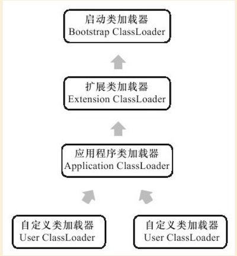

#### 类加载

- 什么时候会触发一个类的加载？

1. 创建类的实例；
2. 访问类的静态变量(除常量【被 final 修辞的静态变量】原因：常量是一种特殊的变量，因为编译器把他们当作值(value)而不是域(field)来对待。如果你的代码中用到了常变量(constant variable)，编译器并不会生成字节码来从对象中载入域的值，而是直接把这个值插入到字节码中。这是一种很有用的优化，但是如果你需要改变final域的值那么每一块用到那个域的代码都需要重新编译；
3. 访问类的静态方法；
4. 反射如（`Class.forName("my.xyz.Test")`）；
5. 当初始化一个类时，发现其父类还未初始化，则先出发父类的初始化；
6. 虚拟机启动时，定义了 `main()` 方法的那个类先初始化。
7. [当使用 jdk1.7 动态语言支持时，如果一个 `java.lang.invoke.MethodHandle` 实例最后的解析结果是 `REF_getstatic`，`REF_putstatic`，`REF_invokeStatic` 的方法句柄，并且这个方法句柄所对应的类没有进行初始化，则需要先出触发其初始化。](https://blog.csdn.net/u013256816/article/details/51780920)

以上情况称为称对一个类进行“主动引用”，除此种情况之外，均不会触发类的初始化，称为“被动引用”.

**接口的加载过程与类的加载过程稍有不同。接口中不能使用 `static{}` 块。当一个接口在初始化时，并不要求其父接口全部都完成了初始化，只有真正在使用到父接口时（例如引用接口中定义的常量）才会初始化。**

- “被动引用”的例子

1. 子类调用父类的静态变量，子类不会被初始化，只有父类被初始化。对于静态字段，只有直接定义这个字段的类才会被初始化；
2. 通过数组定义来引用类，不会触发类的初始化，如 `A[] arr = new A[10];` 不会触发对类 A 的初始化；
3. 访问类的常量，不会初始化类。

- 类加载的几个阶段

1. 加载

“加载”(Loading)阶段是“类加载”(Class Loading)过程的第一个阶段，在此阶段，虚拟机需要完成以下三件事情：

   1. 通过一个类的全限定名来获取定义此类的二进制字节流；

   2. 将这个字节流所代表的静态存储结构转化为方法区的运行时数据结构；

   3. 在内存中生成一个代表这个类的 `java.lang.Class` 对象，作为方法区这些数据的访问入口。（对于 HotSpot 虚拟机，Class 对象存放于方法区。）

加载阶段即可以使用系统提供的类加载器在完成，也可以由用户自定义的类加载器来完成。加载阶段与连接阶段的部分内容(如一部分字节码文件格式验证动作)是交叉进行的，加载阶段尚未完成，连接阶段可能已经开始。

2. 验证

验证是连接阶段的第一步，这一阶段的目的是为了确保 Class 文件的字节流中包含的信息符合当前虚拟机的要求，并且不会危害虚拟机自身的安全。

Java 语言本身是相对安全的语言，使用 Java 编码是无法做到如访问数组边界以外的数据、将一个对象转型为它并未实现的类型等，如果这样做了，编译器将拒绝编译。但是，Class 文件并不一定是由 Java 源码编译而来，可以使用任何途径，包括用十六进制编辑器(如UltraEdit)直接编写。如果直接编写了有害的“代码”(字节流)，而虚拟机在加载该 Class 时不进行检查的话，就有可能危害到虚拟机或程序的安全。

不同的虚拟机，对类验证的实现可能有所不同，但大致都会完成下面四个阶段的验证：**文件格式验证、元数据验证、字节码验证和符号引用验证**。

  - 文件格式验证，是要验证字节流是否符合Class文件格式的规范，并且能被当前版本的虚拟机处理。如验证魔数是否0xCAFEBABE；主、次版本号是否正在当前虚拟机处理范围之内；常量池的常量中是否有不被支持的常量类型……该验证阶段的主要目的是保证输入的字节流能正确地解析并存储于方法区中，经过这个阶段的验证后，字节流才会进入内存的方法区中存储，所以后面的三个验证阶段都是基于方法区的存储结构进行的；

  - 元数据验证，是对字节码描述的信息进行语义分析，以保证其描述的信息符合Java语言规范的要求。可能包括的验证如：这个类是否有父类；这个类的父类是否继承了不允许被继承的类；如果这个类不是抽象类，是否实现了其父类或接口中要求实现的所有方法；
  
  - 字节码验证，主要工作是进行数据流和控制流分析，保证被校验类的方法在运行时不会做出危害虚拟机安全的行为。如果一个类方法体的字节码没有通过字节码验证，那肯定是有问题的；但如果一个方法体通过了字节码验证，也不能说明其一定就是安全的；
  
  - 符号引用验证，发生在虚拟机将符号引用转化为直接引用的时候，**这个转化动作将在“解析阶段”中发生**。验证符号引用中通过字符串描述的权限定名是否能找到对应的类；在指定类中是否存在符合方法字段的描述符及简单名称所描述的方法和字段；符号引用中的类、字段和方法的访问性(private、protected、public、default)是否可被当前类访问。

3. 准备

准备阶段是**为类的静态变量分配内存并将其初始化为默认值**，这些内存都将在方法区中进行分配。*准备阶段不分配类中的实例变量的内存，实例变量将会在对象实例化时随着对象一起分配在 Java 堆中*。

`public static int value=123;//在准备阶段 value 初始值为0 。在初始化阶段才会变为 123 。`

4. 解析

解析阶段是虚拟机将常量池内的符号引用替换为直接引用的过程。

符号引用（Symbolic Reference）：符号引用以一组符号来描述所引用的目标，符号可以是任何形式的字面量，只要使用时能无歧义地定位到目标即可。符号引用与虚拟机实现的内存布局无关，**引用的目标并不一定已经加载到内存中**。

直接引用（Direct Reference）：直接引用可以是直接指向目标的指针、相对偏移量或是一个能间接定位到目标的句柄。直接引用是与虚拟机实现的内存布局相关的，**如果有了直接引用，那么引用的目标必定已经在内存中存在**。

5. 初始化：静态变量赋值和执行静态代码块

类初始化是类加载过程的最后一步，前面的类加载过程，除了在加载阶段用户应用程序可以通过自定义类加载器参与之外，其余动作完全由虚拟机主导和控制。到了初始化阶段，才真正开始执行类中定义的Java程序代码。

初始化阶段是执行类构造器 `<clinit>()` 方法的过程。`<clinit>()` 方法是由编译器自动收集类中的所有类变量的赋值动作和静态语句块(`static{}` 块)中的语句合并产生的。

```java
class SingleTon {
    private static SingleTon singleTon = new SingleTon();
    public static int count1;
    public static int count2 = 0;
 
    private SingleTon() {
        count1++;
        count2++;
    }
 
    public static SingleTon getInstance() {
        return singleTon;
    }
}
 
public class Test {
    public static void main(String[] args) {
        SingleTon singleTon = SingleTon.getInstance();
        System.out.println("count1=" + singleTon.count1);
        System.out.println("count2=" + singleTon.count2);
    }
}

// 输出结果为：
count1=1
count2=0
// 分析：

1:SingleTon singleTon = SingleTon.getInstance();调用了类的SingleTon调用了类的静态方法，触发类的初始化
2:类加载的时候在准备过程中为类的静态变量分配内存并初始化默认值 singleton=null count1=0,count2=0
3:类初始化，为类的静态变量赋值和执行静态代码快。singleton赋值为new SingleTon()调用类的构造方法
4:调用类的构造方法后count=1;count2=1
5:继续为count1与count2赋值,此时count1没有赋值操作,所有count1为1,但是count2执行赋值操作就变为0
```

- 了解双亲委派机制

某个特定的类加载器在接到加载类的请求时，首先将加载任务委托给父类加载器，依次递归，如果父类加载器可以完成类加载任务，就成功返回；只有父类加载器无法完成此加载任务时，才自己去加载。

- 双亲委派机制的作用？

1. 可以避免类的重复加载（JVM 区分不同类的方式不仅仅根据类名，相同的类文件被不同的类加载器加载产生的是两个不同的类），
2. 也保证了 Java 的核心 API 不被篡改。如果没有使用双亲委派模型，而是每个类加载器加载自己的话就会出现一些问题，比如我们编写一个称为 `java.lang.Object` 类的话，那么程序运行的时候，系统就会出现多个不同的 Object 类。

- 如何自己实现一个 classloader 打破双亲委派

可以继承 `java.lang.ClassLoader` 並覆盖 `loadClass` 方法，重写类加载的顺序逻辑，例如：Tomcat 的 WebappClassLoader，不过 ClassLoader 的 `defineClass` 方法中有对类的路径进行校验，例如禁止一个用户类以 `java.` 做开头。

- 有哪些类加载器

JVM 预定义的类加载器有以下几种：

1. 启动（Bootstrap）类加载器：是用本地代码实现的类装入器，它负责将 <Java_Runtime_Home>/lib下面的类库加载到内存中（比如rt.jar）。由于引导类加载器涉及到虚拟机本地实现细节，开发者无法直接获取到启动类加载器的引用，所以不允许直接通过引用进行操作。
2. 标准扩展（Extension）类加载器：是由 Sun 的 ExtClassLoader（sun.misc.Launcher$ExtClassLoader）实现的。它负责将 `<Java_Runtime_Home >/lib/ext` 或者由系统变量 `java.ext.dir` 指定位置中的类库加载到内存中。开发者可以直接使用标准扩展类加载器。
3. 应用程序（Application）类加载器/系统（System）类加载器：是由 Sun 的 AppClassLoader（sun.misc.Launcher$AppClassLoader）实现的。它负责将系统类路径（CLASSPATH）中指定的类库加载到内存中。开发者可以直接使用系统类加载器。

另外用户也可以通过继承 `java.lang.ClassLoader` 並覆盖 `findClass(String name)` 方法来定义自己的类加载器。

它们的层级关系如下：



- Tomcat 的 classloader 结构

以 Tomcat 6 为例，[其类加载器结构如下](http://tomcat.apache.org/tomcat-6.0-doc/class-loader-howto.html)：

      Bootstrap
          |
       System
          |
       Common
       /     \
	Webapp1   Webapp2


其中各个类加载器的说明如下：

1. Bootstrap：相当于是 JVM 中的 Bootstrap 类加载器 + 标准扩展类加载器；
2. System：系统类加载器（AppClassLoader）；
3. Common：该加载器加载的类对 Tomcat 和所有 Web 应用都可见，该加载器加载的目录由 `$CATALINA_BASE/conf/catalina.propertie` 配置文件中的 common.loader 指定，默认的话会按以下顺序进行查找加载：

	1. `$CATALINA_BASE/lib` 下的 class；
	2. `$CATALINA_BASE/lib` 下的 lib；
	3. `$CATALINA_HOME/lib` 下的 class；
	4. `$CATALINA_HOME/lib` 下的 lib。

4. WebappX：每个 Web 应用单独拥有的类加载器，负责加载应用目录下 `/WEB-INF/classes` 所有解压缩的类和资源、`/WEB-INF/lib` 下 Jar 包，仅对自身的 Web 容器可见；

另外，Tomcat 中类加载器的实现与双亲委派机制有些许不同，

> When a request to load a class from the web application's WebappX class loader is processed, this class loader will look in the local repositories first, instead of delegating before looking. There are exceptions. Classes which are part of the JRE base classes cannot be overriden. For some classes (such as the XML parser components in J2SE 1.4+), the J2SE 1.4 endorsed feature can be used. Last, any JAR file that contains Servlet API classes will be explicitly ignored by the classloader — Do not include such JARs in your web application. All other class loaders in Tomcat 6 follow the usual delegation pattern.

也就是说，当 WebappX 类加载器要加载一个类的时候（除了 JDK 类库中的类外），不是先委派父加载器进行加载，而是自己先尝试进行加载，加载失败才会委派给父类。
