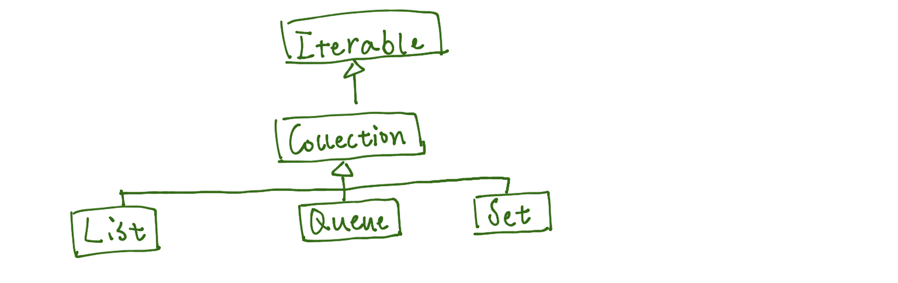
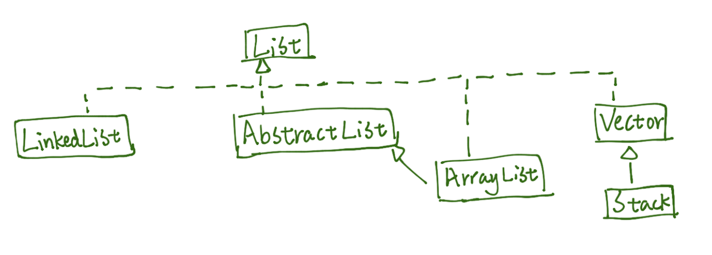
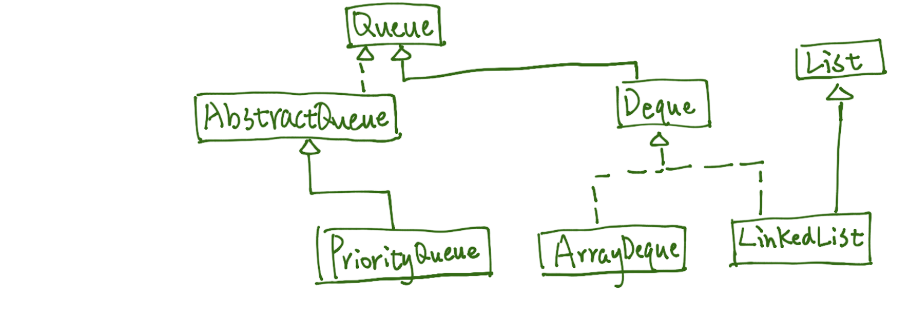
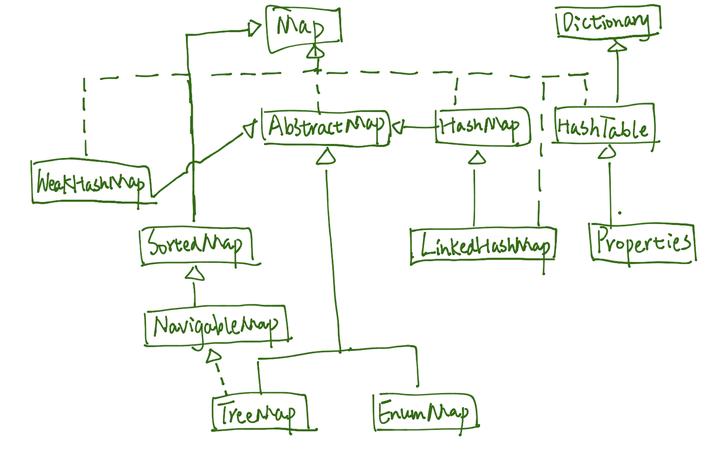
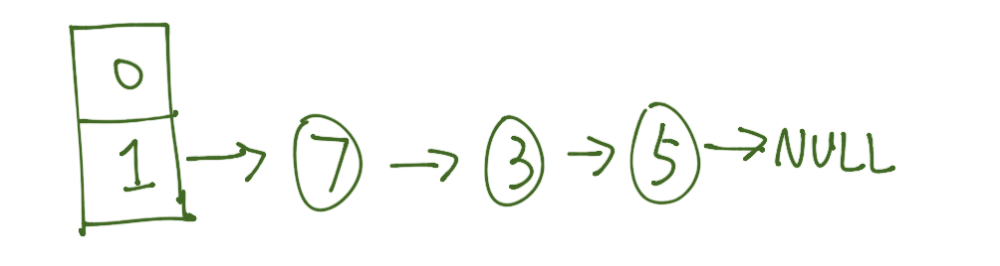
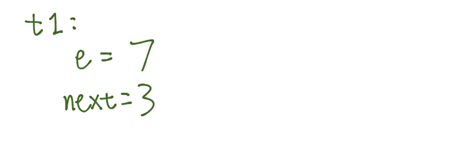
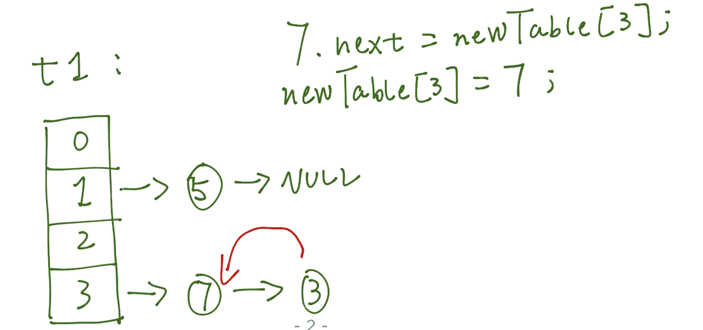

### 普通集合

#### 讲述一下集合类的类继承关系？TreeSet 继承了哪些接口？TreeMap 继承了哪些接口？

- Collection 集合继承关系


- list 继承关系


- queue 继承关系


- set 继承关系


- Map 继承关系


#### ArrayList 与 LinkedList 的实现和区别？

    1. ArrayList 基于动态数组，而 LinkedList 是基于双向链表；
    2. 各个操作的时间复杂度如下：

操作 |          ArrayList 时间复杂度 |　　LinkedList 时间复杂度
---|---|---
get(int index)|　O(1) | O(n) |
add(E element)| 在不需要进行扩容的时候是 O(1)，需要扩容的话是 O(n) | O(1) |
add(int index, E element)| O(n)，因为需要移动 index 之后的数据 | O(n)，因为需要定位到 index，如果 index=0 则为 O(1) |
remove(int index)| O(n)，因为需要将 index 之前的数据往前移动 | O(n)，因为需要定位到 index |
Iterator.remove()| O(n)，因为需要将 index 之前的数据往前移动 | O(1)，无需定位，直接修改指针即可|
ListIterator.add(E element)|O(n)，因为需要移动 index 之后的数据 | O(1)，无需定位，直接修改指针即可|

#### ArrayList 的默认容量？

若在实例化 ArrayList 的时候没有指定容量，则会在第一次执行 `add` 的时候将内部数组初始化为长度 10，每次扩容按照 1.5 倍容量增长。

#### [ArrayList 如何在循环过程中删除元素？](http://swiftlet.net/archives/743)

```java
public static void main(String[] args) {
    ArrayList<String> list = new ArrayList<String>();
    list.add("a");
    list.add("b");
    list.add("b");
    list.add("c");
    list.add("c");
    list.add("c");
    remove(list);
}
// 方法一：
public static void remove(ArrayList<String> list) {
    // 需要逆序删除，正序的话因为 remove 时数组需要进行拷贝，导致下标向前移动了一位，而使得部分元素无法被删除。
    for (int i = list.size() - 1; i >= 0; i--) {
        String s = list.get(i);
        if (s.equals("b")) {
            list.remove(s);
        }
    }
}

// 方法二：
public static void remove(ArrayList<String> list) {
    Iterator<String> it = list.iterator();
    while (it.hasNext()) {
        String s = it.next();
        if (s.equals("b")) {
            // 需要用 iterator.remove 而不能用 list.remove，否则会抛出 java.util.ConcurrentModificationException。
            it.remove();
        }
    }
}

// 有问题的方式，for-each 方式只是 Iterator 方式的语法糖，会抛出 ConcurrentModificationException。
public static void remove(ArrayList<String> list) {
    for (String s : list) {
        if (s.equals("b")) {
            list.remove(s);
        }
    }
}
```

#### LinkedList 在 `get(int index)` 操作时的优化？

会先判断 index 是在链表的前半部份还是后半部份，如果是前半部份则从头节点开始往后查找；否则从尾节点开始往前查找。
```java
// 1.8
// LinkedList.get
public E get(int index) {
    checkElementIndex(index);
    return node(index).item;
}
Node<E> node(int index) {
    // assert isElementIndex(index);

    if (index < (size >> 1)) {
        Node<E> x = first;
        for (int i = 0; i < index; i++)
            x = x.next;
        return x;
    } else {
        Node<E> x = last;
        for (int i = size - 1; i > index; i--)
            x = x.prev;
        return x;
    }
}
```

#### HashMap：jdk1.8 之前并发操作 HashMap 时为什么会有死循环的问题？

- 了解其数据结构、hash 冲突如何解决（链表和红黑树）

Java 中 HashMap 是通过数组链表的方式实现的。HashMap 内部维护了一个 `Entry<K,V>[]` 数组，其中 Entry 是一个键值对结构，它的 key 和 value 对应的是 HashMap.put 的 key 跟 value，同时 Entry 中还包含了一个指向下一节点的 next 属性，所以可以将 Entry 数组看作是一个链表数组。当往 HashMap 中添加数据的时候，会将给定 key 的 hash 映射到 Entry 数组的下标，新建一个 Entry 对象，并将 Entry 对象添加到链表的末尾。但是如果有过多元素都被映射到了同一个数组下标，就会导致链表的长度过长，导致获取元素的时候时间变长，因此在 Java 8 中做了一个判断，如果单个链表的长度大于等于 8，就会将该链表转换为一棵**红黑树**（红黑树是自平衡的二叉查找树），其中树的排序默认按照 key 的 hashcode，而如果 key 的类实现了 `Comparator` 接口的话，则会按照 `compareTo` 的结果进行排序；另外如果树的元素被删除到小于等于 6 个的话，就会将树转换回链表。

- 为什么在 1.8 中把链表转化为红黑树的阈值是 8,而不是 7 或者不是 20 呢？

1. 如果选择 6 和 8（如果链表小于等于 6 时树还原转为链表，大于等于 8 转为树），中间有个差值 7 可以有效防止链表和树频繁转换，而转化成树和从树转化成链表的操作是耗时的。假设一下，如果设计成链表个数超过 8 则链表转换成树结构，链表个数小于 8 则树结构转换成链表，如果一个 HashMap 不停的插入、删除元素，链表个数在 8 左右徘徊，就会频繁的发生树转链表、链表转树，效率会很低；
2. 之所以不使用 20，是因为器中节点分布在 hash 桶中的频率遵循泊松分布，桶的长度超过 8 的概率非常非常小。
3. 还有一点重要的就是由于 TreeNode 的大小大约是常规节点的两倍，因此我们仅在容器包含足够的节点才使用它们，当它们变得太小（由于移除或调整大小）时，它们会被转换回普通的node节点，从而保证新增的空间消耗是有意义的。

> Because TreeNodes are about twice the size of regular nodes, we use them only when bins contain enough nodes to warrant use (see TREEIFY_THRESHOLD). And when they become too small (due to removal or resizing) they are converted back to plain bins.

阈值选太大，触发转换的几率很小；阈值太小，则提高的性能还比不上新增的空间消耗。

- 对 key.hashcode 做了哪些操作来减少哈希冲突？

因为 key 的 hash 在是通过对数组长度进行取余来映射到某个下标的，所以为了尽量避免多个 hash 映射到同一个下标，从而造成哈希冲突，HashMap 采取了一些方法来对 key.hashcode 进行重新计算，使得它们的分布会更平均。本质上都是将 hashcode 的高位比特与低位比特进行异或操作，从而使得低位比特的值更加平均，因为取余时决定结果的只是低位比特的值（高位比特都为取余掉了）。

- HashMap 的数组长度为什么要保证是 2 的幂？

HashMap 选择将数组的大小设置为 2 的幂次方，这样在进行取余的时候，可以直接使用 `hash & (数组长度-1)`，提高了效率。

- table 的初始化时机是什么时候？

一般情况下，在第一次 put 的时候，调用 resize 方法进行 table 的初始化。

- 什么时候会触发扩容、扩容时避免 rehash 的优化

为了减少哈希冲突，当 HashMap 中的元素个数，也就是 size 属性大于等于一定大小的时候，会选择将 Entry 数组进行扩容，这个大小为 `loadFactor*数组长度`，其中 `loadFactor` 默认为 0.75。当进行数组扩容的时候，会新建一个原来数组长度 2 倍的新数组，并将旧数组的元素迁移到新数组上。在 Java 7 中，迁移的过程就是直接对旧数组的每一个链表计算它们在新数组的下标，然后拷贝到新数组对应下标（头插入，导致与原链表倒序），而在 Java 8 中，对迁移过程做了优化（尾插入，保持原顺序）。

因为新的数组大小（newLength）是旧数组（oldLength）的两倍，且都是 2 的幂次方，所以 hash 在对 oldLength 和对 newLength 取余时的结果差异只取决于 hash 在 oldLength 的 1 比特所在位的比特值，例如：

```
oldLength=4 -> 0100
newLength=8 -> 1000
hash = 5    -> 0101
oldIndex = hash%oldLength = hash&(oldLength-1) = 0101 & 0011 = 0001
newIndex = hash%newLength = hash&(newLength-1) = 0101 & 0111 = 0101
```

因为 hash 的第一位比特是 1，所以 newIndex 与 oldIndex 不一样，并且比 oldIndex 大了 oldLength，因此可以直接通过：

`hash & oldLength==0` 来判断该元素的新下标是否与原来相同，并且如果不同，可以直接通过 `newIndex=oldIndex+oldLength` 来决定新的数组下标。

- 为什么 loadFactor 选择 0.75？

作为一般规则，默认负载因子（0.75）在时间和空间成本上提供了很好的折衷。较高的值会降低空间开销，但提高查找成本（体现在大多数的 HashMap 类的操作，包括 get 和 put）。设置初始大小时，应该考虑预计的 entry 数及负载因子，并且尽量减少 rehash 操作的次数。如果初始容量大于最大条目数除以负载因子，rehash 操作将不会发生。

当用 0.75 作为负载因子且 hash 函数良好时，map 中元素的个数可以满足泊松分布，此时链表元素超过 8 的概率为 0.00000006。

- `put(key, val)` 的时候是前插还是后插？

1.7 是前插，1.8 是后插。

- 1.7 resize 的时候是前插还是后插？

rehash 时将每个节点作为链表的头插入，因此会使得链表倒置。

- 并发操作 HashMap 时为什么会有死循环的问题？

存在并发操作导致 map 中的链表出现环的情况。主要是因为在 rehash 时的 transfer 操作是采用头插入的方式，使得迁移后的节点顺序与原来节点顺序相反。

情形如下：

假设有线程 t1、t2，且当前 map 中数据如下：



假设 t1 和 t2 都同时触发了扩容机制，且当前 t1 执行到了 `Entry<K,V> next = e.next;` 后调度到 t2，此时 t1 的数据状态如下：



t2 执行完了 transfer 方法将旧数组数据都迁移到新数组之后的数据状态如下：


此时调度到 t1，继续执行 transfer 方法的：

```java
e.next = newTable[i];
newTable[i] = e;
```

从而使得数据状态变成如下：



也就是出现了循环引用的状态。

```java
// 1.7 HashMap.transfer
void transfer(Entry[] newTable, boolean rehash) {
    int newCapacity = newTable.length;
    for (Entry<K,V> e : table) {
        while(null != e) {
            Entry<K,V> next = e.next; // t1 在此时停留
            if (rehash) {
                e.hash = null == e.key ? 0 : hash(e.key);
            }
            int i = indexFor(e.hash, newCapacity);
            e.next = newTable[i];
            newTable[i] = e;
            e = next;
        }
    }
}
```

- 1.7 和 1.8 中的 hash 方法有何区别？

本质上都是通过对 Key 对象 hashCode() 方法的返回值进行再次处理，以使得 hash 值的分布更加均匀。1.8 里是通过前后 16 bit 的异或操作来扩散各个比特的影响。

```java
// 1.7 hash
final int hash(Object k) {
    int h = 0;
    if (useAltHashing) {
        if (k instanceof String) {
            return sun.misc.Hashing.stringHash32((String) k);
        }
        h = hashSeed;
    }

    h ^= k.hashCode();

    // This function ensures that hashCodes that differ only by
    // constant multiples at each bit position have a bounded
    // number of collisions (approximately 8 at default load factor).
    h ^= (h >>> 20) ^ (h >>> 12);
    return h ^ (h >>> 7) ^ (h >>> 4);
}
// 1.8 hash
static final int HASH_BITS = 0x7fffffff; // usable bits of normal node hash
static final int spread(int h) {
    return (h ^ (h >>> 16)) & HASH_BITS;
}
```
- 准备用 HashMap 存 1w 条数据，构造时传 10000 还会触发扩容吗？

传入 10000，会被 `tableSizeFor(int cap)` 修改为 2 的次幂，也就是 16384，再乘以 0.75 的 loadFactor，为 12288，因此存入 1w 个数据不会达到扩容阈值。

- 一些默认值

参数 | 默认值
---|---
loadFactor | 0.75
initialCapacity | 16
threshold | loadFactor*initialCapacity = 12

#### LinkedHashMap：了解基本原理、哪两种有序、如何用它实现 LRU？

另外维护了 head、tail 两个属性，用于串联起 map 中所有的 Entry，从而保持有序性。默认排序是按照元素的插入顺序，也可以指定使用元素的访问顺序进行排序。

当新增一个 entry 时，会在 被设置为 tail，並与旧 tail 串联起来（`newNode` 方法中）。当 accessOrder=true 时，对一个 entry 的修改会使得被修改的 entry 成为 tail。被删除的 entry 会在 `afterNodeRemoval` 中出队。

LinkedHashMap 有一个构造方法，允许接收一个 Map 对象 ，并返回它的拷贝，同时保持接收 Map 对象元素的插入顺序。

构造一个 Map，包含原 Map 的所有元素，并且保留原 Map 的元素顺序（与遍历原 Map 的结果保持一致）：

`LinkedHashMap(int initialCapacity, float loadFactor, boolean accessOrder)`

- 当 accessOrder 为 true，表示按照元素的*访问顺序*进行排序；
- 当 accessOrder 为 false，表示按照元素的*插入顺序*进行排序。

会修改访问顺序的操作：

- put
- get/getOrDefault
- putAll
- replace/merge/computeIfAbsent 等

重复插入相同的元素不会改变该元素的插入顺序。

LinkedHashMap 继承了 HashMap，在执行了 put 等方法之后会调用 `afterNodeAccess` 方法，LinkedHashMap 实现了 `afterNodeAccess` 方法，用于对元素按照访问顺序进行排序。

```java
// 将最近一次访问的节点 e 移到链表最后
void afterNodeAccess(Node<K,V> e) { // move node to last
    LinkedHashMap.Entry<K,V> last;
    if (accessOrder && (last = tail) != e) {
        LinkedHashMap.Entry<K,V> p =
            (LinkedHashMap.Entry<K,V>)e, b = p.before, a = p.after;
        p.after = null;
        if (b == null)
            head = a;
        else
            b.after = a;
        if (a != null)
            a.before = b;
        else
            last = b;
        if (last == null)
            head = p;
        else {
            p.before = last;
            last.after = p;
        }
        tail = p;
        ++modCount;
    }
}
```

LinkedHashMap 还提供了一个 `removeEldestEntry` 方法，可以选择覆盖该方法，当该方法返回 true 的时候会移除掉**链表头的元素**，配合 `accessOrder` 一起使用，则可以实现移除最久没有被访问的元素。

- 使用 LinkedHashMap 实现 LRU，[Leetcode 相关问题](https://leetcode.com/problems/lru-cache/)

```java
public class LRUCache<K, V> {
    private int capacity;
    private Map<K, V> cache;
    private static int DEFAULT_INIT_CAPACITY = 16;
    private static float DEFAULT_LOAD_FACTOR = 0.75F;

    public LRUCache(int capacity) {
        this.capacity = capacity;
        this.cache = new LinkedHashMap<K, V>(DEFAULT_INIT_CAPACITY, DEFAULT_LOAD_FACTOR, true) {
            @Override
            protected boolean removeEldestEntry(Map.Entry<K, V> eldest) {
                return size() > capacity;
            }
        };
    }

    /**
     * return value or null if not contains key
     * @param key
     * @return
     */
    public V get(K key) {
        return cache.get(key);
    }

    /**
     * add {key, value} to cache
     * @param key
     * @param value
     */
    public void put(K key, V value) {
        cache.put(key, value);
    }
}
```

#### TreeMap：了解数据结构、了解其 key 对象为什么必须要实现 Compare 接口、如何用它实现一致性哈希？

底层使用红黑树维持节点的有序性，默认使用 key 作为排序的依据，所以 key 对象需要实现 `Comparable` 接口，也可以通过提供一个 Comparator 对象用于指定排序方式。

```java
// 构造方法中传入 Comparator
public TreeMap(Comparator<? super K> comparator) {
    this.comparator = comparator;
}

return comparator==null ? ((Comparable<? super K>)k1).compareTo((K)k2) : comparator.compare((K)k1, (K)k2);
```
- [使用 TreeMap 实现一致性哈希](../code/ConsistentCache.md)

#### LinkedHashMap、TreeMap 操作时间复杂度比对

类 | 操作 | 时间复杂度
---|---|---
LinkedHashMap | put | removeEldestEntry 返回 false，O(1)；removeEldestEntry 返回 true，则是 HashMap.remove 的时间复杂度，依然是 O(1)
LinkedHashMap | get | O(1)
LinkedHashMap | containsKey | O(1)
LinkedHashMap | remove | O(1)
TreeMap | put | O(logN)
TreeMap | get | O(logN)
TreeMap | containsKey | O(logN)
TreeMap | remove | O(logN)

#### WeakHashMap

- 使用场景

WeakHashMap 的 Entry.key 是一个 WeakReference，WeakReference.referent 就是 `put(key, value)` 中指定的 key，当一个 WeakReference.referent 没有别的强引用指向它的时候，该 referent 会在下一次 GC 时被回收。使用 WeakHashMap 作为内存缓存的时候，当 WeakReference.referent 被回收后，接着它对应的 value 也会被清除，从而将内存回收。

> Another common source of memory leaks is caches. Once you put an object reference into a cache, it’s easy to forget that it’s there and leave it in the cache long after it becomes irrelevant. There are several solutions to this problem. If you’re lucky enough to implement a cache for which an entry is relevant exactly so long as there are references to its key outside of the cache, represent the cache as a WeakHashMap; entries will be removed automatically after they become obsolete. Remember that WeakHashMap is useful only if the desired lifetime of cache entries is determined by external references to the key, not the value.
>
> 《Effective Java》P26，第二版
```java
private static class Entry<K,V> extends WeakReference<Object> implements Map.Entry<K,V> {
    V value;
    final int hash;
    Entry<K,V> next;

    /**
     * Creates new entry.
     */
    Entry(Object key, V value,
          ReferenceQueue<Object> queue,
          int hash, Entry<K,V> next) {
        super(key, queue);
        this.value = value;
        this.hash  = hash;
        this.next  = next;
    }
...
```

- WeakHashMap 中的 value 什么时候会被回收？

WeakHashMap 内部有一个 `ReferenceQueue<Object> queue` 变量，当 WeakReference.referent 被判定为不可达时，WeakReference 会经过 Active->Pending->Enqueue->Inactive 几个状态，Enqueue 的对象会被加入 queue 中。而 WeakHashMap 中有一个 `expungeStaleEntries()` 方法（会在 size、get、put、remove、containsValue 等方法中被调用到），会去遍历 queue 中的对象（也就是 key），查找其对应的 value，置空，从而完成回收，同时也将 queue 清空。

- WeakHashMap 会发生内存泄漏吗？

当调用 `WeakHashMap.put(null, obj)` 时，会先判定 key 是否为空，若 key 为空，则将 key 改为 `private static final Object NULL_KEY = new Object();`，导致 key==null 的 value 只有在 NULL_KEY 这个常量被回收的时候才会被清除。

```java
private static final Object NULL_KEY = new Object();
/**
 * Use NULL_KEY for key if it is null.
 */
private static Object maskNull(Object key) {
    return (key == null) ? NULL_KEY : key;
}
```

#### Collections

- [`Collections.sort` 的实现 1.8](TimSort.md)

实际调用的是 `Arrays.sort` 方法，而 `Arrays.sort` 则使用的是 `TimSort.sort`（1.7 引入，1.7 之前是 legacyMergeSort），是**稳定排序**（相同大小的对象不会改变先后顺序）。

TimSort 实际上是归并排序，但会利用数组中已有序的序列，在数组部分有序的情况下，性能会有较大提升；而当数组几乎乱序的情况下，性能则与普通的归并排序一样。

在 TimSort 中，如果数组长度小于 MIN_MERGE（32），则使用 binarySort，否则使用 TimSort。

其中，binarySort 是一种插入排序，直接插入排序通过遍历的方式向前搜索插入点，而 binarySort 通过二分搜索的方式搜索插入点。
过程如下：

1. 将待排序列分成两段，前半段为有序序列，后半段为无序序列；
2. 每趟在有序序列中为无序序列的第一个元素寻找插入位置，并使用二分搜索的方式寻找；
3. 当无序序列长度为 0 的时候整个排序完成。

