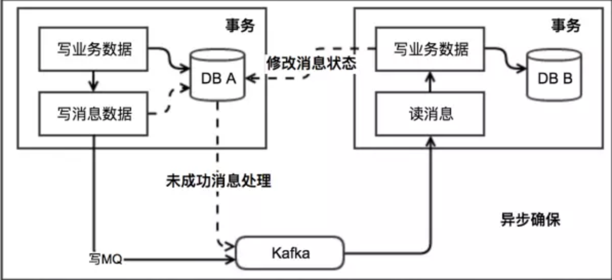

### CAP

一个分布式系统最多只能同时满足一致性（Consistency）、可用性（Availability）和分区容错性（Partition tolerance）这三项中的两项。

- 一致性指所有节点在同一时间的数据完全一致，可以分为强/弱一致性。

1. 强一致性

对于关系型数据库，要求更新过的数据能被后续的访问都能看到，这是强一致性。

2. 弱一致性：更新过的数据不一定能立刻被后续的访问看到。

另外，最终一致性是弱一致性的一种形式，表示在一段时间（*不固定时间*）后，节点间的数据会最终达到一致状态。

- 可用性

可用性指服务在正常响应时间内一直可用（例如可以正常地接受读写请求）。

- 分区容错性

分区容错性指分布式系统在遇到某节点或网络分区故障的时候，仍然能够对外提供满足一致性（CP without A）或可用性（AP without C）的服务。

#### 为什么说 Eureka 是 AP 而 zookeeper 是 CP 的系统？

- zookeeper
1. zk 在生产环境中,如果 master 宕机，需要时间进行选举，在此期间是不能提供服务的注册和发现的；
2. 出现网络分隔的问题，各个 zk 节点彼此都不能发现对方，zk 集群就无法对外提供服务。

- Eureka

Eureka 各个节点都是平等的，几个节点挂掉不会影响正常节点的工作，剩余的节点依然可以提供注册和查询服务。而Eureka的客户端在向某个 Eureka 注册或时如果发现连接失败，则会自动切换至其它节点，只要有一台 Eureka 还在，就能保证注册服务可用(保证可用性)，只不过查到的信息可能不是最新的(不保证强一致性)。

Eureka还有一种自我保护机制，如果在 15 分钟内超过 85% 的节点都没有正常的心跳，那么 Eureka 就认为客户端与注册中心出现了网络故障，如果此时 Eureka 仍将这些节点移除並与其他 Eureka Server 进行同步，会导致大部分服务的下线。此时会出现以下几种情况：

1. Eureka 不再从注册列表中移除因为长时间没收到心跳而应该过期的服务；
2. Eureka 仍然能够接受新服务的注册和查询请求，但是不会被同步到其它节点上（即保证当前节点依然可用）；
3. 当网络稳定时，当前实例新的注册信息会被同步到其它节点中。

### 一致性哈希

一致性哈希主要是为了解决在分布式的数据存储系统中，由于节点的增减而导致的数据大量迁移的问题。被广泛应用于分布式缓存，比如 memcached。

算法步骤如下：

1. 将每个节点（服务器）映射到 0 - 2^32-1 的哈希环上；
2. 对于需要存储的数据，将它们取哈希，並映射到 0 - 2^32-1 的哈希环上；
3. 在步骤 2 中的位置开始沿着哈希环进行顺时针查找，将该数据存储到查找到的第一个节点上。

当增加或减少节点时，需要迁移的数据只有该变更节点到其逆时针的上一个节点中的数据。这可能会导致雪崩问题。

> 如果每个节点在环上只有一个节点，那么可以想象，当某一节点从环中退出时，它原本所负责的任务将全部交由顺时针方向的下一个节点处理。例如，当 node0 退出时，它原本所负责的缓存将全部交给 node1 处理。这就意味着 node1 的访问压力会瞬间增大。设想一下，如果 node1 因为压力过大而崩溃，那么更大的压力又会向 node2 压过去，最终服务压力就像滚雪球一样越滚越大，最终导致雪崩。

- 平衡性

平衡性是指哈希的结果能够尽可能分布到所有的缓冲中去，这样可以使得所有的缓冲空间都得到利用。很多哈希算法都能够满足这一条件。**一致性哈希通过引进虚节点的方法解决平衡性和雪崩问题。**一个物理节点（服务器）会被映射到多个虚拟节点上，而这些虚拟节点会均匀地分布到哈希环上。

- 单调性

单调性是指哈希的结果应能够保证原有已分配的内容可以被映射到原有节点上，避免在节点增减过程中的数据迁移和不能命中。**一致性哈希就很好地解决了单调性的问题。**

#### [使用 TreeMap 实现一致性哈希](../code/ConsistentCache.md)

---
### 分布式事务

- 两种一致性

1. 2PC 协议用于保证属于多个数据分片上的操作的原子性。这些数据分片可能分布在不同的服务器上，2PC 协议保证多台服务器上的操作要么全部成功，要么全部失败。

2. Paxos 协议用于保证同一个数据分片的多个副本之间的数据一致性（即共识）。当这些副本分布到不同的数据中心时，这个需求尤其强烈。

#### 2PC（Two-phase Commi）两阶段提交

2PC 中有两个角色：协调者、参与者。

整个过程分为两个阶段，因而得名。

- 第一阶段：Prepare

1. 协调者节点向所有参与者节点询问是否可以执行提交操作，并开始等待各参与者节点的响应；
2. 参与者节点执行询问发起为止的所有事务操作，但不提交该事务；
3. 各参与者节点响应协调者节点发起的询问。如果参与者节点的事务操作实际执行成功（未提交，锁定资源），则它返回一个“同意”消息；如果参与者节点的事务操作实际执行失败，则它返回一个“中止”消息。

有时候，第一阶段也被称作投票阶段，即各参与者投票是否要继续接下来的提交操作。

- 第二阶段：Commit/Rollback

1. 当协调者节点从所有参与者节点获得的相应消息都为"同意"时：

	1. 协调者节点向所有参与者节点发出“正式提交”的请求；
	2. 参与者节点正式完成操作，并释放在整个事务期间内占用的资源；
	3. 参与者节点向协调者节点发送“完成”消息；
	4. 协调者节点收到所有参与者节点反馈的“完成”消息后，完成事务。

2. 失败：如果任一参与者节点在第一阶段返回的响应消息为“终止”，或者协调者节点在第一阶段的*询问超时*之前无法获取所有参与者节点的响应消息时：

	1. 协调者节点向所有参与者节点发出“回滚操作”的请求；
	2. 参与者节点将未提交的事务进行回滚，并释放在整个事务期间内占用的资源；
	3. 参与者节点向协调者节点发送“回滚完成”消息；
	4. 协调者节点收到所有参与者节点反馈的“回滚完成”消息后，取消事务。

有时候，第二阶段也被称作完成阶段，因为无论结果怎样，协调者都必须在此阶段结束当前事务。

- 优点：原理简单，便于实现

- 缺点

1. 协调者的单点失败问题；
2. 同步阻塞：参与者节点从第一阶段返回“同意”之后就锁定资源，直到第二阶段提交成功才释放资源；在提交阶段，如果有参与者节点长时间不能返回“完成”消息，协调者就要一直等待而不能执行回滚；另外协调者在等待参与者的投票时也是阻塞的；
3. 数据不一致问题：在第二阶段，如果协调者和参与者同时宕机，而又无法确定参与者执行的是 Commit 还是 Rollback 操作时（无法从其他参与者上判断），就会出现不同节点执行了不同操作的情况，从而导致数据不一致。

#### 3PC

- 解决 2PC 的什么问题？

1. 引入参与者的超时机制，解决阻塞问题：参与者在第二阶段 PreCommit 如果发送完 ACK 之后，如果超时仍未收到第三节点 DoCommit 的 Commit/Abort 消息的话，就会自动提交；
2. 只有第一阶段 CanCommit 各参与者都返回 Yes 的情况才会进入第二阶段，进行事务的执行以及锁资源，从而减少了参与者的阻塞时间；

**3PC 仍然无法解决数据不一致的问题，因为参与者在第二阶段的超时自动提交，有可能协调者在第三阶段时给所有参与者发送了 Abort，而因为网络原因无法送达一部分参与者，导致参与者之后执行了不同的操作。**

#### TCC：补偿事务

TCC 分为三个阶段：

1. Try：Try 阶段主要是对业务系统做检测及资源预留（*要减小锁资源的粒度*）；
2. Confirm：Confirm 阶段主要是对业务系统做确认提交，Try 阶段执行成功并开始执行 Confirm 阶段时，默认 Confirm 阶段是不会出错的；
3. Cancel：万一不幸，Confirm 失败了，Cancel 阶段主要是在业务执行错误，需要回滚的状态下执行的业务取消，预留资源释放。

优点：流程简单。

缺点：

1. 业务接口的复杂度增加：原来的一个接口现在需要拆分为 3 个，即 Try 阶段的资源预留，Confirm 的确认提交以及 Cancel 的回滚；
2. Confirm 接口和 Cancel 接口需要是幂等的（网络中断的出现）。

#### 本地消息表

1. 事务发起方 A 在执行一个分布式事务的时候，先执行自己那一部分，並将这个分布式事务记录到本地消息表里；
2. A 有一个轮询任务，定时将本地消息表里未发送的消息写到 MQ 里；
3. 服务 B 监听 MQ，获取到消息后，将其写入自己的事务表（幂等），然后执行自己那一部分的事务；
4. 服务 B 执行完自己的事务后，通知服务 A 该事务已处理完成（通过 B 轮询事务表或者直接访问 A，例如 RPC），A 更新自己的本地消息表；如果服务 B 执行时遇到业务上面的失败，可以给 A 发送一个业务补偿消息，通知 A 进行回滚等操作。

优点：从应用设计开发的角度实现了消息数据的可靠性，消息数据的可靠性不依赖于消息中间件，弱化了对 MQ 中间件特性的依赖。

缺点：

1. 与具体的业务场景绑定，耦合性强，不可公用；
2. 消息数据与业务数据同库，占用业务系统资源。业务系统在使用关系型数据库的情况下，消息服务性能会受到关系型数据库并发性能的局限。

#### MQ 事务消息

通过支持事务型消息的 MQ 来实现本地消息表，并且由 MQ 轮询服务 A 消息状态。

1. 服务 A 向 MQ 发送 half 消息；
2. MQ 将消息持久化后，向 A 确认消息发送成功；
3. A 开始执行事务逻辑；
4. A 根据本地事务执行结果向 MQ 提交二次确认或者回滚；
5. MQ 收到 commit 状态则将 half 消息标记可投递状态；
6. 服务 B 收到该消息，执行本地业务逻辑。返回处理结果。

**如果执行本地事务过程中，服务 A 挂掉，或者超时，MQ 将会不停的询问 A 服务的其他实例来获取状态**。

优点：

1. 消息数据独立存储，降低业务系统与消息系统之间的耦合；
2. 吞吐量优于本地消息表方案。

缺点：

1. 一次消息发送需要两次网络请求(half消息 + commit/rollback)；
2. 需要实现消息回查接口。

#### Paxos

#### [Raft](http://thesecretlivesofdata.com/raft/)

---

### 分布式锁

主要有三种方式实现分布式锁：数据库、Redis、Zookeeper。

#### [使用 Redis 实现分布式锁](https://www.cnblogs.com/zhili/p/redisdistributelock.html)

- 单节点 Redis 实现：

1. 加锁时通过 `SET resource_name my_random_value NX PX 30000` 来锁定资源並设置锁的有效时间（资源对应的 value 是由客户端生成的随机值，在解锁时使用）；
2. 解锁时包含三步操作，用Lua脚本来实现能保证这三步的原子性：`if redis.call('get', KEYS[1]) == ARGV[1] then return redis.call('del', KEYS[1]) else return 0 end`
	1. 'GET'：获取 resource_name 的 value；
	2. 判断和自己加锁时设置的值是否相同（*当加锁成功的客户端断线使得锁自动过期时两个值不相同*，此时是认为成功解锁了？）；
	3. 'DEL'：步骤 2 判断结果相同的话，就删除该 key。

锁的有效时间如果是客户端生成的话，需要进行多客户端之间的时间同步。如果有效时间设置太短的话，锁就有可能在客户端完成对于共享资源的访问之前过期，从而失去保护；如果设置太长的话，一旦某个持有锁的客户端释放锁失败，那么就会导致所有其它客户端都无法获取锁，从而长时间内无法正常工作。

使用 Redis 集群来实现分布式锁时，因为 Redis 的主从复制存在延迟，所以会出现在锁信息还未同步到 slave 时就发生主从切换的情况。如：

1. 客户端 1 从 Master 获取了锁；
2. Master 宕机了，存储锁的 key 还没有来得及同步到 Slave 上；
3. Slave 升级为 Master；
4. 客户端 2 从新的 Master 获取到了对应同一个资源的锁。

- 客户端执行事务的时间超过了锁的有效时间，该怎么办？

可以通过为锁进行自动续约的方式防止在客户端在执行事务的过程中锁失效了。实现上通过一个后台线程，定期的延长锁的有效时间，但延长次数续约进行限制以防止锁的长期持有。

- [Redlock](https://mp.weixin.qq.com/s?__biz=MzA4NTg1MjM0Mg==&mid=2657261514&idx=1&sn=47b1a63f065347943341910dddbb785d&chksm=84479e13b3301705ea29c86f457ad74010eba8a8a5c12a7f54bcf264a4a8c9d6adecbe32ad0b&mpshare=1&scene=23&srcid=1004XqCveZ8C5IDjoB9ZXbWj#rd)

Redlock 基于 N 个完全独立的 Redis 节点（通常情况下 N 可以设置成 5）。

运行 Redlock 算法的客户端依次执行下面各个步骤，来完成获取锁的操作：

1. 获取当前时间（毫秒数）;
2. 按顺序依次向 N 个 Redis 节点执行获取锁的操作。这个获取操作跟前面基于单 Redis 节点的获取锁的过程相同，包含随机字符串 my_random_value，也包含过期时间(比如 `PX 30000`，即锁的有效时间)。为了保证在某个 Redis 节点不可用的时候算法能够继续运行，这个获取锁的操作还有一个超时时间(time out)，它要远小于锁的有效时间（几十毫秒量级）。客户端在向某个 Redis 节点获取锁失败以后，应该立即尝试下一个 Redis 节点。这里的失败，应该包含任何类型的失败，比如该 Redis 节点不可用，或者该 Redis 节点上的锁已经被其它客户端持有（注：Redlock 原文中这里只提到了 Redis 节点不可用的情况，但也应该包含其它的失败情况）;
3. 计算整个获取锁的过程总共消耗了多长时间，计算方法是用当前时间减去第1步记录的时间。如果客户端从大多数 Redis 节点（>= N/2+1）成功获取到了锁，并且获取锁总共消耗的时间没有超过锁的有效时间(lock validity time)，那么这时客户端才认为最终获取锁成功；否则，认为最终获取锁失败;
4. 如果最终获取锁成功了，那么这个锁的有效时间应该重新计算，它等于最初的锁的有效时间减去第3步计算出来的获取锁消耗的时间;
5. 如果最终获取锁失败了（可能由于获取到锁的 Redis 节点个数少于 N/2+1，或者整个获取锁的过程消耗的时间超过了锁的最初有效时间），那么客户端应该立即向所有 Redis 节点发起释放锁的操作（即前面介绍的 Redis Lua 脚本）。

当然，上面描述的只是获取锁的过程，而释放锁的过程比较简单：客户端向所有Redis节点发起释放锁的操作，不管这些节点当时在获取锁的时候成功与否。

#### [如何使用 Zookeeper 实现分布式锁](http://www.dengshenyu.com/java/%E5%88%86%E5%B8%83%E5%BC%8F%E7%B3%BB%E7%BB%9F/2017/10/23/zookeeper-distributed-lock.html)

下面描述使用zookeeper实现分布式锁的算法流程，假设锁空间的根节点为/lock：

1. 客户端连接zookeeper，并在/lock下创建临时的且有序的子节点，第一个客户端对应的子节点为/lock/lock-0000000000，第二个为/lock/lock-0000000001，以此类推；
2. 客户端获取 /lock 下的子节点列表，判断自己创建的子节点是否为当前子节点列表中序号最小的子节点，如果是则认为获得锁，否则监听 /lock的子节点变更消息，获得子节点变更通知后重复此步骤直至获得锁；
3. 执行业务代码；
4. 完成业务流程后，删除对应的子节点释放锁。

其中 zookeeper 提供的 API 中设置监听器的操作与读操作是原子执行的，也就是说在第 2 步中，读子节点列表时同时设置监听器，保证不会丢失事件。

另外，还需要处理羊群效应：假如当前有1000个节点在等待锁，如果获得锁的客户端释放锁时，这1000个客户端都会被唤醒，这种情况称为“羊群效应”；在这种羊群效应中，zookeeper需要通知1000个客户端，这会阻塞其他的操作，最好的情况应该只唤醒新的最小节点对应的客户端。应该怎么做呢？在设置事件监听时，每个客户端应该对刚好在它之前的子节点设置事件监听，例如子节点列表为/lock/lock-0000000000、/lock/lock-0000000001、/lock/lock-0000000002，序号为1的客户端监听序号为0的子节点删除消息，序号为2的监听序号为1的子节点删除消息。

所以调整后的分布式锁算法流程如下：

1. 客户端连接zookeeper，并在/lock下创建临时的且有序的子节点，第一个客户端对应的子节点为/lock/lock-0000000000，第二个为/lock/lock-0000000001，以此类推；
2. 客户端获取/lock下的子节点列表，判断自己创建的子节点是否为当前子节点列表中序号最小的子节点，如果是则认为获得锁，否则监听刚好在自己之前一位的子节点删除消息，获得子节点变更通知后重复此步骤直至获得锁；
3. 执行业务代码；
4. 完成业务流程后，删除对应的子节点释放锁。

其中，**第 2 步中，读 /lock 的子节点与监听前一位子节点的操作仍然是原子性的吗？**

- 与 redis 分布式锁有和优缺点？

1. 如果加锁成功后要做的事情，是一个长时性的或者持续性的工作，那么使用 zk 实现应该会更合理，因为我们很难确定过期时间的设置；
2. 如果加锁成功后要访问的资源，可以在很短的时间内完成（豪秒级或秒级），那么使用 Redis 更合理，复杂度更低，过期时间的设置也容易；
3. Redis 性能高，而 zk 在较多的客户端频繁的申请加锁、释放锁，对于 zk 集群的压力会比较大；
4. Redis 的数据不是强一致性的，在主从模式下可能丢失锁；而 zk 是强一致性的，锁的模型健壮；
5. 加锁方式上，Redis 需要不断进行重试加锁，而 zk 可以通过事件机制来通知加锁时机；
6. Redis 方式实现简单，zk 需要维护一个集群。

- 两者的实现如何避免客户端在获取到锁之后阻塞了一段时间导致锁失效，此时客户端仍然认为自己占有锁而操作了共享资源？