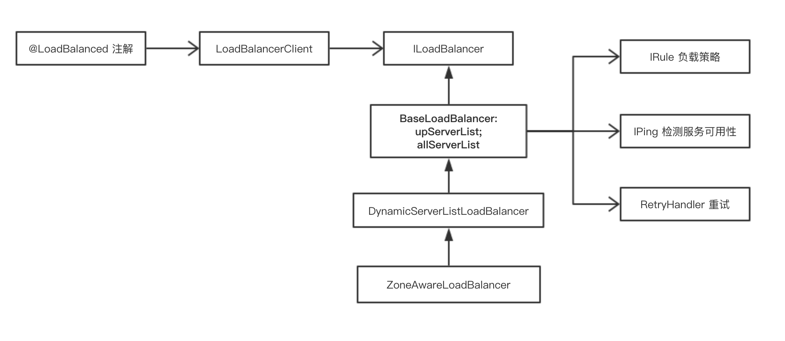

### Ribbon

客户端 Ribbon 在进行 Feign 调用的时候可以配置进行负载均衡。

Feign 的调用本质是通过 RestTemplate，而通过在 RestTemplate 上添加 `@LoadBalance` 注解就可以使得 RestTemplate 对服务的调用拥有负载均衡的效果。

Ribbon 的负载均衡，主要通过 LoadBalancerClient 来实现的，而 LoadBalancerClient 具体交给了 ILoadBalancer 来处理，ILoadBalancer 通过配置 IRule（负载均衡策略）、IPing 等信息，并向 EurekaClient 获取注册列表的信息，并默认 10 秒一次向 EurekaClient 发送 “ping”，进而检查是否更新服务列表，最后，得到注册列表后，ILoadBalancer 根据 IRule 的策略进行负载均衡。

LoadBalancerClient（RibbonLoadBalancerClient 是实现类）在初始化的时候（execute 方法），会通过ILoadBalance（BaseLoadBalancer 是实现类）向Eureka注册中心获取服务注册列表，并且每10s检测一次服务的可用性（通过 IPing 接口以及 PingTask 和 IPingStrategy 检测策略，默认是顺序检测），将可用的服务添加到 upServerList 中。

而 RestTemplate 被 `@LoadBalance` 注解后，能拥有负载均衡的效果，是通过维护了一个被 `@LoadBalance` 注解的 RestTemplate 列表，并给列表中的 RestTemplate 添加 `LoadBalancerInterceptor` 拦截器，进而交给负载均衡器去处理。



- 有哪些负载均衡算法？

1. RandomRule：随机选择；
2. RoundRobinRule：轮询直到找到一个可用的服务，轮询次数不超过 10 次；
3. WeightedResponseTimeRule：响应时间作为选取权重的负载均衡策略，其含义就是，响应时间越短的服务被选中的可能性大；
4. RetryRule：在一定时间内（500ms）使用 RoundRobin 选择出一个可用的服务，否则返回 null；
5. BestAvailableRule：选择当前并发请求数最小的服务；
6. ZoneAvoidanceRule：默认策略，会先过滤不符条件的 zone，然后再从返回的可用 zone 中随机选择一个，再在选择的 zone 中过滤后选择一个 server（在过滤 zone 时会从所有 zone 中剔除满足：实例数为 0 的或 zone 内实例平均负载小于 0 或实例故障率大于等于阈值的（默认 0.99999）的 zone；然后再从过滤完的 zone 中随机选择一个剔除，随机时按照 zone 内的实例数，最后返回剩下的即为可用的 zone）；
7. AvailabilityFilteringRule：过滤不可达的服务以及并发请求数大于阈值（默认 Integer.MAX_VALUE）的服务后使用轮询；

Ribbon 的负载均衡默认使用轮询算法，默认的 LoadBalancer 是 。

配置负载策略：
```java
@Configuration
public class MyRibbonConfiguration {
    @Bean
    public IRule ribbonRule(){
        return new RandomRule();
    }
}
```
- Ribbon 的重试

通过 RetryHandler 处理重试，*默认失败不进行重试*。当访问到故障请求的时候，它会再尝试访问一次当前实例（次数由 maxAutoRetries 配置），如果不行，就换一个实例进行访问，如果还是不行，再换一个实例访问（更换次数由 MaxAutoRetriesNextServer 配置），如果依然不行，返回失败。(`LoadBalancerCommand.submit`)

配置：
```
// 开启重试机制，默认关闭
spring.cloud.loadbalancer.retry.enabled=true
// 断路器的超时时间需要大于Ribbon的超时时间，不然不会触发重试。
hystrix.command.default.execution.isolation.thread.timeoutInMilliseconds=10000

// 请求连接超时时间
my-service.ribbon.ConnectTimeout=250
// 请求处理的超时时间
my-service.ribbon.ReadTimeout=1000
// 对所有操作请求都进行重试
my-service.ribbon.OkToRetryOnAllOperations=true
// 切换实例的重试次数
my-service.ribbon.MaxAutoRetriesNextServer=2
// 对当前实例的重试次数
my-service.ribbon.maxAutoRetries=1
```