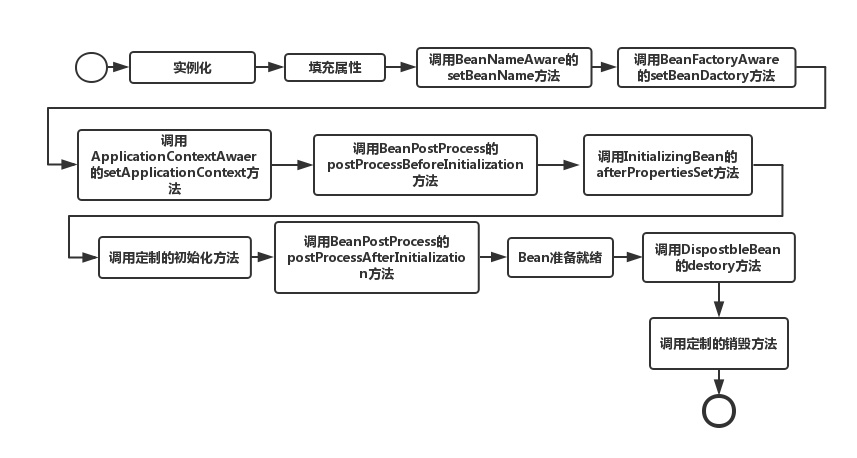

### 参考资料

- [《Spring 揭秘》](https://book.douban.com/subject/3897837/)

---

### Spring

- [Tomcat 如何启动一个 Spring 项目？](https://zouzls.github.io/2017/03/29/SpringStart/)

1. 在启动 Web 项目时，容器比如 Tomcat 会读 web.xml 配置文件中所有的属性，包括 contextConfigLocation 和 ContextLoaderListener 这些等等；
2. 接着 Tomcat 会创建一个 ServletContext（这里的 ServletContext 可以理解为每个 Web 应用对应的 Context 容器),应用范围内即整个 web 项目都能使用这个上下文；
3.  Tomcat 将刚刚读取到 contextConfigLocation 和 ContextLoaderListener 这些 web.xml 中的参数键值对交给 ServletContext；
4. 创建 web.xml 中配置的监听器类 Listener。在监听器类中必须要实现 ServletContextListener 接口；
5. 因为 ContextLoaderListener 实现了用来监听 ServletContext 事件的 ServletContextListener 这个接口，如果 ServletContext 状态发生变化，将会触发产生对应的 ServletContextEvent，然后调用监听器的不同的方法。

```xml
<!-- web.xml Spring配置文件开始  -->
<context-param>
    <param-name>contextConfigLocation</param-name>
    <param-value>
        classpath:spring-config.xml
    </param-value>
</context-param>
<listener>
    <listener-class>org.springframework.web.context.ContextLoaderListener</listener-class>
</listener>
<!-- Spring配置文件结束 -->
```

```java
public class ContextLoaderListener extends ContextLoader implements ServletContextListener {
    ...
    //实现了ServletContextListener的初始化接口
    public void contextInitialized(ServletContextEvent event) {
        this.initWebApplicationContext(event.getServletContext());
    }
    //同上
    public void contextDestroyed(ServletContextEvent event) {
        this.closeWebApplicationContext(event.getServletContext());
        ContextCleanupListener.cleanupAttributes(event.getServletContext());
    }
}
```

- Spring MVC 的请求处理流程


其中，
1. DispatchServlet 是负责前端控制（流程控制）的 Servlet，而其他 Controller（或其他 Handler）则是负责业务处理的；
2. **HandlerMapping 返回的并不是 Handler 对象，而是 HandlerExecutionChain 对象，它包含了 Handler 的引用以及 Handler 关联的 HandlerInterceptor，HandlerInterceptor 的 `preHandle` 和 `postHandle` 分别会在 `HandlerAdapter.handler` 方法执行的前后执行**。

- Spring IOC 的实现

IOC 有三种实现方式（《Spring 揭秘》2.2）：构造方法注入、setter 方法注入、以及接口注入。

1. 构造方法注入

被注入对象可以通过在其构造方法中声明依赖对象的参数列表，让外部（通常是 IOC 容器）知道它需要哪些依赖对象。

2. setter 方法注入

当前对象只要为其依赖对象所对应的属性添加 setter 方法，就可以通过 setter 方法将相应的依赖对象设置到被注入对象中。

3. 接口注入

被注入对象如果想要 IOC 容器为其注入依赖对象，就需要实现某个接口。这个接口提供一个方法，用来为其注入依赖对象。

- Spring AOP 的实现

代理的实现可以分为编译时的字节码增强或者是运行时代理，前者例如 AspectJ，后者则包括 Java 中的动态代理以及 cglib。

[Spring AOP 的实现主要是使用了 Java 动态代理以及 cglib](https://docs.spring.io/spring/docs/2.5.x/reference/aop.html)，因为 Java 动态代理需要目标类实现了某个接口，因此对于实现了接口的代理类采用的是 Java 动态代理，而没有实现接口的类则通过 cglib 生成代理类的子类，因此对于 final 修饰的类无法通过 cglib 生成代理类。

具体获取哪个代理策略是通过调用 `org.springframework.aop.framework.DefaultAopProxyFactory implements AopProxyFactory` 的 `createAopProxy(AdvisedSupport config)` 完成的，代码如下：

```java
public AopProxy createAopProxy(AdvisedSupport config) throws AopConfigException {
	if (config.isOptimize() || config.isProxyTargetClass() || hasNoUserSuppliedProxyInterfaces(config)) {
		Class<?> targetClass = config.getTargetClass();
		if (targetClass == null) {
			throw new AopConfigException("TargetSource cannot determine target class: " +
					"Either an interface or a target is required for proxy creation.");
		}
		if (targetClass.isInterface() || Proxy.isProxyClass(targetClass)) {
			return new JdkDynamicAopProxy(config);
		}
		return new ObjenesisCglibAopProxy(config);
	}
	else {
		return new JdkDynamicAopProxy(config);
	}
}
``` 

- Java 动态代理的实现

通过 `java.lang.reflect.Proxy.newProxyInstance(ClassLoader loader, Class<?>[] interfaces, InvocationHandler h)` 来动态生成代理类，代理类本身实现了传入的接口类并且继承了 Proxy，对被代理对象的实际方法调用是通过  `InvocationHandler.invoke(Object proxy, Method method, Object[] args)` 完成的。

- Java 动态代理和 cglib 动态代理的区别（经常结合 spring 一起问所以就放这里了）

1. 实现的方式不同，Java 动态代理是通过动态生成一个实现了被代理接口的类，并且通过 `InvocationHandler.invoke(Object proxy, Method method, Object[] args)` 进行委托调用的；而 cglib 是通过动态生成被代理对象的子类；
2. Java 动态代理的对象需要实现某个接口，而 cglib 的代理对象不需要；但是 cglib 代理的对象类不能是 final 的，代理方法不能是 final 的。

- [手写动态代理的示例代码](动态代理.md)

- `BeanFactory.getBean` 的过程

1. 检查缓存中是否有对应的单例 bean，有就直接返回；
2. 没有的话，就先获取 bean RootBeanDefinition；
3. 先处理 bean 依赖的对象（`depends-on` 定义的依赖关系而不是对象属性的依赖）；
4. 根据 RootBeanDefinition 的不同类型（）进行相应的创建逻辑：
    1. singleton：IOC 容器中有且只有一个对象，多次调用 `getBean` 返回同一个对象；
    2. prototype：每次调用 `getBean` 返回一个新对象；
    3. scope：
        1. HTTP Request 每次 HTTP 请求共用同一个对象；
        2. HTTP Session 每个 HTTP 会话共用同一个对象；
        3. Application ServletContext 共用一个对象。
5. 创建一个 bean 的流程：实例化、填充属性、`BeanNameAware.setBeanName`、`BeanFactoryAware.setBeanFactory`、`ApplicationContextAware.setApplicationContext`、BeanPostProcess...

- spring 中 bean 的生命周期是怎样的？

当 IOC 容器是 ApplicationContext 时，singleton bean 的生命周期如下图，其中，如果使用的不是 ApplicationContext 而是 BeanFactory 的话，则 “调用 ApplicationContextAware 的 setApplicationContext 方法”这一阶段不会出现，另外这一阶段实际上是在 ApplicationContextAwareProcessor 这个 BeanPostProcessor 的 `postProcessBeforeInitialization` 方法中执行的。



- BeanFactory 和 ApplicationContext 的区别。

Sping 的容器可以分为两种类型：
1. `org.springframework.beans.factory.BeanFactory`：是最简单的容器，提供了基本的依赖注入支持，默认使用延迟初始化策略。最常用的 BeanFactory 实现就是 XmlBeanFactory 类，它根据 XML 文件中的定义加载 beans，该容器从 XML 文件读取配置元数据并用它去创建一个完全配置的系统或应用，适合资源有限且功能要求不是很严格的场景；
2. `org.springframework.context.ApplicationContext`：BeanFactory 的简介子类，除了 BeanFactory 拥有的功能外，还提供了诸如事件发布、国际化支持等。ApplicationContext 管理的对象默认在容器启动后进行初始化。适合系统资源充足，且要求更多功能的场景。

```java
// BeanFactory 调用代码示例
DefaultListableBeanFactory beanFactory = new DefaultListableBeanFactory();
BeanDefinitionReader beanDefinitionReader = new XmlBeanDefinitionReader(beanFactory);
beanDefinitionReader.loadBeanDefinitions(new ClassPathResource("applicationContext.xml"));
DemoServiceImpl demo = (DemoServiceImpl) beanFactory.getBean("demo");

// ApplicationContext 调用代码示例
ApplicationContext ctx = new ClassPathXmlApplicationContext("applicationContext.xml");
DemoService demo = (DemoService) ctx.getBean("demo");
```

- setter 方法注入和构造器注入哪种会有循环依赖的问题？

构造器注入的方式会有循环依赖的问题。换成 setter 方法注入即可解决这个问题。因为 setter 方法注入会首先调用默认构造函数来实例化对象，然后再调用 setter 实现依赖注入。这样在对象实例化的阶段就没有了任何依赖。

- 什么是 FactoryBean？

FactoryBean 是 Spring 提供的接口，可以通过实现它来定义对某个类的实例化规则，即实现一个简单工厂类。对于这个类的依赖，可以通过 `FactoryBean.getObject()` 方法返回的对象作为依赖注入。

适用场景有：

1. 某些对象的实例化过程过于繁琐，通过工厂类进行封装；
2. 某些第三方库不能直接注册到 Spring 容器的时候，需要通过工厂类来实现对象实例化。

```java
public interface FactoryBean {
    Object getObject() throw Exception;
    // 返回工厂类生产对象的类型；
    Class getObjectType();
    // 返回的实例是否使用单例
    boolean isSingleton();
}
```

- spring 的事务传播以及回滚

7 种事务传播设置：

1. PROPAGATION_REQUIRED：支持当前事务，如果当前没有事务，就新建一个事务。默认选项。
2. PROPAGATION_SUPPORTS：支持当前事务，如果当前没有事务，就以非事务方式执行。
3. PROPAGATION_MANDATORY：支持当前事务，如果当前没有事务，就抛出异常。 
4. PROPAGATION_REQUIRES_NEW：新建事务，如果当前存在事务，把当前事务挂起。 
5. PROPAGATION_NOT_SUPPORTED：以非事务方式执行操作，如果当前存在事务，就把当前事务挂起。 
6. PROPAGATION_NEVER：以非事务方式执行，如果当前存在事务，则抛出异常。
7. PROPAGATION_NESTED：如果当前存在事务，则在当前事务的一个*嵌套事务*中执行；如果当前没有事务，就创建新的事务。

如果在 Spring 使用嵌套事务，需要满足以下 3 点：

1. 数据库支持，嵌套事务是使用数据库的 SavePoint(事务保存点)。

可以使用以下代码来判断数据库是否支持。
```java
Connection.getMetaData().supportsSavepoints();
```
2. JDK 1.4 才支持 `java.sql.Savepoint`。所以 JDK 必须在 1.4 及以上。

3. 需要 TransactionManager 的支持。

- Spring 中的只读事务如何配置？如何提升性能的？针对 MySQL/Oracle？

通过 `@Transactional(readOnly = true)` 配置只读事务。

- `@Transactional` 注解在什么情况下会失效？

注解使用在了非 public 的方法上；`org.springframework.transaction.annotation.AnnotationTransactionAttributeSource` 默认只处理 public 的方法；如果应用在 protected、private或者 package 可见度的方法上，也不会报错，不过事务设置不会起作用。

- `@Transactional` 的其他特性

1. Service 类(一般不建议在接口上)上添加 `@Transactional`，可以将整个类纳入spring事务管理，在每个业务方法执行时都会开启一个事务，不过这些事务采用相同的管理方式；

> Spring 推荐将 @Transactional 注解标注于具体的业务实现类或者实现类的业务方法上。之所以如此，是因为 Spring AOP 可以采用两种方式来生成代理对象（动态代理或者 cglib），如果将 @Transactional 标注于业务接口的定义上，那么，当使用动态代理机制构建代理对象时，读取接口定义上的 @Transactional 信息是没有问题的，可是当使用 cglib 构建代理对象的时候，则无法读取接口上定义的 @Transactional 信息。
>
> 《Spring 揭秘》20.2.3


2. 默认情况下，Spring 会对 unchecked exception 进行事务回滚；如果是 checked exception 则不回滚，可以通过配置 rollbackFor 指定在发生特定 checked exception 下进行回滚。

- Spring 使用了哪些设计模式？

1. 策略模式：在选择 AopProxy 的实现类时，通过 AdvisedSupport 作为选择的依据；
2. 模板方法模式：TransactionManager 的实现类，提供了 `commit/rollback` 等方法供客户端使用，在这些方法中封装了事务操作的正确顺序，子类只需要实现事务操作中的某些关注点即可。或者是 JdbcTemplate；
3. 代理模式：AOP 即是通过为目标对象生成代理类实现的；
4. 单例模式：Spring 管理的 bean 默认都是单例的；
5. 观察者模式：Spring 中 Observer 模式常用的地方是 listener 的实现。如 ApplicationListener；
6. 工厂方法：BeanFactory；
7. 适配器模式：HandlerAdapter。
---
#### Spring Boot

- springboot启动方式/启动流程

1. 运行启动类的 main 方法；
2. 打包成 Jar 包后运行；
3. 通过 `mvn spring-boot:run` 运行。


#### Spring Cloud

- spring cloud 组件有哪些

服务注册中心 Eureka，客户端负载均衡 Ribbon，远程调用 Feign、断路器 Hystrix、配置中心 Config、路由及权限控制、负载均衡的 Zuul、消息总线 Bus。

- Eureka 互相注册可以吗

Eureka Server 默认模式为多实例，可以通过 `eureka.client.registerWithEureka=false` 来关闭此行为，以避免日志警告。
服务启动后向 Eureka 注册，Eureka Server 之间相互注册，Eureka Server 会将注册信息向其他 Eureka Server 进行同步，当服务消费者要调用服务提供者，则向服务注册中心获取服务提供者地址，然后会将服务提供者地址缓存在本地，下次再调用时，则直接从本地缓存中取，完成一次调用。

客户端启动时，只需要指定其中一个 Eureka 的地址，该服务的信息就会由 Eureka 自动同步到多个 server 上。**客户端在什么时候得到其他 server 的地址，以在指定的 server 挂了的时候进行切换？**

- Eureka 如何多个通讯交换信息，一个服务可以注册到多个注册中心吗？

可以注册到多个，但没必要，因为注册中心之间会互相通讯，同步注册信息。

- Eureka 之间的同步机制是怎样的？服务消费者缓存在本地的信息包括哪些？

- Eureka 跟客户端之后通过什么协议进行通讯？
- 负载均衡是在客户端还是服务端实现的？

客户端 Ribbon 在进行 Feign 调用的时候。

- 有哪些负载均衡算法？

1. RandomRule：随机选择；
2. RoundRobinRule：轮询；
3. WeightedResponseTimeRule：响应时间作为选取权重的负载均衡策略，其含义就是，响应时间越短的服务被选中的可能性大；
4. 

Ribbon 的负载均衡默认使用轮询算法。

- 熔断、降级如何做的

Hystrix 熔断的目的是为了防止服务的雪崩。

Hystrix 会搞很多个小小的线程池，比如订单服务请求库存服务是一个线程池，请求仓储服务是一个线程池，请求积分服务是一个线程池。每个线程池里的线程就仅仅用于请求那个服务。打个比方：现在很不幸，积分服务挂了，会咋样？当然会导致订单服务里那个用来调用积分服务的线程都卡死不能工作了啊！但由于订单服务调用库存服务、仓储服务的这两个线程池都是正常工作的，所以这两个服务不会受到任何影响。

- Eureka 在什么情况下会触发熔断保护？

Eureka 还有一种自我保护机制，如果在 15 分钟内超过 85% 的节点都没有正常的心跳，那么 Eureka 就认为客户端与注册中心出现了网络故障，如果此时 Eureka 仍将这些节点移除並与其他 Eureka Server 进行同步，会导致大部分服务的下线。此时会出现以下几种情况：

1. Eureka 不再从注册列表中移除因为长时间没收到心跳而应该过期的服务；
2. Eureka 仍然能够接受新服务的注册和查询请求，但是不会被同步到其它节点上(即保证当前节点依然可用)；
3. 当网络稳定时，当前实例新的注册信息会被同步到其它节点中。

- Eureka client 断开一段时间注册信息会怎样

client 的状态转换为：STARTING->UP->DOWN。

client 默认 30 秒发送一次心跳，如果 Eureka 超过 90 秒没有接收到 client 的心跳，则将 client 状态修改为 DOWN。

- Ribbon 和 Zuul 的区别

Zuul 是负责外部调用内部服务的时候进行统一的鉴权、流量过滤、服务路由等；而 Ribbon 是负责内部服务之后相互调用时基于负载均衡算法选择一个可用服务提供者。