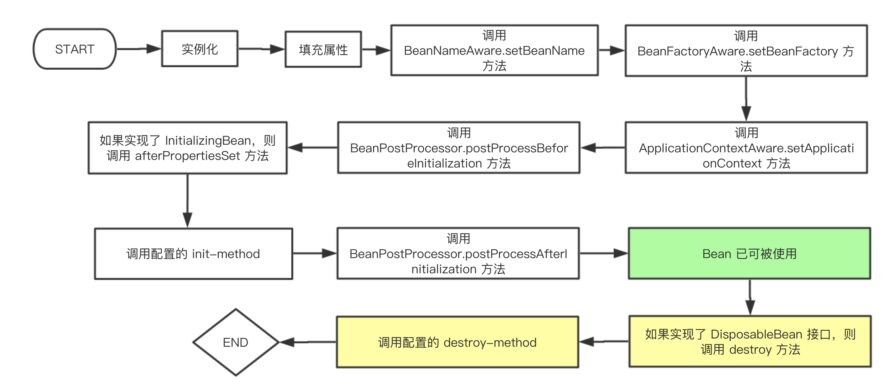

### Spring

- [Tomcat 如何启动一个 Spring 项目？](https://zouzls.github.io/2017/03/29/SpringStart/)

1. 在启动 Web 项目时，容器比如 Tomcat 会读 web.xml 配置文件中所有的属性，包括 contextConfigLocation 和 ContextLoaderListener 这些等等；
2. 接着 Tomcat 会创建一个 ServletContext（这里的 ServletContext 可以理解为每个 Web 应用对应的 Context 容器),应用范围内即整个 web 项目都能使用这个上下文；
3.  Tomcat 将刚刚读取到 contextConfigLocation 和 ContextLoaderListener 这些 web.xml 中的参数键值对交给 ServletContext；
4. 创建 web.xml 中配置的监听器类 Listener。在监听器类中必须要实现 ServletContextListener 接口；
5. 因为 ContextLoaderListener 实现了用来监听 ServletContext 事件的 ServletContextListener 这个接口，如果 ServletContext 状态发生变化，将会触发产生对应的 ServletContextEvent，然后调用监听器的不同的方法。

```xml
<!-- web.xml Spring配置文件开始  -->
<context-param>
    <param-name>contextConfigLocation</param-name>
    <param-value>
        classpath:spring-config.xml
    </param-value>
</context-param>
<listener>
    <listener-class>org.springframework.web.context.ContextLoaderListener</listener-class>
</listener>
<!-- Spring配置文件结束 -->
```

```java
public class ContextLoaderListener extends ContextLoader implements ServletContextListener {
    ...
    //实现了ServletContextListener的初始化接口
    public void contextInitialized(ServletContextEvent event) {
        this.initWebApplicationContext(event.getServletContext());
    }
    //同上
    public void contextDestroyed(ServletContextEvent event) {
        this.closeWebApplicationContext(event.getServletContext());
        ContextCleanupListener.cleanupAttributes(event.getServletContext());
    }
}
```

- Spring MVC 的请求处理流程


其中，
1. DispatchServlet 是负责前端控制（流程控制）的 Servlet，而其他 Controller（或其他 Handler）则是负责业务处理的；
2. **HandlerMapping 返回的并不是 Handler 对象，而是 HandlerExecutionChain 对象，它包含了 Handler 的引用以及 Handler 关联的 HandlerInterceptor，HandlerInterceptor 的 `preHandle` 和 `postHandle` 分别会在 `HandlerAdapter.handler` 方法执行的前后执行**。

- Spring IOC 的实现

IOC 有三种实现方式（《Spring 揭秘》2.2）：构造方法注入、setter 方法注入、以及接口注入。

1. 构造方法注入

被注入对象可以通过在其构造方法中声明依赖对象的参数列表，让外部（通常是 IOC 容器）知道它需要哪些依赖对象。

2. setter 方法注入

当前对象只要为其依赖对象所对应的属性添加 setter 方法，就可以通过 setter 方法将相应的依赖对象设置到被注入对象中。

3. 接口注入

被注入对象如果想要 IOC 容器为其注入依赖对象，就需要实现某个接口。这个接口提供一个方法，用来为其注入依赖对象。

- Spring AOP 的实现

代理的实现可以分为编译时的字节码增强或者是运行时代理，前者例如 AspectJ，后者则包括 Java 中的动态代理以及 cglib。

[Spring AOP 的实现主要是使用了 Java 动态代理以及 cglib](https://docs.spring.io/spring/docs/2.5.x/reference/aop.html)，因为 Java 动态代理需要目标类实现了某个接口，因此对于实现了接口的代理类采用的是 Java 动态代理。而没有实现接口的类则通过 cglib 生成代理类的子类，因此对于 final 修饰的类无法通过 cglib 生成代理类。

具体获取哪个代理策略是通过调用 `org.springframework.aop.framework.DefaultAopProxyFactory implements AopProxyFactory` 的 `createAopProxy(AdvisedSupport config)` 完成的，代码如下：

```java
public AopProxy createAopProxy(AdvisedSupport config) throws AopConfigException {
	if (config.isOptimize() || config.isProxyTargetClass() || hasNoUserSuppliedProxyInterfaces(config)) {
		Class<?> targetClass = config.getTargetClass();
		if (targetClass == null) {
			throw new AopConfigException("TargetSource cannot determine target class: " +
					"Either an interface or a target is required for proxy creation.");
		}
		if (targetClass.isInterface() || Proxy.isProxyClass(targetClass)) {
			return new JdkDynamicAopProxy(config);
		}
		return new ObjenesisCglibAopProxy(config);
	}
	else {
		return new JdkDynamicAopProxy(config);
	}
}
``` 

代理对象的创建调用路径如下：


- Java 动态代理的实现

通过 `java.lang.reflect.Proxy.newProxyInstance(ClassLoader loader, Class<?>[] interfaces, InvocationHandler h)` 来动态生成代理类，代理类本身实现了传入的接口类并且继承了 Proxy，对被代理对象的实际方法调用是通过  `InvocationHandler.invoke(Object proxy, Method method, Object[] args)` 完成的。

- Java 动态代理和 cglib 动态代理的区别（经常结合 spring 一起问所以就放这里了）

1. 实现的方式不同，Java 动态代理是通过动态生成一个实现了被代理接口的类，并且通过 `InvocationHandler.invoke(Object proxy, Method method, Object[] args)` 进行委托调用的；而 cglib 是通过动态生成被代理对象的子类；
2. Java 动态代理的对象需要实现某个接口，而 cglib 的代理对象不需要；但是 cglib 代理的对象类不能是 final 的，否则报错；方法不能是 static/final/private 的，否则无法进行代理。

- [手写动态代理的示例代码](动态代理.md)

- `BeanFactory.getBean` 的过程

1. 检查缓存中是否有对应的单例 bean，有就直接返回；
2. 没有的话，就先获取 bean RootBeanDefinition；
3. 先处理 bean 依赖的对象（`depends-on` 定义的依赖关系而不是对象属性的依赖）；
4. 根据 RootBeanDefinition 的不同类型进行相应的创建逻辑：
    1. singleton：IOC 容器中有且只有一个对象，多次调用 `getBean` 返回同一个对象；
    2. prototype：每次调用 `getBean` 返回一个新对象；
    3. scope：
        1. HTTP Request 每次 HTTP 请求共用同一个对象；
        2. HTTP Session 每个 HTTP 会话共用同一个对象；
        3. Application ServletContext 共用一个对象。
5. 创建一个 bean 的流程：实例化、填充属性、`BeanNameAware.setBeanName`、`BeanFactoryAware.setBeanFactory`、`ApplicationContextAware.setApplicationContext`、BeanPostProcess...

- spring 中 bean 的生命周期是怎样的？

当 IOC 容器是 ApplicationContext 时，singleton bean 的生命周期如下图，其中，如果使用的不是 ApplicationContext 而是 BeanFactory 的话，则 “调用 ApplicationContextAware 的 setApplicationContext 方法”这一阶段不会出现，另外这一阶段实际上是在 ApplicationContextAwareProcessor 这个 BeanPostProcessor 的 `postProcessBeforeInitialization` 方法中执行的。

如果 bean 实现了 InitializingBean 接口，则会调用 `afterPropertiesSet`，比通过反射调用 init-method 指定的方法效率相对来说要高点。但是 init-method 方式消除了对 spring 的依赖。两种方式可以同时使用。

如果 bean 实现了 DisposableBean 接口，则会调用 `destroy()`，也可以通过 destory-method 指定一个 bean 销毁时的调用方法，两者可以同时使用。



- BeanFactory 和 ApplicationContext 的区别。

Sping 的容器可以分为两种类型：
1. `org.springframework.beans.factory.BeanFactory`：是最简单的容器，提供了基本的依赖注入支持，默认使用延迟初始化策略。最常用的 BeanFactory 实现就是 XmlBeanFactory 类，它根据 XML 文件中的定义加载 beans，该容器从 XML 文件读取配置元数据并用它去创建一个完全配置的系统或应用，适合资源有限且功能要求不是很严格的场景；
2. `org.springframework.context.ApplicationContext`：BeanFactory 的间接子类，除了 BeanFactory 拥有的功能外，还提供了诸如事件发布、国际化支持等。ApplicationContext 管理的对象默认在容器启动后进行初始化。适合系统资源充足，且要求更多功能的场景。

```java
// BeanFactory 调用代码示例
DefaultListableBeanFactory beanFactory = new DefaultListableBeanFactory();
BeanDefinitionReader beanDefinitionReader = new XmlBeanDefinitionReader(beanFactory);
beanDefinitionReader.loadBeanDefinitions(new ClassPathResource("applicationContext.xml"));
DemoServiceImpl demo = (DemoServiceImpl) beanFactory.getBean("demo");

// ApplicationContext 调用代码示例
ApplicationContext ctx = new ClassPathXmlApplicationContext("applicationContext.xml");
DemoService demo = (DemoService) ctx.getBean("demo");
```

- setter 方法注入和构造器注入哪种会有循环依赖的问题？

构造器注入的方式会有循环依赖的问题。换成 setter 方法注入即可解决这个问题。因为 setter 方法注入会首先调用默认构造函数来实例化对象，然后再调用 setter 实现依赖注入。这样在对象实例化的阶段就没有了任何依赖。

- spring 如何解决循环依赖的问题？

spring 对循环依赖的处理有三种情况：

1. 构造器的循环依赖：这种依赖 spring 是处理不了的，直接抛出 `BeanCurrentlylnCreationException` 异常；
2. 单例模式下的 setter 循环依赖：通过“三级缓存”处理循环依赖；
3. 非单例循环依赖：无法处理。

spring 单例对象的初始化分为以下三步：

1. createBeanInstance：实例化，其实也就是调用对象的构造方法实例化对象；
2. populateBean：填充属性，这一步主要是对 bean 的依赖属性进行填充；
3. initializeBean：调用配置的 init-method。

spring 中定义了三级缓存：

1. singletonObjects：缓存初始化完成的单例对象。
2. earlySingletonObjects：缓存提前暴光的单例对象；
3. singletonFactories：缓存单例对象的对象工厂；

BeanA 和 BeanB 相互依赖，现在先调用 `beanFactory.getBean("beanA");`，创建一个 BeanA 实例（原始对象而不是 BeanWrapper），並调用 `addSingletonFactory("beanA", singletonFactory);`，其中 `singletonFactory.getObject()` 负责返回上面创建的 BeanA 实例，然后进入 `populateBean("beanA", mbd, instanceWrapper);`，对 BeanA 实例进行属性填充，在这时需要填充 BeanB 的依赖。

进入 `beanFactory.getBean("beanB");`，流程跟上面一致，直到 `populateBean("beanB", mbd, instanceWrapper);`，此时需要填充 BeanA 的依赖，调用 `beanFactory.getBean("beanA");`，从而再调用到 `getSingleton("beanA", true);`，从三级缓存 singletonFactories 中取出 BeanA 加入的 singletonFactory，调用 getObject() 方法得到 BeanA 实例，然后完成 BeanB 的后续处理，然后调用 `addSingleton("beanB", beanB 对象);` 来将 beanB 的二三级缓存删除，只留下以及缓存，完成 BeanB 的创建。

创建完 BeanB 后，继续 BeanA 的后续处理。然后调用 `addSingleton("beanA", beanA 对象);` 来将 beanA 的二三级缓存删除，只留下以及缓存，完成 BeanA 的创建。

结束。

```java
// org.springframework.beans.factory.support.DefaultSingletonBeanRegistry

/** Cache of singleton objects: bean name --> bean instance */
private final Map<String, Object> singletonObjects = new ConcurrentHashMap<String, Object>(256);
/** Cache of singleton factories: bean name --> ObjectFactory */
private final Map<String, ObjectFactory<?>> singletonFactories = new HashMap<String, ObjectFactory<?>>(16);
/** Cache of early singleton objects: bean name --> bean instance */
private final Map<String, Object> earlySingletonObjects = new HashMap<String, Object>(16);

protected void addSingletonFactory(String beanName, ObjectFactory<?> singletonFactory) {
    Assert.notNull(singletonFactory, "Singleton factory must not be null");
    synchronized (this.singletonObjects) {
        if (!this.singletonObjects.containsKey(beanName)) {
            this.singletonFactories.put(beanName, singletonFactory);
            this.earlySingletonObjects.remove(beanName);
            this.registeredSingletons.add(beanName);
        }
    }
}

protected Object getSingleton(String beanName, boolean allowEarlyReference) {
    // 从一级缓存获取 bean，没有的话就从二级缓存获取
    Object singletonObject = this.singletonObjects.get(beanName);
    // 一级缓存没有，且该 bean 正在创建过程中
    if (singletonObject == null && isSingletonCurrentlyInCreation(beanName)) {
        synchronized (this.singletonObjects) {
            // 从二级缓存获取
            singletonObject = this.earlySingletonObjects.get(beanName);

            if (singletonObject == null && allowEarlyReference) {
                // 获取该 bean 对应的 FactoryBean，第一次获取时没有对应的 ObjectFactory，需要通过 addSingletonFactory 添加进去。
                ObjectFactory<?> singletonFactory = this.singletonFactories.get(beanName);
                if (singletonFactory != null) {
                    // 通过 FactoryBean 创建对象
                    singletonObject = singletonFactory.getObject();
                    // 从三级缓存移动到二级缓存
                    this.earlySingletonObjects.put(beanName, singletonObject);
                    this.singletonFactories.remove(beanName);
                }
            }
        }
    }
    return (singletonObject != NULL_OBJECT ? singletonObject : null);
}

// 清空二三级缓存，移动到一级缓存
protected void addSingleton(String beanName, Object singletonObject) {
    synchronized (this.singletonObjects) {
        this.singletonObjects.put(beanName, singletonObject);
        this.singletonFactories.remove(beanName);
        this.earlySingletonObjects.remove(beanName);
        this.registeredSingletons.add(beanName);
    }
}
```
- 为什么需要三级缓存？二级缓存可以吗？
- 循环依赖注入的是未完全初始化的 bean，需要怎么处理？

- 什么是 FactoryBean？

FactoryBean 是 Spring 提供的接口，可以通过实现它来定义对某个类的实例化规则，即实现一个简单工厂类。如果有其他对象依赖了这个类，可以通过 `FactoryBean.getObject()` 方法返回的对象进行依赖注入。

适用场景有：

1. 某些对象的实例化过程过于繁琐，通过工厂类进行封装；
2. 某些第三方库不能直接注册到 Spring 容器的时候，需要通过工厂类来实现对象实例化。

```java
public interface FactoryBean {
    Object getObject() throw Exception;
    // 返回工厂类生产对象的类型；
    Class getObjectType();
    // 返回的实例是否使用单例
    boolean isSingleton();
}
```

- spring 的事务传播以及回滚

7 种事务传播设置：

1. PROPAGATION_REQUIRED：支持当前事务，如果当前没有事务，就新建一个事务。默认选项。
2. PROPAGATION_SUPPORTS：支持当前事务，如果当前没有事务，就以非事务方式执行。
3. PROPAGATION_MANDATORY：支持当前事务，如果当前没有事务，就抛出异常。 
4. PROPAGATION_REQUIRES_NEW：新建事务，如果当前存在事务，把当前事务挂起。 
5. PROPAGATION_NOT_SUPPORTED：以非事务方式执行操作，如果当前存在事务，就把当前事务挂起。 
6. PROPAGATION_NEVER：以非事务方式执行，如果当前存在事务，则抛出异常。
7. PROPAGATION_NESTED：如果当前存在事务，则在当前事务的一个*嵌套事务*中执行；如果当前没有事务，就创建新的事务。

如果在 Spring 使用嵌套事务，需要满足以下 3 点：

1. 数据库支持，嵌套事务是使用数据库的 SavePoint(事务保存点)。

可以使用以下代码来判断数据库是否支持。
```java
Connection.getMetaData().supportsSavepoints();
```
2. JDK 1.4 才支持 `java.sql.Savepoint`。所以 JDK 必须在 1.4 及以上。

3. 需要 TransactionManager 的支持。

- Spring 中的只读事务如何配置？如何提升性能的？针对 MySQL/Oracle？

通过 `@Transactional(readOnly = true)` 配置只读事务。

- `@Transactional` 注解在什么情况下会失效？

注解使用在了非 public 的方法上；`org.springframework.transaction.annotation.AnnotationTransactionAttributeSource` 默认只处理 public 的方法；如果应用在 protected、private或者 package 可见度的方法上，也不会报错，不过事务设置不会起作用。

- `@Transactional` 的其他特性

1. Service 类(一般不建议在接口上)上添加 `@Transactional`，可以将整个类纳入spring事务管理，在每个业务方法执行时都会开启一个事务，不过这些事务采用相同的管理方式；

> Spring 推荐将 @Transactional 注解标注于具体的业务实现类或者实现类的业务方法上。之所以如此，是因为 Spring AOP 可以采用两种方式来生成代理对象（动态代理或者 cglib），如果将 @Transactional 标注于业务接口的定义上，那么，当使用动态代理机制构建代理对象时，读取接口定义上的 @Transactional 信息是没有问题的，可是当使用 cglib 构建代理对象的时候，则无法读取接口上定义的 @Transactional 信息。
> （因为 cglib 采用的是继承实现代理，当注解是用在接口上时，接口的实现类获取不到接口的注解元数据，只有注解使用在具体的实现类上时，其子类才能获取到注解元数据。）
> 《Spring 揭秘》20.2.3

默认情况下，只有来自外部的方法调用才会被 AOP 代理捕获，也就是，类内部方法调用本类内部的其他方法并不会引起事务行为，即使被调用方法使用 `@Transactional` 注解进行修饰。

2. 默认情况下，Spring 会对 unchecked exception 进行事务回滚；如果是 checked exception 则不回滚，可以通过配置 rollbackFor 指定在发生特定 checked exception 下进行回滚。

- Spring 使用了哪些设计模式？

1. 策略模式：在选择 AopProxy 的实现类时，通过 AdvisedSupport 作为选择的依据；
2. 模板方法模式：TransactionManager 的实现类，提供了 `commit/rollback` 等方法供客户端使用，在这些方法中封装了事务操作的正确顺序，子类只需要实现事务操作中的某些关注点即可。或者是 JdbcTemplate；
3. 代理模式：AOP 即是通过为目标对象生成代理类实现的；
4. 单例模式：Spring 管理的 bean 默认都是单例的；
5. 观察者模式：Spring 中 Observer 模式常用的地方是 listener 的实现。如 ApplicationListener；
6. 工厂方法：BeanFactory；
7. 适配器模式：HandlerAdapter。
---
#### Spring Boot

- springboot启动方式/启动流程

1. 运行启动类的 main 方法；
2. 打包成 Jar 包后运行；
3. 通过 `mvn spring-boot:run` 运行。

- springboot 相比 spring

1. 配置简单，spring boot 中采用了许多默认配置，省去手动配置的工作；
2. 依赖简单，通过引入 starter 就可以拥有全套组件的依赖；
3. 内嵌 tomcat/jetty，打包、启动方便。

---
### 参考资料

- [《Spring 揭秘》](https://book.douban.com/subject/3897837/)
