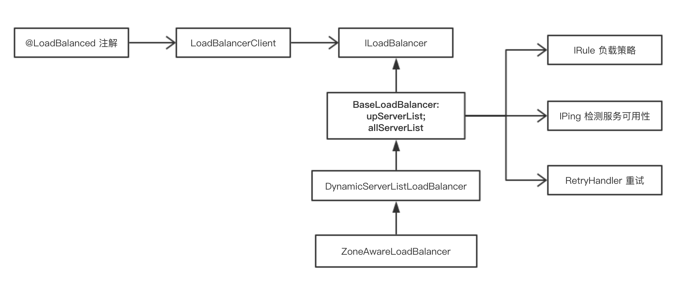

### Spring Cloud

- spring cloud 组件有哪些

服务注册中心 Eureka，客户端负载均衡 Ribbon，远程调用 Feign、断路器 Hystrix、配置中心 Config、路由及权限控制、负载均衡的 Zuul、消息总线 Bus。

---
### eureka

服务注册：每个服务单元向注册中心登记自己提供的服务，注册的信息含括主机与端口号、版本号、通信协议等。服务中心会维护一个服务清单，同时使用心跳的方式检测清单中的服务是否可用，若不可用则需要从服务清单中剔除，以达到排除故障服务的效果。（注册、续约、下线）

eureka server 在启动的时候会创建一个定时任务，每 60s 将失效的服务实例剔除。

服务消费：拉取服务注册信息，每 30 秒拉取一次更新信息应用到本地。

eureka 节点之间的数据同步：同一个服务的两个实例如果注册到不同的服务中心实例上，由于服务注册中心之间互相注册为服务，所以服务中心之间会互相转发注册请求服务给集群中的其他服务注册中心，从而实现服务注册中心之间的服务同步。

eureka 注册信息更新、一级二级缓存、自我保护机制 

- eureka 注册信息的存储结构
注册信息存储在内存中，以处理高并发的访问请求：

```java
// com.netflix.eureka.registry.AbstractInstanceRegistry
// 其中，第一层的 key 是 App name，第二层的 key 是 instance id，而 Lease 维护了每个服务的最后续约时间。
private final ConcurrentHashMap<String, Map<String, Lease<InstanceInfo>>> registry = new ConcurrentHashMap<String, Map<String, Lease<InstanceInfo>>>();

// 
```

同时采用了二级缓存，尽可能保证了内存注册表数据不会出现频繁的读写冲突问题。

1. ReadOnlyCacheMap 提供只读的注册信息查询；
2. ReadWriteCacheMap 作为二级缓存，在注册信息变更时过期对应的缓存，並定时同步到 ReadOnlyCacheMap（后台线程 30s 检查一次 ReadWriteCacheMap 是否为空，如果是清空 ReadOnlyCacheMap）；
3. 

在服务消费者获取注册信息时（单个服务还是全部服务？），

1. 先查看 ReadOnlyCacheMap，若有则直接返回；没有则查看 ReadWriteCacheMap；
2. 若 ReadWriteCacheMap 有则将其加入 ReadOnlyCacheMap 然后返回；没有则查看 

- Eureka 互相注册可以吗

**Eureka Server 默认模式为多节点**，可以通过 `eureka.client.registerWithEureka=false` 来关闭此行为，以避免日志警告。
服务启动后向 Eureka 注册，Eureka Server 之间相互注册，Eureka Server 会将注册信息向其他 Eureka Server 进行同步，当服务消费者要调用服务提供者，则向服务注册中心获取服务提供者地址，然后会将服务提供者地址缓存在本地，下次再调用时，则直接从本地缓存中取，完成一次调用。

客户端启动时，只需要指定其中一个 Eureka 的地址，该服务的信息就会由 Eureka 自动同步到多个 server 上。**客户端在什么时候得到其他 server 的地址，以在指定的 server 挂了的时候进行切换？**

- Eureka 如何多个通讯交换信息，一个服务可以注册到多个注册中心吗？

可以注册到多个，但没必要，因为注册中心之间会互相通讯，同步注册信息。

- Eureka 之间的同步机制是怎样的？服务消费者缓存在本地的信息包括哪些？

当 eureka server 启动的时候，会去连接其他的 eureka server，获取服务注册信息，如果从某个 eureka 节点，则尝试从下一个节点获取，直到尝试了所有节点。

当服务提供者发送注册请求到一个服务注册中心时，它会将该请求转发给集群中相连的其他注册中心，从而实现注册中心之间的服务同步。通过服务同步，两个服务提供者的服务信息就可以通过多台服务注册中心的任意一台获取。

服务消费者启动的时候会发送一个 REST 请求给注册中心，获取已注册的服务清单。
为了性能考虑，Eureka Server 会维护一份只读的服务清单来返回给客户端，同时该缓存清单会隔三十秒刷新一次。


`eureka.client.fetch-registry`：获取服务，默认为 true；
`eureka.client.registry-fetch-interval-seconds`：缓存清单的更新时间，默认三十秒。

- Eureka 跟客户端之后通过什么协议进行通讯？

通过 HTTP。
---
### Feign


---
### Ribbon

客户端 Ribbon 在进行 Feign 调用的时候可以配置进行负载均衡。

Feign 的调用本质是通过 RestTemplate，而通过在 RestTemplate 上添加 `@LoadBalance` 注解就可以使得 RestTemplate 对服务的调用拥有负载均衡的效果。

Ribbon 的负载均衡，主要通过 LoadBalancerClient 来实现的，而 LoadBalancerClient 具体交给了 ILoadBalancer 来处理，ILoadBalancer 通过配置 IRule（负载均衡策略）、IPing 等信息，并向 EurekaClient 获取注册列表的信息，并默认 10 秒一次向 EurekaClient 发送 “ping”，进而检查是否更新服务列表，最后，得到注册列表后，ILoadBalancer 根据 IRule 的策略进行负载均衡。

LoadBalancerClient（RibbonLoadBalancerClient 是实现类）在初始化的时候（execute 方法），会通过ILoadBalance（BaseLoadBalancer 是实现类）向Eureka注册中心获取服务注册列表，并且每10s检测一次服务的可用性（通过 IPing 接口以及 PingTask 和 IPingStrategy 检测策略，默认是顺序检测），将可用的服务添加到 upServerList 中。

而 RestTemplate 被 `@LoadBalance` 注解后，能拥有负载均衡的效果，是通过维护了一个被 `@LoadBalance` 注解的 RestTemplate 列表，并给列表中的 RestTemplate 添加 `LoadBalancerInterceptor` 拦截器，进而交给负载均衡器去处理。



- 有哪些负载均衡算法？

1. RandomRule：随机选择；
2. RoundRobinRule：轮询直到找到一个可用的服务，轮询次数不超过 10 次；
3. WeightedResponseTimeRule：响应时间作为选取权重的负载均衡策略，其含义就是，响应时间越短的服务被选中的可能性大；
4. RetryRule：在一定时间内（500ms）使用 RoundRobin 选择出一个可用的服务，否则返回 null；
5. BestAvailableRule：选择当前并发请求数最小的服务；
6. ZoneAvoidanceRule：默认策略，会先过滤不符条件的 zone，然后再从返回的可用 zone 中随机选择一个，再在选择的 zone 中过滤后选择一个 server（在过滤 zone 时会从所有 zone 中剔除满足：实例数为 0 的或 zone 内实例平均负载小于 0 或实例故障率大于等于阈值的（默认 0.99999）的 zone；然后再从过滤完的 zone 中随机选择一个剔除，随机时按照 zone 内的实例数，最后返回剩下的即为可用的 zone）；
7. AvailabilityFilteringRule：过滤不可达的服务以及并发请求数大于阈值（默认 Integer.MAX_VALUE）的服务后使用轮询；

Ribbon 的负载均衡默认使用轮询算法，默认的 LoadBalancer 是 。

配置负载策略：
```java
@Configuration
public class MyRibbonConfiguration {
    @Bean
    public IRule ribbonRule(){
        return new RandomRule();
    }
}
```
- Ribbon 的重试

通过 RetryHandler 处理重试，*默认失败不进行重试*。当访问到故障请求的时候，它会再尝试访问一次当前实例（次数由 maxAutoRetries 配置），如果不行，就换一个实例进行访问，如果还是不行，再换一个实例访问（更换次数由 MaxAutoRetriesNextServer 配置），如果依然不行，返回失败。(`LoadBalancerCommand.submit`)

配置：
```
// 开启重试机制，默认关闭
spring.cloud.loadbalancer.retry.enabled=true
// 断路器的超时时间需要大于Ribbon的超时时间，不然不会触发重试。
hystrix.command.default.execution.isolation.thread.timeoutInMilliseconds=10000

// 请求连接超时时间
my-service.ribbon.ConnectTimeout=250
// 请求处理的超时时间
my-service.ribbon.ReadTimeout=1000
// 对所有操作请求都进行重试
my-service.ribbon.OkToRetryOnAllOperations=true
// 切换实例的重试次数
my-service.ribbon.MaxAutoRetriesNextServer=2
// 对当前实例的重试次数
my-service.ribbon.maxAutoRetries=1
```

---

### hystrix

hystrix 在分布式系统中提供了服务熔断、降级、缓存、调用合并等诸多功能，用于防止单个服务的宕机而引起的级联异常。

hystrix 主要使用了命令模式，将方法的调用封装为 `HystrixCommand` 或 `HystrixObservableCommand`，再由这些 Command 对象执行对远程服务的调用。

- 启用
```java
@SpringBootApplication
@EnableDiscoveryClient
// 添加注解
@EnableHystrix
public class ServiceRibbonApplication {

	public static void main(String[] args) {
		SpringApplication.run(ServiceRibbonApplication.class, args);
	}

	@Bean
	@LoadBalanced
	RestTemplate restTemplate() {
		return new RestTemplate();
	}
}
```

为服务添加：
```java
@Service
public class HelloService {

    @Autowired
    RestTemplate restTemplate;

    // 配置熔断方法
    @HystrixCommand(fallbackMethod = "hiError")
    public String hiService(String name) {
        return restTemplate.getForObject("http://SERVICE-HI/hi?name="+name,String.class);
    }

    public String hiError(String name) {
        return "hi,"+name+",sorry,error!";
    }
}
```

- 为 feign 开启 hystrix：
1. 配置文件开启

`feign.hystrix.enabled=true`

2. feign client 添加配置
```java
// 指定熔断的类，方法熔断时会调用熔断类实现的同一方法
@FeignClient(value = "service-hi",fallback = SchedualServiceHiHystric.class)
public interface SchedualServiceHi {
    @RequestMapping(value = "/hi",method = RequestMethod.GET)
    String sayHiFromClientOne(@RequestParam(value = "name") String name);
}

// 熔断类实现 feign client 注解的接口
@Component
public class SchedualServiceHiHystric implements SchedualServiceHi {
    @Override
    public String sayHiFromClientOne(String name) {
        return "sorry "+name;
    }
}
```
- hystrix 的处理流程


1. 构造一个 HystrixCommand 或 HystrixObservableCommand 对象，用于封装请求，并在构造方法配置请求被执行需要的参数；
2. 执行命令，hystrix 提供了 4 种执行命令的方法：`execute/queue/observe/toObservable`；
3. 判断是否使用缓存响应请求，若启用了缓存，且缓存可用，直接使用缓存响应请求；hystrix 支持请求缓存，但需要用户自定义启动；
4. 判断熔断器是否打开，如果打开，跳到第 8 步，不计入监控信息中；
5. 判断线程池/队列/信号量是否已满，已满则跳到第 8 步；
6. 执行 `HystrixObservableCommand.construct()` 或 `HystrixCommand.run()`，如果执行失败或者超时，跳到第 8 步；否则，跳到第 9 步；
7. 统计熔断器监控信息；
8. 执行 fallback 逻辑；
9. 返回请求响应。

Command 的请求方式，execute() 和 queue() 适用于 HystrixCommand 对象，而 observe() 和 toObservable() 适用于 HystrixObservableCommand 对象。

1. execute：阻塞；
2. queue：非阻塞，返回一个 Future 对象；
3. observe：
4. 

HystrixCommand 用于处理只有一个返回的请求，同步请求使用 `execute()`，异步请求使用 `queue()`。HystrixObservableCommand

#### hystrix 的缓存

- 开启缓存
```java
public class CommandUsingRequestCache extends HystrixCommand<Boolean> {

    private final int value;

    protected CommandUsingRequestCache(int value) {
        super(HystrixCommandGroupKey.Factory.asKey("ExampleGroup"));
        this.value = value;
    }

    @Override
    protected Boolean run() {
        return value == 0 || value % 2 == 0;
    }

    // 通过覆盖 getCacheKey 来定义缓存的 key，如果缓存的 key 返回 null，则不进行缓存
    @Override
    protected String getCacheKey() {
        return String.valueOf(value);
    }
}
```

hystrix 通过 `com.netflix.hystrix.HystrixRequestCache` 实现请求的缓存，对于新创建的 HystrixRequestContext 实例，之前的缓存会被清空（会在 `context.shutdown()` 中清空 HystrixRequestVariableDefault	）。

- 在数据更新时删除缓存

2. 缓存的是什么信息？
3. 如何删除缓存？

- 断路器

`static class HystrixCircuitBreakerImpl implements HystrixCircuitBreaker`

HystrixCircuitBreakerImpl 通过 HealthCounts 记录了一个滚动时间窗内的请求信息快照，默认时间窗为 10 秒。

触发的条件：如果请求总数超出 circuitBreakerRequestVolumeThreshold（默认值为 20）且错误百分比大于 circuitBreakerErrorThresholdPercentage（默认值 50），就将断路器打开。之后的请求都会被拒绝而调用 fallback。

断路器打开的持续时间为 circuitBreakerSleepWindowInMilliseconds（默认为 5s），当断路器的打开时间已经超过这个时长之后，允许尝试一次请求，此时断路器为半开状态，如果该次请求成功，则将断路器关闭，否则继续等待该时长。

- 熔断器的配置参数
```
// 是否启用熔断器，默认是TRUE
circuitBreaker.enabled
// 熔断器强制打开，始终保持打开状态，不关注熔断开关的实际状态。默认值FLASE
circuitBreaker.forceOpen
// 熔断器强制关闭，始终保持关闭状态，不关注熔断开关的实际状态。默认值FLASE
circuitBreaker.forceClosed
// 失败阈值，默认值50%
circuitBreaker.errorThresholdPercentage
// 允许失败总数，默认 20
circuitBreaker.requestVolumeThreshold
// 断路器关闭持续时间，超过这个时间后允许进行试探请求
circuitBreaker.sleepWindowInMilliseconds
```

断路器监控数据的生成：事件流以及统计。

- command name、group 以及线程池的划分

hystrix 通过 Command.threadPoolKey 为 key，创建线程池 `HystrixThreadPool`，当没有指定 threadPoolKey 的时候就使用 groupKey，线程池大小默认为 10（core=max=10），队列默认使用 SynchronusQueue。

配置 groupKey 和 threadPoolKey：
```java
@HystrixCommand(commandKey="commandKey", groupKey="groupKey", threadPoolKey="threadPoolKey")
public User getUserByid(Long id) {
	// do something
}
```
groupKey 默认取的是类名 `getClass().getSimpleName();`，commandKey 默认取方法名。

线程池的配置：
```
// 配置队列大小，默认为 -1，即使用 SynchronousQueue
hystrix.threadpool.default.maxQueueSize=-1
hystrix.threadpool.default.coreSize=10
// 需要设置 allowMaximumSizeToDivergeFromCoreSize，此配置才会生效
// default=false
hystrix.threadpool.default.allowMaximumSizeToDivergeFromCoreSize=false
hystrix.threadpool.default.maximumSize=10
// keep alive time，单位分钟
hystrix.threadpool.default.keepAliveTimeMinutes=1
// 最大排队数，不是任务队列的大小，即使任务队列未满或者线程池未达 maximumSize，只要排队请求大于这个数就会被拒绝。用于通过动态配置调整排队数，因为线程池的队列大小不能动态修改。
hystrix.threadpool.default.queueSizeRejectionThreshold=5
```

通过线程池进行隔离的方式对于大多数场景都是适合的，但线程池的增加会导致响应时间的轻微加大，因此对于响应时间本来就很小的服务可以使用信号量的方式，但是信号量不能支持异步以及超时调用。

配置使用信号量进行服务隔离：

```
execution.isolation.strategy=SEMAPHORE
// 信号量的数量，默认为 10，当并发请求大于 10 时会拒绝后续请求。
execution.isolation.semaphore.maxConcurrentRequests=10
```

信号量会在两种场景中使用：

1. 命令执行：当配置了使用信号量来控制请求并发数时；
2. 降级逻辑：hystrix 会在降级逻辑中使用信号量（**作用是？**）。

- 降级发生的条件

以下任一条件均会触发 fallback：
1. 断路器是开启状态且未到请求尝试时间；
2. 线程池/队列/信号量达到上限；
3. 请求超时；
4. 执行过程发生异常（除 HystrixBadRequestException 外）

自定义不触发 fallback 的异常：
```java
@HystrixCommand(ignoreExceptions = {MyException.class})
public User getUserByid(Long id) {
	// do something
}
```

- Eureka 在什么情况下会触发熔断保护？

```
// 配置引发自我保护的节点下线比率
eureka.renewalPercentThreshold=[0.0, 1.0]
// 配置是否启用自我保护，默认启用
eureka.enableSelfPreservation=false
```
Eureka 还有一种自我保护机制，如果在 15 分钟内，当前注册的服务实例超过 15% 没有续约，并且也没有调用服务注销接口，那么 Eureka 就认为客户端与注册中心出现了网络故障，如果此时 Eureka 仍将这些节点移除並与其他 Eureka Server 进行同步，会导致大部分服务的下线。此时会出现以下几种情况：

1. Eureka 不再从注册列表中移除因为长时间没收到心跳而应该过期的服务；
2. Eureka 仍然能够接受新服务的注册和查询请求，但是不会被同步到其它节点上(即保证当前节点依然可用)；
3. 当网络稳定时，当前实例新的注册信息会被同步到其它节点中。

- Eureka client 断开一段时间注册信息会怎样

client 的状态转换为：STARTING->UP->DOWN。一开始的状态是 STARTING，以给客户端一段时间用于完成自身的初始化工作。

client 默认 30 秒发送一次心跳，如果 Eureka 超过 90 秒没有接收到 client 的心跳，则将 client 状态修改为 DOWN。

- Ribbon 和 Zuul 的区别

Zuul 是负责外部调用内部服务的时候进行统一的鉴权、流量过滤、服务路由等；而 Ribbon 是负责内部服务之后相互调用时基于负载均衡算法选择一个可用服务提供者。

---
参考：
- [hystrix 文档](https://github.com/Netflix/Hystrix/wiki/How-it-Works)
- [hystrix 配置项](https://github.com/Netflix/Hystrix/wiki/Configuration)
