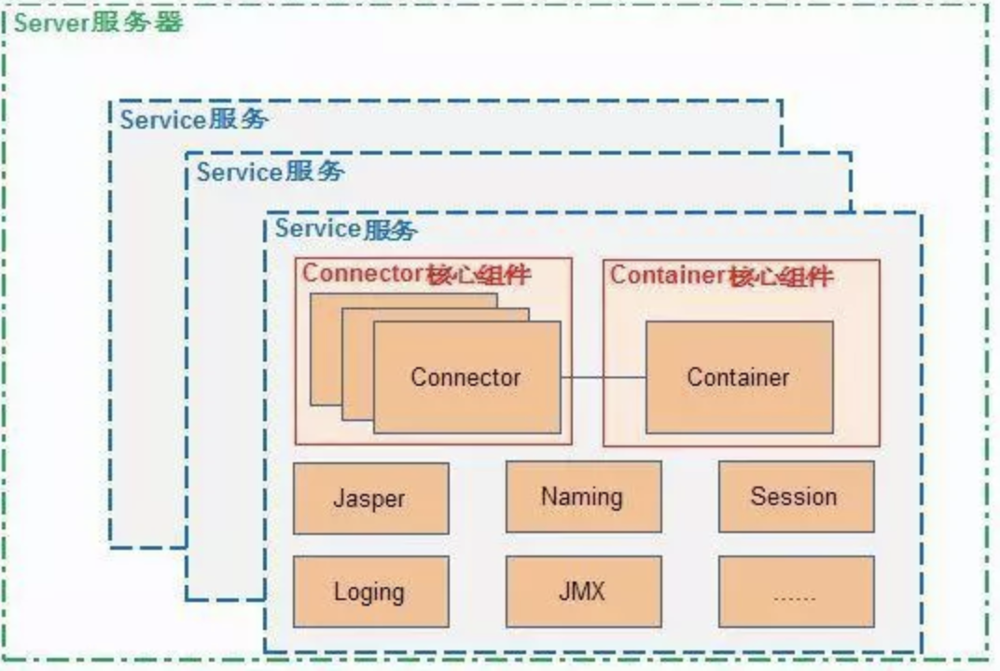

参考资料：

- 《How Tomcat Works》
---
#### Tomcat 的层级结构

#### Tomcat 的请求处理流程

#### Connector 的组成

#### Container 的组成

1. 四种 Container 及其对应的层级；
2. 责任链模式：Pipeline 和 Valve；

#### Tomcat 的启动流程

1. bin 目录下的启动脚本 catalina.sh 文件中指出了 main 方法所在的类 `org.apache.catalina.startup.Bootstrap`；
2. Bootstrap 实例化並调用 Cataline 的 process 方法；
3. Catalina 在 process 中解析 `server.xml` 並实例化一个 Server 对象；
4. Server 中可以有多个 Service，一个 Service 里包含了多个 Connector 和一个 Container（Engine）；
5. 当 Server 启动的时候也会启动其包含的 Service，Service 又会启动其包含的 Connector 和 Container，从而实现所有组件的启动。

