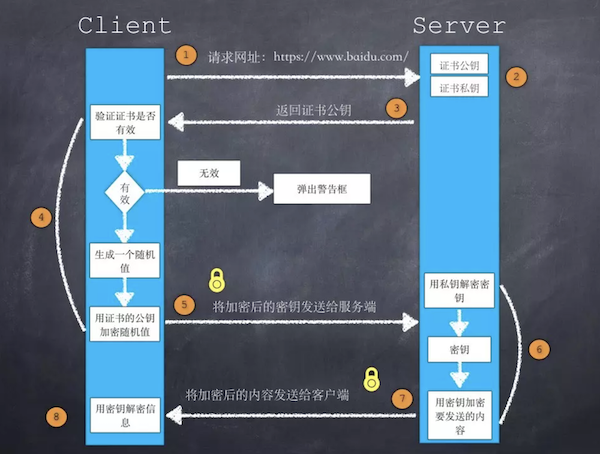

### TCP

- TCP、UDP 的区别

1. TCP 面向连接（如打电话要先拨号建立连接）；UDP 是无连接的，即发送数据之前不需要建立连接；
2. TCP 提供可靠的服务。也就是说，通过 TCP 连接传送的数据，无差错，不丢失，不重复，且按序到达；UDP尽最大努力交付，即不保   证可靠交付；
3. TCP 面向字节流，实际上是 TCP 把数据看成一连串无结构的字节流；UDP是面向报文的；
4. UDP 没有拥塞控制，因此网络出现拥塞不会使源主机的发送速率降低（对实时应用很有用，如IP电话，实时视频会议等）；
4. 每一条 TCP 连接只能是点到点的；UDP 支持一对一，一对多，多对一和多对多的交互通信；
5. TCP 首部开销 20 字节；UDP 的首部开销小，只有8个字节；
6. TCP 的逻辑通信信道是全双工的可靠信道，UDP 则是不可靠信道。

- UDP应用场景：

1. 面向数据报方式；
2. 网络数据大多为短消息；
3. 拥有大量 client；
4. 对数据安全性无特殊要求；
5. 网络负担非常重，但对响应速度要求高；

- [三次握手、四次挥手的过程](https://blog.csdn.net/lengxiao1993/article/details/82771768)


需要注意的是，上图中出现的 ACK=x+1 的写法很容易让人误以为数据包中的 ACK 域的数据值被填成了 y+1。ACK=x+1 的实际含义是：

1. TCP 包的 ACK 标志位（1 bit） 被置成了 1；
2. TCP 包的确认号（acknowledgement number ） 的值为 x+1。

- 为什么需要四次挥手断开连接？

由于 TCP 连接是全双工的，因此每个方向都必须单独进行关闭。当一方完成它的数据发送任务后就能发送一个 FIN 来终止这个方向的连接。收到一个 FIN 只意味着这一方向上没有数据流动，一个 TCP 连接在收到一个 FIN 后仍能发送数据。首先进行关闭的一方将执行主动关闭，而另一方执行被动关闭。

TCP 协议的连接是全双工连接，一个 TCP 连接存在双向的读写通道。

简单说来是 “先关读，后关写”，一共需要四个阶段。以客户机发起关闭连接为例：
1. 服务器读通道关闭
2. 客户机写通道关闭
3. 客户机读通道关闭
4. 服务器写通道关闭

关闭行为是在发起方数据发送完毕之后，给对方发出一个FIN（finish）数据段。直到接收到对方发送的 FIN，且对方收到了接收确认 ACK 之后，双方的数据通信完全结束，过程中每次接收都需要返回确认数据段 ACK。

详细过程：

第一阶段：客户机发送完数据之后，向服务器发送一个 FIN 数据段，序列号为 i

1. 服务器收到 FIN(i) 后，返回确认段 ACK，序列号为 i+1，关闭服务器读通道；
2. 客户机收到 ACK(i+1) 后，关闭客户机写通道（此时，客户机仍能通过读通道读取服务器的数据，服务器仍能通过写通道写数据）

第二阶段：服务器发送完数据之后，向客户机发送一个 FIN 数据段，序列号为 j
3. 客户机收到 FIN(j) 后，返回确认段 ACK，序列号为 j+1，关闭客户机读通道，*进入 TIME_WAIT 状态，等待 2 个 MSL 再进入 CLOSED 状态*；
4. 服务器收到 ACK(j+1) 后，关闭服务器写通道。

这是标准的 TCP 关闭两个阶段，服务器和客户机都可以发起关闭，完全对称。

FIN 标识是通过发送最后一块数据时设置的，标准的例子中，服务器还在发送数据，所以要等到发送完的时候，设置 FIN（此时可称为 TCP 连接处于半关闭状态，因为数据仍可从被动关闭一方向主动关闭方传送）。**如果在服务器收到 FIN(i) 时，已经没有数据需要发送，可以在返回 ACK(i+1) 的时候就设置 FIN(j) 标识，这样就相当于可以合并第二步和第三步**。

- CLOSE_WAIT 状态的连接过多怎么办？

发起 TCP 连接关闭的一方称为 client，被动关闭的一方称为 server。被动关闭的 server 收到 FIN 后发出 ACK 的 TCP 状态是 CLOSE_WAIT。出现这种状况一般都是由于 server 端代码的问题，导致没有给 client 端发 FIN，如果你的服务器上出现大量 CLOSE_WAIT，应该要考虑检查代码。

- TIME_WAIT 状态的连接过多怎么办？

根据 TCP 协议定义的 3 次握手断开连接规定，主动关闭的一方将进入 TIME_WAIT 状态。TIME_WAIT 状态将持续 2 个 MSL(Max Segment Lifetime)，在 Windows 下默认为 4 分钟，即 240 秒。TIME_WAIT 状态下的 socket 不能被回收使用。 具体现象是对于一个处理大量短连接的服务器,如果是由服务器主动关闭客户端的连接，将导致服务器端存在大量的处于 TIME_WAIT 状态的 socket，甚至比处于 Established 状态下的 socket 多的多，严重影响服务器的处理能力，甚至耗尽可用的 socket，停止服务。

可以通过修改服务器参数来加速连接关闭：
```
# /etc/sysctl.conf
# 表示开启重用。允许将 TIME-WAIT socket 重新用于新的 TCP 连接，默认为 0，表示关闭  
net.ipv4.tcp_tw_reuse = 1  
# 表示开启 TCP 连接中 TIME-WAIT socket 的快速回收，默认为 0，表示关闭  
net.ipv4.tcp_tw_recycle = 1  
# 等待在 FIN_WAIT_2 状态等待接收到 FIN 的时间，默认 60s 
net.ipv4.tcp_fin_timeout=30  
# 表示当 keepalive 起用的时候，TCP 发送 keepalive 消息的间隔时间。缺省是 2 小时，改为 300 秒  
net.ipv4.tcp_keepalive_time=1200
# 减少超时前的探测次数   
net.ipv4.tcp_keepalive_probes=5
# 允许 TIME_WAIT 状态连接的最大数目，超过的会被回收
tcp_max_tw_buckets
```
- 查看 TCP 连接状态及数目

`netstat -n | awk ’/^tcp/ {++S[$NF]} END {for(a in S) print a, S[a]}’`

- 为什么连接的时候是三次握手，关闭的时候却是四次握手？

因为当 Server 端收到 Client 端的 SYN 连接请求报文后，可以直接发送 SYN+ACK 报文。其中 ACK 报文是用来应答的，SYN 报文是用来同步的。但是关闭连接时，当 Server 端收到 FIN 报文时，很可能并不会立即关闭 socket，所以只能先回复一个 ACK 报文，告诉 Client 端，"你发的 FIN 报文我收到了"。只有等到 Server 端所有的报文都发送完了，才能发送 FIN 报文，因此不能一起发送。故需要四步握手。

- [为什么 TIME_WAIT 状态需要经过 2MSL(最大报文段生存时间)才能进入到 CLOSE 状态？](https://blog.csdn.net/smileiam/article/details/78226816)

1. 保证TCP协议的全双工连接能够可靠关闭
2. 保证这次连接的重复数据段从网络中消失

先说第一点，如果 Client 直接 CLOSED 了，那么由于 IP 协议的不可靠性或者是其它网络原因，导致 Server 没有收到 Client 最后回复的 ACK。那么 Server 就会在超时之后继续发送 FIN，此时由于 Client 已经 CLOSED 了，就找不到与重发的 FIN 对应的连接，最后 Server 就会收到 RST 而不是 ACK， Server 就会以为是连接错误把问题报告给高层。这样的情况虽然不会造成数据丢失，但是却导致 TCP 协议不符合可靠连接的要求。所以，Client 不是直接进入 CLOSED，而是要保持 TIME_WAIT，当再次收到 FIN 的时候，能够保证对方收到 ACK，最后正确的关闭连接。

再说第二点，如果 Client 直接 CLOSED，然后又再向 Server 发起一个新连接，我们不能保证这个新连接与刚关闭的连接的端口号是不同的。也就是说有可能新连接和老连接的端口号是相同的。一般来说不会发生什么问题，但是还是有特殊情况出现：假设新连接和已经关闭的老连接端口号是一样的，如果前一次连接的某些数据仍然滞留在网络中，这些延迟数据在建立新连接之后才到达 Server ，由于新连接和老连接的端口号是一样的，又因为 TCP 协议判断不同连接的依据是 socket pair，于是，TCP 协议就认为那个延迟的数据是属于新连接的，这样就和真正的新连接的数据包发生混淆了。所以 TCP 连接还要在 TIME_WAIT 状态等待 2 倍 MSL，这样可以保证本次连接的所有数据都从网络中消失。


- 半连接攻击

三次握手中，在第一步 server 收到 client 的 syn 后，把相关信息放到半连接队列中，同时回复 syn+ack 给 client（第二步）。半连接攻击是针对半连接队列的，攻击方不停地建连接，但是建连接的时候只做第一步，第二步中攻击方收到 server 的 syn+ack 后故意扔掉什么也不做，导致 server 上这个队列满其它正常请求无法进来。

服务器发送完 syn+ack 包，如果未收到客户确认包，服务器进行首次重传，等待一段时间仍未收到客户确认包，进行第二次重传，如果重传次数超过系统规定的最大重传次数，系统将该连接信息从半连接队列中删除。注意，每次重传等待的时间不一定相同。

- 为什么 TCP 需要握手环节？

TCP 协议为了实现可靠传输，通信双方需要判断自己已经发送的数据包是否都被接收方收到，如果没收到，就需要重发。为了实现这个需求，很自然地就会引出序号（sequence number）和确认号（acknowledgement number）的使用。而握手环节就是为了交换序号和确认号的。

- 为什么需要第三次握手？

1. 为了实现可靠数据传输，TCP 协议的通信双方，都必须维护一个序列号，以标识发送出去的数据包中，哪些是已经被对方收到的。 三次握手的过程即是通信双方相互告知序列号起始值，并确认对方已经收到了序列号起始值的必经步骤；
2. 如果只是两次握手， 至多只有连接发起方的起始序列号能被确认， 另一方选择的序列号则得不到确认。

- TCP 如何实现可靠传输？

1. 确认机制；
2. 超时重传；
3. 数据校验；
4. 数据合理分片和排序：

　　UDP：IP数据报大于1500字节,大于MTU.这个时候发送方IP层就需要分片(fragmentation).把数据报分成若干片,使每一片都小于MTU.而接收方IP层则需要进行数据报的重组.这样就会多做许多事情,而更严重的是,由于UDP的特性,当某一片数据传送中丢失时,接收方便无法重组数据报.将导致丢弃整个UDP数据报.

　　tcp会按MTU合理分片，接收方会缓存未按序到达的数据，重新排序后再交给应用层。

5. 流量控制：当接收方来不及处理发送方的数据，能提示发送方降低发送的速率，防止包丢失，根据接收端返回的缓冲窗口大小决定；

	1. 发送窗口：当前允许发送的数据区间，区间之间的数据是已经确认的，发送方的发送窗口，不能超过接收方给出的接受窗口的数值；
	2. 接收窗口：当前允许接收的数据区间，区间之前的数据是已经确认的；

接收方将自己可接受的缓冲区大小放入TCP首部中的”窗口大小字段”，通过ACK通知发送端；窗口大小字段越大，说明网络的吞吐量越高；接收方一旦发现自己的缓冲区快满了，就会将窗口大小设置成一个更小的值给发送端；发送端接受到这个窗口之后，就会减慢自己的发送速率；如果接受缓冲区满了，就会将窗口设置为0，这时发送方不在发送数据，但是需要定期发送一个窗口探测数据段，使接收方把窗口大小告诉发送端。


6. 拥塞控制：当网络拥塞时，减少数据的发送，通过 ACK 是否丢失导致重传来决定。

发送窗口大小 = min(发送窗口大小, 拥塞窗口大小)

	1. 慢开始：刚开始时，定义拥塞窗口的大小为 1，每次接收到一个 ACK 应答，拥塞窗口值 *2，每次发送数据包的时候，将拥塞窗口和接收端主机反馈的窗口大小做比较，取较小的值作为实际发送的窗口。这样的拥塞窗口增长的速度是指数级别的，慢启动只是指初始时慢，但是增长速度很快。
	2. 拥塞避免：引入一个慢启动的阈值，当拥塞窗口超过这个阈值的时候，不在按指数方式增长，而是按照线性方式增长。
	3. 快重传
	4. 快恢复

- 超时重传时间如何确定？

TCP 采用了一种自适应算法，它记录一个报文发出的时间，以及收到相应确认的时间，或者两个时间之差就是报文的往返时间 RTT。
最理想的情况下，找到一个最小的时间，保证确认应答一定能在这个时间内返回。

Linux 中，超时以 500ms 为一个单位进行控制，每次判定超时重发的超时时间都是 500ms 的整数倍；如果重发一次仍然得不到应答，等待 2*500ms 后再进行重传；如果仍然得不到应答，等待 4*500ms 进行重传，依次类推，以指数形式递增；累积到一定的重传次数，TCP 认为网络或者对端主机出现异常，强制关闭连接。

---
### HTTP、HTTPS
- 浏览器访问一个网页的过程


- [HTTPS 如何建立连接？](https://juejin.im/post/5a4f4884518825732b19a3ce)



- [HTTPS必须在每次请求中都要先在SSL/TLS层进行握手传输密钥吗？](https://zhuanlan.zhihu.com/p/43789231)

显然每次请求都经历一次密钥传输过程非常耗时，那怎么达到只传输一次呢？用session就行。

服务器会为每个浏览器（或客户端软件）维护一个 session ID，在 TSL 握手阶段传给浏览器，浏览器生成好密钥传给服务器后，服务器会把该密钥存到相应的 session ID 下，之后浏览器每次请求都会携带 session ID，服务器会根据 session ID 找到相应的密钥并进行解密加密操作，这样就不必要每次重新制作、传输密钥了。

- HTTP keep-alive 与 tcp keep-alive
- HTTP 中 transfer-encoding 头部](https://imququ.com/post/transfer-encoding-header-in-http.html)

针对服务端有时候不能确定响应的 content-length，而又要降低 TTFB（Time To First Byte，它代表的是从客户端发出请求到收到响应的第一个字节所花费的时间），可以使用 transfer-encoding 来使用分块编码。
