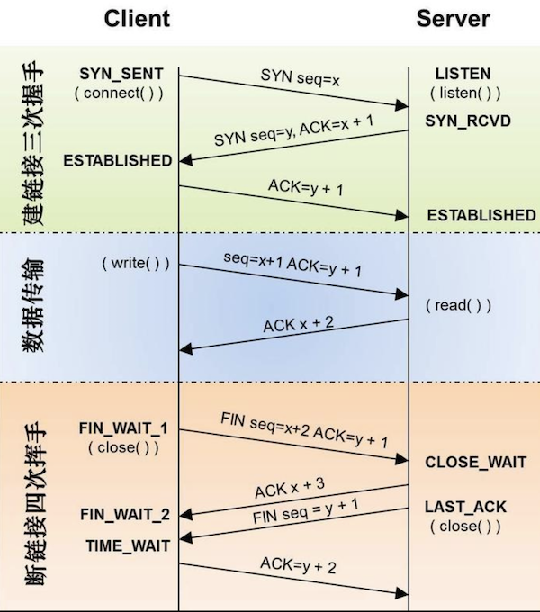

### TCP

- TCP、UDP 的区别

1. TCP 面向连接（如打电话要先拨号建立连接）；UDP 是无连接的，即发送数据之前不需要建立连接；
2. TCP 提供可靠的服务。也就是说，通过 TCP 连接传送的数据，无差错，不丢失，不重复，且按序到达；UDP尽最大努力交付，即不保   证可靠交付；
3. TCP 面向字节流，实际上是 TCP 把数据看成一连串无结构的字节流；UDP是面向报文的；
4. UDP 没有拥塞控制，因此网络出现拥塞不会使源主机的发送速率降低（对实时应用很有用，如IP电话，实时视频会议等）；
4. 每一条 TCP 连接只能是点到点的；UDP 支持一对一，一对多，多对一和多对多的交互通信；
5. TCP 首部开销 20 字节；UDP 的首部开销小，只有8个字节；
6. TCP 的逻辑通信信道是全双工的可靠信道，UDP 则是不可靠信道。

- UDP应用场景：

1. 面向数据报方式；
2. 网络数据大多为短消息；
3. 拥有大量 client；
4. 对数据安全性无特殊要求；
5. 网络负担非常重，但对响应速度要求高；

- [三次握手、四次挥手的过程](https://blog.csdn.net/lengxiao1993/article/details/82771768)

需要注意的是，上图中出现的 ACK=x+1 的写法很容易让人误以为数据包中的 ACK 域的数据值被填成了 y+1。ACK=x+1 的实际含义是：

1. TCP 包的 ACK 标志位（1 bit） 被置成了 1；
2. TCP 包的确认号（acknowledgement number ） 的值为 x+1。

- 半连接攻击

三次握手中，在第一步 server 收到 client 的 syn 后，把相关信息放到半连接队列中，同时回复 syn+ack 给 client（第二步）。半连接攻击是针对半连接队列的，攻击方不停地建连接，但是建连接的时候只做第一步，第二步中攻击方收到 server 的 syn+ack 后故意扔掉什么也不做，导致 server 上这个队列满其它正常请求无法进来。

服务器发送完 syn+ack 包，如果未收到客户确认包，服务器进行首次重传，等待一段时间仍未收到客户确认包，进行第二次重传，如果重传次数超过系统规定的最大重传次数，系统将该连接信息从半连接队列中删除。注意，每次重传等待的时间不一定相同。

- 为什么 TCP 需要握手环节？

TCP 协议为了实现可靠传输，通信双方需要判断自己已经发送的数据包是否都被接收方收到，如果没收到，就需要重发。为了实现这个需求，很自然地就会引出序号（sequence number）和确认号（acknowledgement number）的使用。而握手环节就是为了交换序号和确认号的。

- 为什么需要第三次握手？

1. 为了实现可靠数据传输，TCP 协议的通信双方，都必须维护一个序列号，以标识发送出去的数据包中，哪些是已经被对方收到的。 三次握手的过程即是通信双方相互告知序列号起始值，并确认对方已经收到了序列号起始值的必经步骤；
2. 如果只是两次握手， 至多只有连接发起方的起始序列号能被确认， 另一方选择的序列号则得不到确认。

---
### HTTP、HTTPS
- 浏览器访问一个网页的过程

- [HTTPS 如何建立连接？](https://juejin.im/post/5a4f4884518825732b19a3ce)

- [HTTPS必须在每次请求中都要先在SSL/TLS层进行握手传输密钥吗？](https://zhuanlan.zhihu.com/p/43789231)

显然每次请求都经历一次密钥传输过程非常耗时，那怎么达到只传输一次呢？用session就行。

服务器会为每个浏览器（或客户端软件）维护一个 session ID，在 TSL 握手阶段传给浏览器，浏览器生成好密钥传给服务器后，服务器会把该密钥存到相应的 session ID 下，之后浏览器每次请求都会携带 session ID，服务器会根据 session ID 找到相应的密钥并进行解密加密操作，这样就不必要每次重新制作、传输密钥了。

- HTTP keep-alive 与 tcp keep-alive
- HTTP 中 transfer-encoding 头部](https://imququ.com/post/transfer-encoding-header-in-http.html)

针对服务端有时候不能确定响应的 content-length，而又要降低 TTFB（Time To First Byte，它代表的是从客户端发出请求到收到响应的第一个字节所花费的时间），可以使用 transfer-encoding 来使用分块编码。
